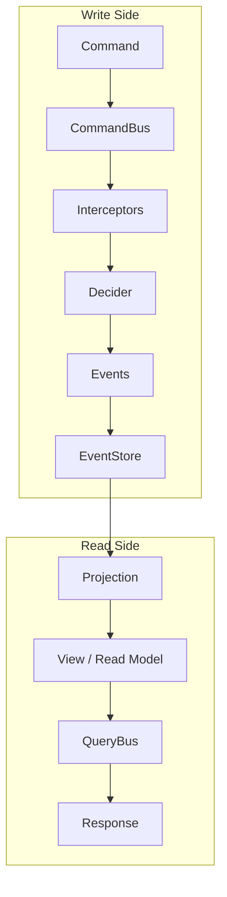

# Chapter 1 — Project Setup

> **What you'll learn:**
> - What CQRS and Event Sourcing are, and why they matter
> - How StreamRune implements these patterns
> - How to scaffold a multi-module Gradle project for an e-commerce application
> - How to wire StreamRune's Spring Boot integration and verify that schema migrations run automatically

---

## What We're Building and Why

Over the next 17 chapters you will build a production-grade e-commerce backend from scratch. By the end you will have a system that handles products, customers, orders, payments, and inventory — all backed by a full event history that you can replay, project, and query independently on the read side.

Why not start with a REST controller and a JPA entity like most tutorials? Because when your domain grows, that approach accumulates invisible costs: read-optimised queries fighting write-optimised transactions, audit logs bolted on as afterthoughts, integrations that break when you add a new field. CQRS and Event Sourcing solve these problems at the architecture level. StreamRune gives you a tested implementation of both patterns so you can focus on your domain logic, not the plumbing.

---

## What is CQRS/Event Sourcing?

### The Problem with Traditional CRUD

In a typical CRUD application you have one model that serves both reads and writes. A `Product` entity is loaded from a row, mutated, and saved back. This works well when the domain is small, but it starts to break down as complexity grows:

- Read queries want denormalised, pre-joined data; writes want a normalised, consistent structure.
- Adding a new read concern (e.g. "how many times has this product been viewed this week?") forces changes to the write model.
- There is no intrinsic audit trail — you know the current state, but not how you got there.
- Event-driven integrations must be retrofitted with change-data-capture or polling.

### Command Query Responsibility Segregation (CQRS)

CQRS addresses the first problem by splitting the system into two explicit sides:

- **Write side** — accepts *commands* (intent to change state), validates them, and emits *events* (facts that happened).
- **Read side** — subscribes to those events and builds *read models* (projections) optimised for specific query needs.

Each side evolves independently. You can add a new read model without touching the write path, and you can refactor the write logic without breaking any query.

### Event Sourcing

Event Sourcing takes CQRS further on the write side. Instead of storing the current state of an entity (the row as it looks right now), you store the *sequence of events* that caused it to reach that state. Current state is derived on demand by replaying the event stream from the beginning.

Consider a `Product` aggregate. Rather than a row with `stock_level = 42`, you store:

```
ProductCreated  { name: "Wireless Keyboard", price: 49.99, stock: 100 }
StockReserved   { quantity: 50 }
StockReturned   { quantity: 5 }
StockReserved   { quantity: 13 }
```

Replaying these four events gives you `stock = 42`. The history is the source of truth.

### Why This Matters

- **Full audit trail** — every change is preserved as a first-class fact, not overwritten.
- **Temporal queries** — you can reconstruct the state of any aggregate at any point in time.
- **Event-driven integration** — downstream services consume the event stream directly; no polling required.
- **Debugging** — a production bug can be reproduced by replaying the exact event sequence that triggered it.

---

## What is StreamRune?

StreamRune is a Java framework for building event-sourced applications using the **Decider pattern**. A Decider is a pure function that takes the current aggregate state and a command, and returns a list of new events. Another function — the *evolve* function — takes the current state and an event and returns the next state. No side effects, no database calls, no framework magic inside your domain logic.

Around this pure core, StreamRune provides:

- **EventStore** — a PostgreSQL-backed append-only event log with optimistic concurrency.
- **CommandBus** — routes commands to Deciders, manages transactions, and publishes resulting events.
- **QueryBus** — routes queries to handlers backed by read models.
- **Projections** — listen to the event stream and maintain read models (polling or push-based).
- **Sagas** — long-running process managers that coordinate multi-step workflows across aggregates.
- **20+ infrastructure features** — encryption, circuit breakers, outbox pattern, OpenTelemetry tracing, GraalVM native image support, and more.

StreamRune works with **Spring Boot**, **Quarkus**, and **Micronaut**. This tutorial uses Spring Boot.

---

## Architecture Overview



Commands enter the write side via the `CommandBus`. Interceptors run cross-cutting logic (validation, authorisation, tracing) before the `Decider` processes the command and produces events. Those events are appended to the `EventStore`. On the read side, `Projections` consume the event stream and update read models. Queries are answered by the `QueryBus` directly from those read models.

---

## Prerequisites: Getting the StreamRune Artifacts

The tutorial builds against StreamRune `1.0.0-alpha-SNAPSHOT`, an unreleased preview. It is published only to the Maven Central snapshot repository (`https://central.sonatype.com/repository/maven-snapshots/`), not to Maven Central itself, so a plain `mavenCentral()` repository cannot find it. Three paths are supported — pick one and stick with it throughout the tutorial.

### Path A — Composite build (recommended)

Clone the framework repository as a sibling of your project directory:

```bash
# parent directory contains both streamrune/ and your project/
git clone https://github.com/StreamRune/streamrune.git ../streamrune
```

If you already have a StreamRune checkout elsewhere, point the composite build at it instead (the path is configured in the next step) — you do not have to clone it again.

Open `settings.gradle.kts` and add the composite build block **before** the `include(...)` call (exact copy from the real demo):

```kotlin
// Composite build: resolve StreamRune from local source when available.
// Falls back to the published StreamRune artifacts when the directory doesn't exist
// (e.g., inside a Docker build or CI without the framework checkout). The default clone
// directory of github.com/StreamRune/streamrune is lowercase, so the name matters on
// case-sensitive file systems.
val frameworkDir = file("../streamrune")
if (frameworkDir.isDirectory) {
    includeBuild(frameworkDir) {
        dependencySubstitution {
            substitute(module("org.streamrune:streamrune-core")).using(project(":streamrune-core"))
            substitute(module("org.streamrune:streamrune-runtime")).using(project(":streamrune-runtime"))
            substitute(module("org.streamrune:streamrune-test")).using(project(":streamrune-test"))
            substitute(module("org.streamrune:streamrune-crypto-api")).using(project(":streamrune-crypto:streamrune-crypto-api"))
            substitute(module("org.streamrune:streamrune-postgres-crypto")).using(project(":streamrune-crypto:streamrune-postgres-crypto"))
            substitute(module("org.streamrune:streamrune-postgres")).using(project(":streamrune-eventstore:streamrune-postgres"))
            substitute(module("org.streamrune:streamrune-spring")).using(project(":streamrune-integration:streamrune-spring"))
            substitute(module("org.streamrune:streamrune-quarkus")).using(project(":streamrune-integration:streamrune-quarkus"))
            substitute(module("org.streamrune:streamrune-micronaut")).using(project(":streamrune-integration:streamrune-micronaut"))
            substitute(module("org.streamrune:streamrune-rabbitmq-outbox")).using(project(":streamrune-outbox:streamrune-rabbitmq-outbox"))
        }
    }
}
```

With this block in place, Gradle resolves all `org.streamrune:*` coordinates directly from the framework source tree. No version number in the dependency declaration is required — the substitution rule handles it.

### Path B — Publish to Maven Local

From the framework checkout, publish the artifacts:

```bash
cd ../streamrune
./gradlew publishToMavenLocal
cd -
```

Make `mavenLocal()` available in the `repositories` block of the root `build.gradle.kts`. The demo enables it only on request (`-PuseMavenLocal=true`), so that a stale `~/.m2` copy of the framework never shadows the published artifacts by accident:

```kotlin
repositories {
    if (providers.gradleProperty("useMavenLocal").isPresent) {
        mavenLocal()
    }
    mavenCentral()
}
```

Then pass the property to every Gradle invocation, e.g. `./gradlew build -PuseMavenLocal=true`.

Use version `1.0.0-alpha-SNAPSHOT` in every StreamRune dependency declaration throughout this tutorial.

> **Path B — stale jar risk:** `mavenLocal()` resolves whatever was last published to `~/.m2/repository`. If you have not run `./gradlew publishToMavenLocal` recently, or if the framework has gained new types (e.g. `SubjectForgottenException`) since your last publication, the local cache will be stale and compilation will fail with `cannot find symbol` errors. Re-run `./gradlew publishToMavenLocal` from the framework checkout whenever you pull new framework commits.

### Path C — The published preview build

Add the snapshot repository to the `repositories` block of the root `build.gradle.kts`, restricted to StreamRune snapshots (the root build file in Step 1 below already contains it):

```kotlin
repositories {
    mavenCentral()
    maven("https://central.sonatype.com/repository/maven-snapshots/") {
        mavenContent { snapshotsOnly() }
        content { includeGroup("org.streamrune") }
    }
}
```

Nothing else is needed: Gradle downloads the latest `1.0.0-alpha-SNAPSHOT` build. Path C is also what the demo itself falls back to when no `../streamrune` checkout exists (a Docker build, for example).

> **All dependency examples in this tutorial use Path A (composite build).** If you chose Path B or Path C, keep the same coordinates — the version is implied by the catalog entry `libs.versions.streamrune = "1.0.0-alpha-SNAPSHOT"`.

---

## Step by Step

### Step 0 — Create the version catalog

Before writing any build file, create the Gradle version catalog so that all modules can share dependency aliases.

Create `gradle/libs.versions.toml` (copy from the real demo — only the key aliases used in this tutorial are shown here; copy the full file to get all aliases):

```toml
[versions]
# Unreleased preview, published to https://central.sonatype.com/repository/maven-snapshots/
# (declared in the root build.gradle.kts). A ../streamrune checkout replaces it via the composite
# build in settings.gradle.kts.
streamrune = "1.0.0-alpha-SNAPSHOT"
spring-boot = "4.1.1"
spring-dependency-management = "1.1.6"
jackson = "2.18.3"
jakarta-validation = "3.0.2"
hibernate-validator = "8.0.1.Final"
jakarta-el = "4.0.2"
assertj = "3.27.3"
spotless = "7.1.0"
# ... (see the full catalog in the real demo for all aliases)

[libraries]
jackson-databind = { module = "com.fasterxml.jackson.core:jackson-databind", version.ref = "jackson" }
jakarta-validation-api = { module = "jakarta.validation:jakarta.validation-api", version.ref = "jakarta-validation" }
hibernate-validator = { module = "org.hibernate.validator:hibernate-validator", version.ref = "hibernate-validator" }
jakarta-el = { module = "org.glassfish:jakarta.el", version.ref = "jakarta-el" }
assertj-core = { module = "org.assertj:assertj-core", version.ref = "assertj" }
spring-boot-starter-web = { module = "org.springframework.boot:spring-boot-starter-web", version.ref = "spring-boot" }
spring-boot-starter-webflux = { module = "org.springframework.boot:spring-boot-starter-webflux", version.ref = "spring-boot" }
spring-boot-starter-validation = { module = "org.springframework.boot:spring-boot-starter-validation", version.ref = "spring-boot" }
spring-boot-starter-jdbc = { module = "org.springframework.boot:spring-boot-starter-jdbc", version.ref = "spring-boot" }
spring-boot-starter-actuator = { module = "org.springframework.boot:spring-boot-starter-actuator", version.ref = "spring-boot" }
spring-boot-starter-test = { module = "org.springframework.boot:spring-boot-starter-test", version.ref = "spring-boot" }

[plugins]
spotless = { id = "com.diffplug.spotless", version.ref = "spotless" }
spring-boot = { id = "org.springframework.boot", version.ref = "spring-boot" }
spring-dependency-management = { id = "io.spring.dependency-management", version.ref = "spring-dependency-management" }
```

> Copy the complete `gradle/libs.versions.toml` from the real demo — it includes all aliases for later chapters (Quarkus, Micronaut, observability, testing, etc.).

### Step 1 — Create the Gradle project structure

Create a root directory for the project and initialise Gradle:

```bash
mkdir ecommerce && cd ecommerce
gradle init --type basic --dsl kotlin
```

Open `settings.gradle.kts` and replace its contents with the composite build version (Path A):

```kotlin
rootProject.name = "streamrune-ecommerce-demo"

// Composite build: resolve StreamRune from local source when available.
// Falls back to the published StreamRune artifacts when the directory doesn't exist
// (e.g., inside a Docker build or CI without the framework checkout). The default clone
// directory of github.com/StreamRune/streamrune is lowercase, so the name matters on
// case-sensitive file systems.
val frameworkDir = file("../streamrune")
if (frameworkDir.isDirectory) {
    includeBuild(frameworkDir) {
        dependencySubstitution {
            substitute(module("org.streamrune:streamrune-core")).using(project(":streamrune-core"))
            substitute(module("org.streamrune:streamrune-runtime")).using(project(":streamrune-runtime"))
            substitute(module("org.streamrune:streamrune-test")).using(project(":streamrune-test"))
            substitute(module("org.streamrune:streamrune-crypto-api")).using(project(":streamrune-crypto:streamrune-crypto-api"))
            substitute(module("org.streamrune:streamrune-postgres-crypto")).using(project(":streamrune-crypto:streamrune-postgres-crypto"))
            substitute(module("org.streamrune:streamrune-postgres")).using(project(":streamrune-eventstore:streamrune-postgres"))
            substitute(module("org.streamrune:streamrune-spring")).using(project(":streamrune-integration:streamrune-spring"))
            substitute(module("org.streamrune:streamrune-quarkus")).using(project(":streamrune-integration:streamrune-quarkus"))
            substitute(module("org.streamrune:streamrune-micronaut")).using(project(":streamrune-integration:streamrune-micronaut"))
            substitute(module("org.streamrune:streamrune-rabbitmq-outbox")).using(project(":streamrune-outbox:streamrune-rabbitmq-outbox"))
        }
    }
}

include(
    "domain",
    "commands",
    "queries",
    "projections",
    "spring-app"
)
```

> **Directory placement (composite build):** The `file("../streamrune")` path in `settings.gradle.kts` is resolved relative to the project root. Your project directory must therefore sit **beside** the `streamrune/` checkout, not inside it or elsewhere. For example, if StreamRune is at `~/projects/streamrune`, create this project at `~/projects/ecommerce`. If you placed it somewhere else, either move the project or change the path in `settings.gradle.kts` to an absolute path pointing at your StreamRune checkout. If the directory check (`frameworkDir.isDirectory`) is false, Gradle silently skips the composite build and falls back to the published preview artifacts on the Maven Central snapshot repository (and to `mavenLocal()` only when you pass `-PuseMavenLocal=true`) — with no warning. If you then see compile errors for types that are present in the StreamRune source (e.g. `SubjectForgottenException`), the composite build failed to activate; check the path first.
>
> **Note:** `rootProject.name` does not affect composite build resolution. Gradle matches the included build by the directory path passed to `includeBuild(...)`, not by the project name. You may name the root project whatever you like.

> The real demo's `settings.gradle.kts` also includes `"quarkus-app"` and `"micronaut-app"`, since it ships all three runtime apps. This tutorial targets Spring Boot, so those two modules are omitted here. Everything else in the file is identical.

Create the module directories:

```bash
mkdir -p domain/src/main/java
mkdir -p commands/src/main/java
mkdir -p queries/src/main/java
mkdir -p projections/src/main/java
mkdir -p spring-app/src/main/java
mkdir -p spring-app/src/main/resources
```

### Step 2 — Configure the root build file

Replace `build.gradle.kts` at the root:

```kotlin
plugins {
    java
    alias(libs.plugins.spotless) apply false
}

subprojects {
    apply(plugin = "java-library")
    apply(plugin = "com.diffplug.spotless")

    group = "org.streamrune.ecommerce"
    version = "0.1.0-SNAPSHOT"

    java {
        toolchain {
            languageVersion.set(JavaLanguageVersion.of(25))
        }
    }

    tasks.withType<JavaCompile> {
        options.compilerArgs.addAll(listOf("--enable-preview"))
    }

    tasks.withType<Test> {
        useJUnitPlatform()
        jvmArgs("--enable-preview")
    }

    repositories {
        // Opt-in only (./gradlew -PuseMavenLocal=true ...): a stale ~/.m2 copy of the framework must
        // never shadow the published artifacts by accident.
        if (providers.gradleProperty("useMavenLocal").isPresent) {
            mavenLocal()
        }
        mavenCentral()
        // StreamRune 1.0.0-alpha-SNAPSHOT is an unreleased preview published only to the Central
        // snapshot repository; it serves the org.streamrune snapshots and nothing else. When
        // ../streamrune exists, the composite build in settings.gradle.kts replaces these
        // artifacts with the local framework source.
        maven("https://central.sonatype.com/repository/maven-snapshots/") {
            mavenContent { snapshotsOnly() }
            content { includeGroup("org.streamrune") }
        }
    }

    dependencies {
        val libs = rootProject.the<VersionCatalogsExtension>().named("libs")
        testImplementation(platform(libs.findLibrary("junit-bom").get()))
        testImplementation("org.junit.jupiter:junit-jupiter")
        testRuntimeOnly("org.junit.platform:junit-platform-launcher")
    }

    configure<com.diffplug.gradle.spotless.SpotlessExtension> {
        setEnforceCheck(false)
        java {
            googleJavaFormat("1.34.1")
            removeUnusedImports()
        }
    }
}
```

> This demo enables Java 25 preview features at compile time (`--enable-preview` on the `JavaCompile` task) and test time (`jvmArgs("--enable-preview")` on the `Test` task). The `bootRun` task does **not** set `--enable-preview` and runs fine because the demo currently uses no Java preview language features at runtime. StreamRune itself uses only finalized Java 25 features and does **not** require the flag — `--enable-preview` here is the demo's own choice, not a framework requirement.
>
> The `spotless` plugin enforces Google Java Format across all subprojects. `setEnforceCheck(false)` means the format check does not fail CI by default — run `./gradlew spotlessApply` to auto-format all Java files.

### Step 3 — Add StreamRune dependencies to domain and commands

Create `domain/build.gradle.kts`:

```kotlin
plugins {
    java
}

dependencies {
    val sr = libs.versions.streamrune.get()
    implementation("org.streamrune:streamrune-core:$sr")
    implementation("org.streamrune:streamrune-crypto-api:$sr")
    implementation(libs.jackson.databind)
    // Use implementation (not compileOnly) so validation annotations are available at runtime
    implementation(libs.jakarta.validation.api)
}
```

Create `commands/build.gradle.kts`:

```kotlin
plugins {
    java
}

dependencies {
    val sr = libs.versions.streamrune.get()
    implementation(project(":domain"))
    implementation("org.streamrune:streamrune-core:$sr")
    implementation(libs.jackson.databind)

    testImplementation("org.streamrune:streamrune-test:$sr")
    testImplementation(libs.assertj.core)
}
```

Create `queries/build.gradle.kts`:

```kotlin
plugins {
    java
}

dependencies {
    val sr = libs.versions.streamrune.get()
    implementation(project(":domain"))
    implementation("org.streamrune:streamrune-core:$sr")
}
```

Create `projections/build.gradle.kts`:

```kotlin
plugins {
    java
}

dependencies {
    val sr = libs.versions.streamrune.get()
    implementation(project(":domain"))
    implementation(project(":queries"))
    implementation("org.streamrune:streamrune-core:$sr")
    implementation(libs.jackson.databind)
}
```

> **Note on `jakarta.validation-api` in `domain`:** The annotation `@Valid` and friends live in this jar. Using `implementation` (not `compileOnly`) ensures they are present at runtime for the `BeanValidationInterceptor` to read reflectively. Chapter 3 adds the annotation to command records; the validator implementation itself stays in `spring-app`.

### Step 4 — Configure the spring-app module

Create `spring-app/build.gradle.kts`:

```kotlin
plugins {
    java
    alias(libs.plugins.spring.dependency.management)
    alias(libs.plugins.spring.boot)
}

val sr = libs.versions.streamrune.get()

dependencies {
    implementation(project(":domain"))
    implementation(project(":commands"))
    implementation(project(":queries"))
    implementation(project(":projections"))

    // StreamRune Spring integration and PostgreSQL EventStore
    implementation("org.streamrune:streamrune-spring:$sr")
    implementation("org.streamrune:streamrune-postgres:$sr")
    implementation("org.streamrune:streamrune-runtime:$sr")
    implementation("org.streamrune:streamrune-crypto-api:$sr")
    implementation("org.streamrune:streamrune-postgres-crypto:$sr")

    // Jackson (Spring Boot 4.0 uses Jackson 3.x internally; StreamRune needs Jackson 2.x)
    implementation("com.fasterxml.jackson.core:jackson-databind")

    // Required at runtime: StreamRune's Spring auto-configuration (StreamRuneAutoConfiguration)
    // references these optional types when it evaluates its @Conditional beans. They are not on
    // the classpath transitively, so without them the application context fails to start with a
    // NoClassDefFoundError (io/opentelemetry/api/OpenTelemetry) — even though your own code never
    // touches them directly.
    implementation(libs.opentelemetry.api)
    implementation(libs.spring.security.core)

    // Spring Boot starters
    implementation("org.springframework.boot:spring-boot-starter-web")
    implementation("org.springframework.boot:spring-boot-starter-webflux")  // required for Ch15 SSE
    implementation("org.springframework.boot:spring-boot-starter-jdbc")
    implementation("org.springframework.boot:spring-boot-starter-validation")
    implementation("org.springframework.boot:spring-boot-starter-actuator")

    implementation("org.postgresql:postgresql")

    testImplementation(libs.spring.boot.starter.test)
}
```

> `spring-boot-starter-webflux` is added now because Chapter 15 (Server-Sent Events) streams `Flux<ServerSentEvent<String>>` from the reactive stack (Spring WebFlux and Reactor). Adding it here prevents a compilation failure when you reach that chapter.
>
> `opentelemetry-api` and `spring-security-core` are runtime requirements of StreamRune's Spring auto-configuration, not of your code. The `gradle/libs.versions.toml` catalog you copied from the real demo already defines both aliases (`opentelemetry` and `spring-security` versions). Omitting them compiles fine but fails at startup.

### Step 5 — Start PostgreSQL and create the schema

StreamRune's PostgreSQL EventStore needs a running database **with its tables already created**. This demo lets StreamRune auto-configure the event store (the Spring auto-configuration in `streamrune-spring` picks up the `EventTypeRegistry` bean you define, plus the crypto engine and upcaster beans added in later chapters). By default the auto-configured factory runs the bundled Flyway migrations from `db/streamrune-migration/` inside the `streamrune-postgres` jar — but this demo's schema comes from `scripts/init-db.sql` (mounted by `docker-compose.yml` into the container's init directory), so it sets `streamrune.event-store.schema.auto-initialize: false` to skip that and use the pre-existing schema instead. The schema is therefore **not** created on startup; it must already exist before the application starts.

First, copy the schema file from the real demo into your project (it is regenerated from the framework's Flyway migrations and is the demo's source of truth for the schema):

```bash
mkdir -p scripts
# Copy scripts/init-db.sql from your checkout of the real demo
# (the same repository this tutorial lives in):
cp /path/to/streamrune-ecommerce-demo/scripts/init-db.sql scripts/init-db.sql
```

Then start PostgreSQL, mounting that script so Postgres runs it automatically the first time the container initialises:

```bash
docker run -d \
  --name streamrune-pg \
  -e POSTGRES_DB=streamrune_ecommerce \
  -e POSTGRES_USER=postgres \
  -e POSTGRES_PASSWORD=postgres \
  -p 5432:5432 \
  -v "$(pwd)/scripts/init-db.sql:/docker-entrypoint-initdb.d/init-db.sql:ro" \
  postgres:17
```

> **Why `postgres:17`:** StreamRune requires PostgreSQL 17 or newer (its CI tests 17 and 18) and refuses an older server at startup — `PostgresEventStoreFactory.create()` throws `UnsupportedServerVersionException` before it touches the schema, even with `streamrune.event-store.schema.auto-initialize: false`. The demo's containers, tests and `docker-compose.yml` all use 17, the oldest supported version.

> The mount only runs on **first** initialisation of a fresh data volume. If the container already exists from an earlier run, remove it first (`docker rm -f streamrune-pg`) so the script runs against a clean database, or apply the script manually: `docker exec -i streamrune-pg psql -U postgres -d streamrune_ecommerce < scripts/init-db.sql`.

Wait a few seconds for the container to initialise, then verify the tables exist:

```bash
docker exec -it streamrune-pg psql -U postgres -d streamrune_ecommerce -c "\dt"
```

You should see `event_stream`, `snapshot_store`, `projection_offset`, and several others.

> **Tip:** When you reach Chapter 17, `docker compose up` starts PostgreSQL (with this same `init-db.sql` mounted), the backend, and the frontend together. For the tutorial chapters, the standalone container above is simpler.

### Step 6 — Configure the datasource

Create `spring-app/src/main/resources/application.yml`:

```yaml
server:
  port: 8080

spring:
  datasource:
    url: jdbc:postgresql://localhost:5432/streamrune_ecommerce
    username: postgres
    password: postgres
    driver-class-name: org.postgresql.Driver
  jpa:
    hibernate:
      ddl-auto: none

streamrune:
  event-store:
    type: postgres
    schema:
      # The demo's schema is created by scripts/init-db.sql (Docker initdb), not Flyway.
      # The auto-configured event store defaults to running Flyway; disable it so it does not
      # fail against the pre-existing schema. init-db.sql pre-creates the full framework schema by
      # hand, so a real migrate would hit a raw "relation \"event_stream\" already exists" conflict
      # on V001, not a Flyway validation error.
      auto-initialize: false
  projection:
    type: polling
    interval: 100
  projections:
    auto-discovery:
      enabled: false

management:
  endpoints:
    web:
      exposure:
        include: health,metrics
```

A word on the `streamrune.*` block. The PostgreSQL EventStore is selected simply by having the `streamrune-postgres` artifact on the classpath (StreamRune's auto-configuration detects it) — **not** by the `streamrune.event-store.type` key. Likewise, the framework's catch-up polling interval is controlled by `streamrune.polling-interval-ms` (default `5000`), **not** by `projection.interval`. The `event-store.type`, `projection.type`, and `projection.interval` keys shown above are inert: they appear in the real demo's `application.yml` but the framework does not bind or read them, so they have no effect. They are kept here for parity with the real demo's file; treat them as documentation, not configuration.

`streamrune.projections.auto-discovery.enabled: false` **is** a real, bound property (prefix `streamrune.projections.auto-discovery`). It turns off auto-discovery of projections on the classpath. The tutorial wires projections explicitly via `MultiProjectionRunner` (Chapter 5), so auto-discovery would conflict with the manual wiring.

> The real demo also ships an `application.properties` alongside this `application.yml`. It carries the same datasource defaults plus `spring.sql.init.mode=never`, which the native-image build needs at AOT processing time. You do not need it for the plain `bootRun` in this chapter; it matters only for the native build (Chapter 17, *Deploy to production*).

### Step 7 — Create the application entry point

Create `spring-app/src/main/java/org/streamrune/ecommerce/spring/SpringEcommerceApplication.java`:

```java
package org.streamrune.ecommerce.spring;

import org.springframework.boot.SpringApplication;
import org.springframework.boot.autoconfigure.SpringBootApplication;

@SpringBootApplication
public class SpringEcommerceApplication {
    public static void main(String[] args) {
        SpringApplication.run(SpringEcommerceApplication.class, args);
    }
}
```

> The class is called `SpringEcommerceApplication` to distinguish it from any Quarkus or Micronaut entry points you might add later. The log line on startup will read `Started SpringEcommerceApplication`.

### Step 7a — Create `GlobalExceptionHandler`

This handler maps framework and domain exceptions to HTTP status codes. Later chapters rely on it being present; create it now.

Create `spring-app/src/main/java/org/streamrune/ecommerce/spring/config/GlobalExceptionHandler.java`:

```java
package org.streamrune.ecommerce.spring.config;

import org.springframework.http.HttpStatus;
import org.springframework.http.ResponseEntity;
import org.springframework.web.bind.annotation.ExceptionHandler;
import org.springframework.web.bind.annotation.RestControllerAdvice;
import org.streamrune.core.DomainException;
import org.streamrune.core.crypto.SubjectForgottenException;

@RestControllerAdvice
public class GlobalExceptionHandler {

  @ExceptionHandler(DomainException.class)
  public ResponseEntity<String> handleDomainException(DomainException e) {
    return ResponseEntity.status(HttpStatus.BAD_REQUEST).body(e.getMessage());
  }

  @ExceptionHandler(IllegalArgumentException.class)
  public ResponseEntity<String> handleIllegalArgument(IllegalArgumentException e) {
    return ResponseEntity.status(HttpStatus.BAD_REQUEST).body(e.getMessage());
  }

  /**
   * Terminal erasure: a command tried to encrypt PII for a crypto-shredded subject (e.g.
   * re-registering a forgotten customer id). The subject was erased under GDPR Article 17, so the
   * write is refused — 410 Gone is the honest status for a resource that was deliberately removed.
   */
  @ExceptionHandler(SubjectForgottenException.class)
  public ResponseEntity<String> handleSubjectForgotten(SubjectForgottenException e) {
    return ResponseEntity.status(HttpStatus.GONE).body(e.getMessage());
  }
}
```

`DomainException` is thrown by `Decider.decide()` when a business rule is violated (e.g. trying to ship a cancelled order). `ValidationException` (from `BeanValidationInterceptor`) and `AuthorizationException` (from `AnnotationAuthorizationInterceptor`) both extend `DomainException`, so the `DomainException` handler already maps them to `400 Bad Request`. The separate `IllegalArgumentException` handler catches the plain `IllegalArgumentException`s that record compact constructors and other guards throw (also `400`). Among them is the command bus's refusal of an aggregate id that is blank or contains a control character, which `AggregateId.of` raises in the id extractor (chapter 2). The `SubjectForgottenException` handler returns `410 Gone` and supports the GDPR forget flow you build in a later chapter — `SubjectForgottenException` comes from `org.streamrune.core.crypto`, not the domain hierarchy, so it needs its own mapping.

### Step 7b — Create `CorsConfig`

The frontend (Chapter 16) runs on port 3000 and needs CORS headers. Create the config now so you never have to debug CORS later.

Create `spring-app/src/main/java/org/streamrune/ecommerce/spring/config/CorsConfig.java`:

```java
package org.streamrune.ecommerce.spring.config;

import org.springframework.context.annotation.Bean;
import org.springframework.context.annotation.Configuration;
import org.springframework.web.servlet.config.annotation.CorsRegistry;
import org.springframework.web.servlet.config.annotation.WebMvcConfigurer;

@Configuration
public class CorsConfig {
  @Bean
  public WebMvcConfigurer corsConfigurer() {
    return new WebMvcConfigurer() {
      @Override
      public void addCorsMappings(CorsRegistry registry) {
        registry
            .addMapping("/api/**")
            .allowedOrigins("http://localhost:3000")
            .allowedMethods("*")
            .allowedHeaders("*");
      }
    };
  }
}
```

### Step 7c — The `legacyObjectMapper` bean

Spring Boot 4.x ships with Jackson 3.x as its primary `ObjectMapper`. StreamRune's components that take an `ObjectMapper` (`PostgresSagaStore`, `DeadLetterRetryRunner`, etc.) were built against Jackson 2.x. The two major versions have different package names (`com.fasterxml.jackson` vs `tools.jackson`) and are not wire-compatible.

To prevent a `ClassNotFoundException` at runtime you must expose a Jackson 2.x `ObjectMapper` bean explicitly. Spring Boot will prefer the existing Jackson 3.x auto-configured bean for its own use; StreamRune beans will ask for this one by type.

Create `spring-app/src/main/java/org/streamrune/ecommerce/spring/config/StreamRuneConfig.java` as the complete (minimal) file below. Chapter 2 adds the `eventTypeRegistry` and `commandBus` beans to this same class — the `EventStore` itself is auto-configured by `streamrune-spring`, so you never declare it. Later chapters add more beans — so keep this file and grow it; do not overwrite it.

```java
package org.streamrune.ecommerce.spring.config;

import com.fasterxml.jackson.databind.ObjectMapper;
import com.fasterxml.jackson.databind.json.JsonMapper;
import org.springframework.context.annotation.Bean;
import org.springframework.context.annotation.Configuration;

@Configuration(proxyBeanMethods = false)
public class StreamRuneConfig {

  // Spring Boot 4.0 auto-configures Jackson 3.x (tools.jackson.databind.ObjectMapper).
  // StreamRune framework still uses Jackson 2.x — provide the legacy ObjectMapper explicitly.
  @Bean
  public ObjectMapper legacyObjectMapper() {
    return JsonMapper.builder().build();
  }
}
```

Spring Boot will prefer its own Jackson 3.x bean; StreamRune beans ask for this one by type. You will see it referenced in the `PostgresSagaStore` wiring in Chapter 11.

> **Forward note:** The real demo also carries an `@ImportRuntimeHints(EcommerceNativeHints.class)` annotation on this class (and the `EcommerceNativeHints` class itself) for the GraalVM native build: Chapter 14 explains why the sealed command roots must be registered, and Chapter 17 (*Deploy to production*) builds the binary. JVM `bootRun` is unaffected — skip this for now.

### Step 8 — Start the application and verify it connects

Run the Spring Boot application:

```bash
./gradlew :spring-app:bootRun
```

On startup you should see the application connect to PostgreSQL and finally log `Started SpringEcommerceApplication`. No projection runner starts yet: the application has no read side until Chapter 5 adds the `MultiProjectionRunner` bean, and `streamrune.projections.auto-discovery.enabled: false` keeps the framework from building one. There is **no** migration step in the log — the schema was already created in Step 5 by `init-db.sql`. The log does carry one expected warning, `Schema validation warning [flyway_schema_history_streamrune]: Flyway history table not found — schema may not be managed by Flyway`: the event store still checks the schema at startup, finds every table it needs, and notes that Flyway did not create them, which is true for a schema from `init-db.sql`.

> **Where the schema comes from.** This demo uses the auto-configured event store: `postgresEventStoreFactory` builds `PostgresEventStore` from the `EventTypeRegistry`, crypto engine, and upcaster beans you define. By default that factory also runs the bundled Flyway migrations from `db/streamrune-migration/` inside the `streamrune-postgres` jar. Because the demo's schema comes from `scripts/init-db.sql` (mounted by `docker-compose.yml` at container init time), it sets `streamrune.event-store.schema.auto-initialize: false` to skip that migration and use the pre-existing schema instead. The tables must therefore already exist before startup — which is why Step 5 provisions them. The demo keeps `init-db.sql` in sync with the framework migrations via a drift check. `flyway-core` still arrives transitively as an `api` dependency of `streamrune-postgres`; you never add it yourself.

You already verified the tables in Step 5. You can re-check them:

```bash
docker exec -it streamrune-pg psql -U postgres -d streamrune_ecommerce \
  -c "\dt"
```

You should see several tables including `event_stream`, `snapshot_store`, `projection_offset`, and `audit_log`.

The application exposes a health endpoint at `http://localhost:8080/actuator/health`. Open it in a browser or run:

```bash
curl http://localhost:8080/actuator/health
```

A `{"status":"UP"}` response confirms the application is connected to the database and all subsystems are healthy.

---

## What We Learned

- **CQRS** separates commands (writes) from queries (reads), allowing each side to evolve independently without compromising the other.
- **Event Sourcing** stores the sequence of events that led to the current state, rather than the state itself — enabling full audit trails and temporal queries.
- **StreamRune** implements these patterns via the Decider pattern: a pure function that maps (State, Command) → [Events] and (State, Event) → State.
- **EventStore** is the append-only log at the heart of the write side. StreamRune provides a PostgreSQL-backed implementation with optimistic concurrency built in.
- **Schema provisioning** — StreamRune's PostgreSQL event store can run its bundled Flyway migrations on startup, but this demo sets `streamrune.event-store.schema.auto-initialize: false` and provisions the schema from `scripts/init-db.sql` instead, kept in sync with the framework migrations via a drift check.
- **Multi-module project structure** keeps domain logic (`domain`, `commands`, `queries`, `projections`) cleanly separated from the infrastructure wiring (`spring-app`). Domain modules have zero framework dependencies; they only know about `streamrune-core`.

---

## Next Up

In the next chapter, we'll create our first aggregate — `Product` — and learn the Decider pattern in depth. You'll write your first command, your first event, and see how StreamRune routes them through the `CommandBus` to the `EventStore`.
