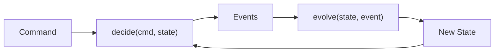

# Chapter 2 — Your First Aggregate: Product

> **What you'll learn:**
> - What the Decider pattern is and why it keeps domain logic pure
> - How to model commands, events, and state as Java sealed interfaces and records
> - How to implement a `Decider` for the `Product` aggregate
> - How to test every decision path with `DeciderFixture` using a TDD workflow
> - How to wire the `ProductDecider` into a `VirtualThreadCommandBus` and expose it over HTTP

---

## What We're Building and Why

In chapter 1 we wired up the project skeleton and verified that the event store schema was created. The application starts, but it does nothing useful — there are no aggregates, no commands, and no events. This chapter changes that.

We are going to implement the `Product` aggregate from scratch. By the end you will be able to `POST` a product to a REST endpoint, have it flow through the `CommandBus` to a `Decider`, get persisted as an event in PostgreSQL, and read it back via a query controller.

Before writing any code, let us understand the pattern that makes this possible.

### The Decider Pattern

A **Decider** is a pure function — actually a pair of pure functions — that sits at the heart of the write side:

- **`initialState()`** — returns the zero value of the aggregate state before any events have been applied. No parameters, no side effects.
- **`decide(command, state) → List<Event>`** — given the current state and the incoming command, either returns a list of new events or throws a `DomainException` if the command is not valid in the current state. No database calls, no network I/O.
- **`evolve(state, event) → State`** — given the current state and one event, returns the next state. Called once per event when replaying the stream to rebuild current state.

That is the entire write-side contract. The `CommandBus` handles loading the aggregate stream from the `EventStore`, calling `evolve` on each past event to reconstruct state, calling `decide` with the incoming command to get new events, and appending those events back to the store. Your domain logic never touches the database.

This separation has a practical benefit that will become obvious in the next section: because `decide` and `evolve` are pure functions with no external dependencies, they are trivially testable. You pass in a state and a command, you get back events. No mocks, no Spring context, no database.

---

## The Decider Flow



The `CommandBus` drives this loop. On the first command for a new aggregate stream, `state` is whatever `initialState()` returns. On subsequent commands, `state` is reconstructed by replaying the full event history through `evolve`.

---

## Domain Model

We need four building blocks before we can write the `Decider`: a `Money` value object, a `ProductStatus` enum, the `ProductCommand` sealed interface, the `ProductEvent` sealed interface, and the `ProductState` record.

### Money

`Money` belongs to the `domain/common/` package because it will be shared across aggregates later (orders and payments both use it).

Create `domain/src/main/java/org/streamrune/ecommerce/domain/common/Money.java`:

```java
package org.streamrune.ecommerce.domain.common;

import java.math.BigDecimal;

public record Money(BigDecimal amount, String currency) {
    public static Money usd(BigDecimal amount) {
        return new Money(amount, "USD");
    }

    public Money add(Money other) {
        return new Money(this.amount.add(other.amount), this.currency);
    }

    public Money multiply(int quantity) {
        return new Money(this.amount.multiply(BigDecimal.valueOf(quantity)), this.currency);
    }
}
```

Using a record here is deliberate: records are immutable by default, they generate `equals`, `hashCode`, and `toString` for free, and they communicate "this is a value, not an entity" to every reader of the code.

### ProductStatus

Create `domain/src/main/java/org/streamrune/ecommerce/domain/product/ProductStatus.java`:

```java
package org.streamrune.ecommerce.domain.product;

public enum ProductStatus {
    AVAILABLE,
    LOW_STOCK,
    OUT_OF_STOCK,
    DISCONTINUED
}
```

The status is derived automatically from the stock level when events are applied. You never set it directly from a command — that is the `evolve` function's job.

### ProductCommand

Commands express *intent*. Each command is a record — an immutable data carrier — nested inside a sealed interface. The `sealed` keyword forces the compiler to verify that every `switch` expression on `ProductCommand` covers all cases. If you add a command later and forget to update a `switch`, the build fails. That is exactly the kind of feedback you want from a type system. The interface extends `Command`, the marker interface from `streamrune-core`: `Decider`, `DeciderFixture` and the command bus accept only types that implement it, so a command root without it fails to compile at the first decider.

Create `domain/src/main/java/org/streamrune/ecommerce/domain/product/ProductCommand.java`:

```java
package org.streamrune.ecommerce.domain.product;

import org.streamrune.core.Command;
import org.streamrune.ecommerce.domain.common.Money;

public sealed interface ProductCommand extends Command {
    record CreateProduct(
        String productId,
        String name,
        String description,
        String category,
        Money price,
        int initialStock)
        implements ProductCommand {}

    record UpdatePrice(String productId, Money newPrice)
        implements ProductCommand {}

    record AdjustStock(String productId, int quantityChange, String reason)
        implements ProductCommand {}

    record DiscontinueProduct(String productId) implements ProductCommand {}
}
```

> Notice there are no validation annotations here. Commands at this stage are plain data. We will add `@NotBlank`, `@NotNull`, `@PositiveOrZero`, and role-based access control in chapter 3 (validation) and chapter 9 (authorisation).

### ProductEvent

Events are facts — things that *have already happened*. Like commands, they live in a sealed interface so the compiler knows the exhaustive set. Events implement `DomainEvent`, the marker interface from `streamrune-core` that the `EventStore` requires.

Create `domain/src/main/java/org/streamrune/ecommerce/domain/product/ProductEvent.java`:

```java
package org.streamrune.ecommerce.domain.product;

import org.streamrune.core.DomainEvent;
import org.streamrune.ecommerce.domain.common.Money;

public sealed interface ProductEvent extends DomainEvent {
    record ProductCreated(
        String productId, String name, String description, String category, Money price, int stock)
        implements ProductEvent {}

    record PriceUpdated(String productId, Money previousPrice, Money newPrice)
        implements ProductEvent {}

    record StockAdjusted(String productId, int previousStock, int newStock, String reason)
        implements ProductEvent {}

    record ProductDiscontinued(String productId) implements ProductEvent {}
}
```

Observe that `PriceUpdated` carries *both* the previous and the new price. Storing the before-value in the event is a common event-sourcing practice: it means projections and audit logs never need to look up the prior state from another source.

Similarly, `StockAdjusted` carries `previousStock` and `newStock` rather than just a delta. Either representation is valid; the absolute values make projections simpler to write.

### ProductState

State is the in-memory snapshot of the aggregate after replaying all events. It is a record, not a JPA entity — it never touches the database directly.

Create `domain/src/main/java/org/streamrune/ecommerce/domain/product/ProductState.java`:

```java
package org.streamrune.ecommerce.domain.product;

import org.streamrune.core.AggregateState;
import org.streamrune.core.types.AggregateType;
import org.streamrune.ecommerce.domain.common.Money;

public record ProductState(
    String productId,
    String name,
    String description,
    String category,
    Money price,
    int stock,
    ProductStatus status)
    implements AggregateState {

    /** The aggregate type the product decider is registered under: streams are product:<productId>. */
    public static final AggregateType TYPE = AggregateType.of("product");

    private static final int LOW_STOCK_THRESHOLD = 10;

    public ProductState() {
        this(null, null, null, null, null, 0, ProductStatus.AVAILABLE);
    }

    public static ProductStatus statusForStock(int stock) {
        if (stock <= 0) return ProductStatus.OUT_OF_STOCK;
        if (stock < LOW_STOCK_THRESHOLD) return ProductStatus.LOW_STOCK;
        return ProductStatus.AVAILABLE;
    }
}
```

The no-arg constructor is what `initialState()` will delegate to. `statusForStock` is a pure helper used by `evolve` to derive the status from any stock level — centralising that logic so it cannot drift out of sync between events.

---

## Step by Step

Now we have the domain model. Let us build the `Decider` using a test-driven workflow: write a failing test, run it, implement just enough to make it pass, repeat.

### Step 1 — Add the test-kit dependency

Open `commands/build.gradle.kts` and add the StreamRune test-kit to the test classpath:

```kotlin
dependencies {
    val sr = libs.versions.streamrune.get()
    implementation(project(":domain"))
    implementation("org.streamrune:streamrune-core:$sr")
    implementation(libs.jackson.databind)

    testImplementation("org.streamrune:streamrune-test:$sr")
    testImplementation(libs.assertj.core)
}
```

`streamrune-test` provides `DeciderFixture`, a lightweight test helper that drives the given/when/then cycle without any Spring context. We use the `libs.*` version-catalog accessors (defined in `gradle/libs.versions.toml`) rather than hardcoded versions, matching the rest of the project. There is no explicit JUnit dependency here: the root `build.gradle.kts` `subprojects` block already puts the JUnit BOM, `junit-jupiter`, and `junit-platform-launcher` on every module's test classpath.

### Step 2 — Create the test class

Create `commands/src/test/java/org/streamrune/ecommerce/commands/product/ProductDeciderTest.java`:

```java
package org.streamrune.ecommerce.commands.product;

import static org.assertj.core.api.Assertions.assertThat;

import org.junit.jupiter.api.Test;
import org.streamrune.core.DomainException;
import org.streamrune.ecommerce.domain.common.Money;
import org.streamrune.ecommerce.domain.product.*;
import org.streamrune.test.DeciderFixture;

class ProductDeciderTest {

    private final DeciderFixture<ProductCommand, ProductState, ProductEvent> fixture =
        DeciderFixture.of(new ProductDecider());

    @Test
    void createProduct_emitsProductCreated() {
        fixture
            .given()
            .when(new ProductCommand.CreateProduct(
                "p-1", "Widget", "A widget", "Electronics",
                new Money(java.math.BigDecimal.valueOf(19.99), "USD"), 100))
            .expectEvents(new ProductEvent.ProductCreated(
                "p-1", "Widget", "A widget", "Electronics",
                new Money(java.math.BigDecimal.valueOf(19.99), "USD"), 100))
            .expectState(s -> {
                assertThat(s.status()).isEqualTo(ProductStatus.AVAILABLE);
                assertThat(s.stock()).isEqualTo(100);
            });
    }
}
```

Run it now — it will not compile because `ProductDecider` does not exist yet:

```bash
./gradlew :commands:test --tests "*.ProductDeciderTest"
```

Expected output: compilation error (`ProductDecider` not found). Good. That is the red phase.

### Step 3 — Create the ProductDecider skeleton

Create `commands/src/main/java/org/streamrune/ecommerce/commands/product/ProductDecider.java`:

```java
package org.streamrune.ecommerce.commands.product;

import java.util.List;
import org.streamrune.core.Decider;
import org.streamrune.core.DomainException;
import org.streamrune.ecommerce.domain.product.*;

public class ProductDecider implements Decider<ProductCommand, ProductState, ProductEvent> {

    @Override
    public ProductState initialState() {
        return new ProductState();
    }

    @Override
    public List<ProductEvent> decide(ProductCommand cmd, ProductState state) {
        return switch (cmd) {
            case ProductCommand.CreateProduct c ->
                List.of(new ProductEvent.ProductCreated(
                    c.productId(), c.name(), c.description(), c.category(),
                    c.price(), c.initialStock()));

            case ProductCommand.UpdatePrice c ->
                List.of(new ProductEvent.PriceUpdated(c.productId(), state.price(), c.newPrice()));

            case ProductCommand.AdjustStock c -> {
                int newStock = state.stock() + c.quantityChange();
                if (newStock < 0)
                    throw new DomainException("Insufficient stock for product: " + c.productId());
                yield List.of(new ProductEvent.StockAdjusted(
                    c.productId(), state.stock(), newStock, c.reason()));
            }

            case ProductCommand.DiscontinueProduct c -> {
                if (state.status() == ProductStatus.DISCONTINUED)
                    throw new DomainException("Product already discontinued: " + c.productId());
                yield List.of(new ProductEvent.ProductDiscontinued(c.productId()));
            }
        };
    }

    @Override
    public ProductState evolve(ProductState state, ProductEvent evt) {
        return switch (evt) {
            case ProductEvent.ProductCreated e ->
                new ProductState(
                    e.productId(), e.name(), e.description(), e.category(),
                    e.price(), e.stock(), ProductState.statusForStock(e.stock()));

            case ProductEvent.PriceUpdated e ->
                new ProductState(
                    state.productId(), state.name(), state.description(), state.category(),
                    e.newPrice(), state.stock(), state.status());

            case ProductEvent.StockAdjusted e ->
                new ProductState(
                    state.productId(), state.name(), state.description(), state.category(),
                    state.price(), e.newStock(), ProductState.statusForStock(e.newStock()));

            case ProductEvent.ProductDiscontinued e ->
                new ProductState(
                    state.productId(), state.name(), state.description(), state.category(),
                    state.price(), state.stock(), ProductStatus.DISCONTINUED);
        };
    }
}
```

Run the test again:

```bash
./gradlew :commands:test --tests "*.ProductDeciderTest"
```

It should pass now. Green phase.

### Step 4 — Add the remaining tests

Expand `ProductDeciderTest` with tests for every business rule. Add these test methods alongside `createProduct_emitsProductCreated`:

```java
@Test
void createProduct_lowStock() {
    fixture
        .given()
        .when(new ProductCommand.CreateProduct(
            "p-1", "Widget", null, null,
            new Money(java.math.BigDecimal.TEN, "USD"), 5))
        .expectState(s -> assertThat(s.status()).isEqualTo(ProductStatus.LOW_STOCK));
}

@Test
void createProduct_outOfStock() {
    fixture
        .given()
        .when(new ProductCommand.CreateProduct(
            "p-1", "Widget", null, null,
            new Money(java.math.BigDecimal.TEN, "USD"), 0))
        .expectState(s -> assertThat(s.status()).isEqualTo(ProductStatus.OUT_OF_STOCK));
}

@Test
void adjustStock_reducesStock() {
    fixture
        .given(new ProductEvent.ProductCreated(
            "p-1", "Widget", null, null,
            new Money(java.math.BigDecimal.TEN, "USD"), 100))
        .when(new ProductCommand.AdjustStock("p-1", -30, "Sold"))
        .expectEvents(new ProductEvent.StockAdjusted("p-1", 100, 70, "Sold"))
        .expectState(s -> assertThat(s.stock()).isEqualTo(70));
}

@Test
void adjustStock_insufficientStock_throws() {
    fixture
        .given(new ProductEvent.ProductCreated(
            "p-1", "Widget", null, null,
            new Money(java.math.BigDecimal.TEN, "USD"), 5))
        .when(new ProductCommand.AdjustStock("p-1", -10, "Oversold"))
        .expectException(DomainException.class);
}

@Test
void adjustStock_triggersLowStockStatus() {
    fixture
        .given(new ProductEvent.ProductCreated(
            "p-1", "Widget", null, null,
            new Money(java.math.BigDecimal.TEN, "USD"), 15))
        .when(new ProductCommand.AdjustStock("p-1", -10, "Sale"))
        .expectState(s -> assertThat(s.status()).isEqualTo(ProductStatus.LOW_STOCK));
}

@Test
void updatePrice() {
    var oldPrice = new Money(java.math.BigDecimal.TEN, "USD");
    var newPrice = new Money(java.math.BigDecimal.valueOf(25), "USD");
    fixture
        .given(new ProductEvent.ProductCreated("p-1", "Widget", null, null, oldPrice, 50))
        .when(new ProductCommand.UpdatePrice("p-1", newPrice))
        .expectEvents(new ProductEvent.PriceUpdated("p-1", oldPrice, newPrice));
}

@Test
void discontinueProduct() {
    fixture
        .given(new ProductEvent.ProductCreated(
            "p-1", "Widget", null, null,
            new Money(java.math.BigDecimal.TEN, "USD"), 50))
        .when(new ProductCommand.DiscontinueProduct("p-1"))
        .expectEvents(new ProductEvent.ProductDiscontinued("p-1"))
        .expectState(s -> assertThat(s.status()).isEqualTo(ProductStatus.DISCONTINUED));
}

@Test
void discontinueProduct_alreadyDiscontinued_throws() {
    fixture
        .given(
            new ProductEvent.ProductCreated(
                "p-1", "Widget", null, null,
                new Money(java.math.BigDecimal.TEN, "USD"), 50),
            new ProductEvent.ProductDiscontinued("p-1"))
        .when(new ProductCommand.DiscontinueProduct("p-1"))
        .expectException(DomainException.class);
}
```

Run the full test class:

```bash
./gradlew :commands:test --tests "*.ProductDeciderTest"
```

All eight tests should pass. Notice the `DeciderFixture` API:

- `.given()` — no prior events; this is a brand-new aggregate.
- `.given(event1, event2, ...)` — pre-load the aggregate with past events. `evolve` is called for each one before the command is processed.
- `.when(command)` — the command under test.
- `.expectEvents(event1, ...)` — asserts the exact events emitted by `decide`.
- `.expectState(consumer)` — runs assertions on the final state after `evolve` has been applied to every emitted event.
- `.expectException(type)` — asserts that `decide` throws the given exception type.

There are no Spring mocks, no Mockito, no in-memory databases. The entire aggregate lifecycle — load, decide, evolve — is exercised in a few milliseconds per test.

### Step 5 — Wire the event type registry

The `EventStore` serialises events to JSON and needs to map between the wire type name and the Java class. StreamRune's Spring auto-configuration picks this up automatically: expose an `EventTypeRegistry` bean and the `postgresEventStoreFactory` auto-config builds and wires the `EventStore` for you, along with any `EventUpcaster` and `CryptoEngine` beans you declare later (chapters 4 and 6).

You already created `spring-app/src/main/java/org/streamrune/ecommerce/spring/config/StreamRuneConfig.java` in chapter 1 (Step 7c) with the `legacyObjectMapper` bean. **Add the two beans below to that existing file** — do not overwrite it, because the `legacyObjectMapper` bean is still needed (later chapters wire beans that inject a Jackson 2.x `ObjectMapper` by type). The complete file at this point looks like:

```java
package org.streamrune.ecommerce.spring.config;

import com.fasterxml.jackson.databind.ObjectMapper;
import com.fasterxml.jackson.databind.json.JsonMapper;
import org.springframework.context.annotation.Bean;
import org.springframework.context.annotation.Configuration;
import org.streamrune.core.EventStore;
import org.streamrune.core.EventTypeRegistry;
import org.streamrune.core.SimpleEventTypeRegistry;
import org.streamrune.core.types.AggregateId;
import org.streamrune.runtime.VirtualThreadCommandBus;
import org.streamrune.ecommerce.domain.product.ProductCommand;
import org.streamrune.ecommerce.domain.product.ProductEvent;
import org.streamrune.ecommerce.domain.product.ProductState;
import org.streamrune.ecommerce.commands.product.ProductDecider;

@Configuration(proxyBeanMethods = false)
public class StreamRuneConfig {

    // From chapter 1: Spring Boot 4.0 auto-configures Jackson 3.x. StreamRune
    // still uses Jackson 2.x, so we expose the legacy ObjectMapper explicitly.
    @Bean
    public ObjectMapper legacyObjectMapper() {
        return JsonMapper.builder().build();
    }

    /**
     * Exposes the event type registry for the auto-configured event store to pick
     * up. Later chapters add more event types here as each aggregate is introduced.
     * The full demo registers 21 event types across all aggregates.
     */
    @Bean
    public EventTypeRegistry eventTypeRegistry() {
        return SimpleEventTypeRegistry.builder()
            .registerEvent("ProductCreated", ProductEvent.ProductCreated.class)
            .registerEvent("PriceUpdated",   ProductEvent.PriceUpdated.class)
            .registerEvent("StockAdjusted",  ProductEvent.StockAdjusted.class)
            .registerEvent("ProductDiscontinued", ProductEvent.ProductDiscontinued.class)
            .build();
    }

    @Bean
    public VirtualThreadCommandBus commandBus(EventStore store) {
        return VirtualThreadCommandBus.builder()
            .eventStore(store)
            .register(
                ProductState.TYPE,
                ProductCommand.class,
                cmd ->
                    AggregateId.of(
                        switch (cmd) {
                          case ProductCommand.CreateProduct c -> c.productId();
                          case ProductCommand.UpdatePrice c -> c.productId();
                          case ProductCommand.AdjustStock c -> c.productId();
                          case ProductCommand.DiscontinueProduct c -> c.productId();
                        }),
                new ProductDecider())
            .build();
    }
}
```

Three things worth noting here:

1. `SimpleEventTypeRegistry` maps the string name used in the JSON payload (e.g. `"ProductCreated"`) to the Java class used for deserialisation. These names become part of your persisted data — choose them deliberately, because renaming them later requires an event upcaster (covered in chapter 4).

2. The `EventStore` bean itself is **not** declared here. The `streamrune-spring` auto-configuration provides a `postgresEventStoreFactory` that discovers the `EventTypeRegistry` bean (via `ObjectProvider`) and constructs the `PostgresEventStore` automatically. It also discovers any `EventUpcaster` and `CryptoEngine` beans you declare in later chapters. The same factory created the schema on the application's first start (`streamrune.event-store.schema.auto-initialize: true` in `application.yml`, Chapter 1), so the tables this bean writes to are already there.

3. The first argument to `.register(...)` on the command bus is the aggregate type — `ProductState.TYPE`, the name `product`: the stream a product's events live in is `product:p-1`. It is stored as two columns, `aggregate_type` and `aggregate_id`, and is permanent — renaming the type renames every stream. The second argument is the command root, the third the *aggregate ID extractor* — a function that extracts the aggregate ID from any subtype of `ProductCommand`. StreamRune uses this to load the correct event stream from the store before calling `decide`. The `switch` expression is exhaustive because `ProductCommand` is sealed. The extractor returns a typed `AggregateId`, built with `AggregateId.of(...)`. That factory is where a client-supplied id is checked: it throws `IllegalArgumentException` for a blank id, for one longer than 255 characters, or for one containing a control character (C0 `U+0000`–`U+001F` such as CR, LF, TAB and NUL, DEL `U+007F`, or C1 `U+0080`–`U+009F`). The aggregate id is stored verbatim in the `aggregate_id` column, beside the type, and in the audit and dead-letter rows, where a CR/LF would forge a line and a NUL would fail the PostgreSQL write. Those `aggregate_id` columns are `VARCHAR(255)`, so the length check turns an over-long id into a `400` rather than a failed SQL insert. A prefix added to an id counts toward the 255, as the fulfillment saga's `"fulfillment-"` will for an order id in chapter 8. The check runs inside the bus before any interceptor, so nothing is written, and the `IllegalArgumentException` handler from chapter 1 answers `400 Bad Request`. Keep the request fields as `String`s and let `AggregateId.of` build the id. The `AggregateId` constructor skips the control-character and length checks; it is meant for ids rebuilt from stored data (you will use it in the saga in chapter 11).

### Step 6 — Add the command controller

Create `spring-app/src/main/java/org/streamrune/ecommerce/spring/controller/ProductCommandController.java`:

```java
package org.streamrune.ecommerce.spring.controller;

import jakarta.validation.Valid;
import jakarta.validation.constraints.NotBlank;
import jakarta.validation.constraints.NotNull;
import jakarta.validation.constraints.Positive;
import java.math.BigDecimal;
import org.springframework.http.ResponseEntity;
import org.springframework.web.bind.annotation.*;
import org.streamrune.ecommerce.domain.common.Money;
import org.streamrune.ecommerce.domain.product.ProductCommand;
import org.streamrune.runtime.VirtualThreadCommandBus;

@RestController
@RequestMapping("/api/products")
public class ProductCommandController {

    private final VirtualThreadCommandBus commandBus;

    public ProductCommandController(VirtualThreadCommandBus commandBus) {
        this.commandBus = commandBus;
    }

    @PostMapping
    public ResponseEntity<Void> createProduct(@Valid @RequestBody CreateProductRequest req) {
        commandBus.execute(new ProductCommand.CreateProduct(
            req.productId(), req.name(), req.description(), req.category(),
            new Money(req.price(), "USD"), req.initialStock()));
        return ResponseEntity.ok().build();
    }

    @PutMapping("/{id}/stock")
    public ResponseEntity<Void> adjustStock(
        @PathVariable String id, @Valid @RequestBody AdjustStockRequest req) {
        commandBus.execute(new ProductCommand.AdjustStock(id, req.quantity(), req.reason()));
        return ResponseEntity.ok().build();
    }

    @PutMapping("/{id}/price")
    public ResponseEntity<Void> updatePrice(
        @PathVariable String id, @Valid @RequestBody UpdatePriceRequest req) {
        commandBus.execute(new ProductCommand.UpdatePrice(id, new Money(req.price(), "USD")));
        return ResponseEntity.ok().build();
    }

    @PostMapping("/{id}/discontinue")
    public ResponseEntity<Void> discontinueProduct(@PathVariable String id) {
        commandBus.execute(new ProductCommand.DiscontinueProduct(id));
        return ResponseEntity.ok().build();
    }

    public record CreateProductRequest(
        @NotBlank String productId,
        @NotBlank String name,
        String description,
        String category,
        @NotNull @Positive BigDecimal price,
        int initialStock) {}

    public record AdjustStockRequest(int quantity, String reason) {}

    public record UpdatePriceRequest(@NotNull @Positive BigDecimal price) {}
}
```

> `@Valid` on the method parameter triggers Spring MVC's built-in validation before the request body is even mapped to a command. The `@NotBlank`, `@NotNull`, and `@Positive` constraints on the request records match the real demo's controller — a null price or blank product ID is rejected with `400 Bad Request` before it ever reaches the `CommandBus`. These controller-level constraints are an interim measure: in chapter 3 we add field-level `@NotBlank`/`@NotNull`/`@PositiveOrZero` annotations directly on the `ProductCommand` records, enforced by a `BeanValidationInterceptor` so the rules hold no matter how a command is dispatched (not just over HTTP).

### Step 7 — Add the query controller

The query controller reads from a `ProductProjection` — a read model we will build properly in chapter 5. For now, add a minimal stub so the list endpoint compiles and returns an empty array.

Create `spring-app/src/main/java/org/streamrune/ecommerce/spring/controller/ProductQueryController.java`:

```java
package org.streamrune.ecommerce.spring.controller;

import java.util.List;
import org.springframework.http.ResponseEntity;
import org.springframework.web.bind.annotation.*;

@RestController
@RequestMapping("/api/products")
public class ProductQueryController {

    @GetMapping
    public List<Object> listProducts() {
        return List.of();
    }

    @GetMapping("/{id}")
    public ResponseEntity<Object> getProduct(@PathVariable String id) {
        return ResponseEntity.notFound().build();
    }
}
```

> We return `List<Object>` and a 404 stub here intentionally. Chapter 5 replaces this with a real projection-backed implementation. The stub lets us verify the full command path works before building the read side.

### Step 8 — Run and verify

Start the application:

```bash
./gradlew :spring-app:bootRun
```

Wait for the startup banner, then create a product:

```bash
curl -X POST http://localhost:8080/api/products \
  -H 'Content-Type: application/json' \
  -d '{"productId":"p-1","name":"Widget","description":"A fine widget","category":"Gadgets","price":29.99,"initialStock":100}'
```

A `200 OK` response with an empty body means the command was accepted, the `ProductDecider` ran, a `ProductCreated` event was emitted, and the event was appended to the PostgreSQL event store.

Confirm the event was persisted:

```bash
docker exec -it streamrune-pg psql -U postgres -d streamrune_ecommerce \
  -c "SELECT aggregate_type, aggregate_id, event_type, version FROM event_stream ORDER BY global_offset;"
```

You should see one row: `product | p-1 | ProductCreated | 1`. (`version` is the per-stream sequence number, and `global_offset` is the store-wide ordering column — those are the actual columns on the `event_stream` table.)

Query the product list (returns an empty array until chapter 5):

```bash
curl http://localhost:8080/api/products
```

---

## What We Learned

- **The Decider pattern** consists of three pure functions: `initialState()`, `decide(command, state) → events`, and `evolve(state, event) → state`. No side effects enter the domain layer.
- **Sealed interfaces** for commands and events make `switch` expressions exhaustive — the compiler tells you when you miss a case.
- **Records** are ideal for commands, events, and state: immutable, with value equality and zero boilerplate.
- **`DeciderFixture`** provides a given/when/then test harness that exercises the full aggregate lifecycle — load, decide, evolve — without any infrastructure dependencies.
- **`SimpleEventTypeRegistry`** maps string event type names to Java classes, decoupling the serialisation wire format from the class hierarchy. Expose it as an `EventTypeRegistry` bean and StreamRune's Spring auto-configuration builds the `EventStore` from it — no explicit `PostgresEventStore` bean needed.
- **`VirtualThreadCommandBus`** routes commands to the correct `Decider`, manages the load/decide/persist cycle, and runs each command on a virtual thread — so the application handles thousands of concurrent commands without thread pool exhaustion.
- **Stream ID extractor** is the switch expression that maps any command subtype to its aggregate ID, telling the `CommandBus` which event stream to load.

---

## Next Up

Our `Product` aggregate works, but it accepts any input — a blank name, a negative price, an empty product ID. Next, we will add validation so that `@NotBlank`, `@NotNull`, and `@PositiveOrZero` constraints are enforced automatically by a `BeanValidationInterceptor` before the command ever reaches the `Decider`.
