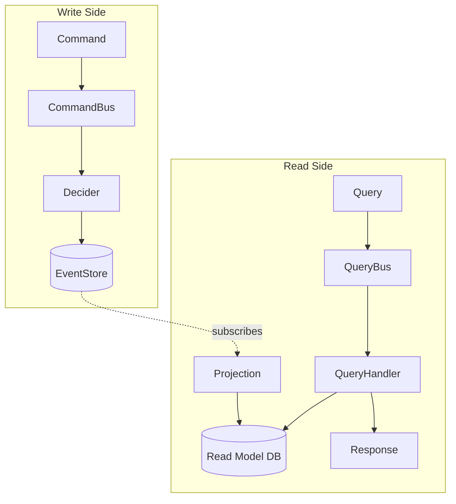

# Chapter 5 — Projections & QueryBus

> **What you'll learn:**
> - What CQRS means in practice and why separate read and write models pay off
> - How `BaseProjection` subscribes to the event stream and builds a denormalized view
> - How `ProjectionRepository` persists those views in PostgreSQL with upsert semantics
> - How to dispatch read queries through a `QueryBus` and implement a `QueryHandler`
> - How `CachingQueryBus` transparently caches responses using `@Cacheable` and `CacheInvalidator`

---

## What We're Building and Why

After four chapters the write side is solid: commands flow through a `CommandBus` to a `Decider`, events are persisted in the event store, and upcast events survive schema evolution. But the query controller we created in chapter 2 still returns an empty list. Every `GET /api/products` goes straight to the event store, reconstructing state from scratch. That is fine for a single aggregate, but it is the wrong pattern for queries that need to filter, sort, or join across many aggregates.

The solution is **CQRS — Command Query Responsibility Segregation**. The write side owns the canonical source of truth: the event stream. The read side maintains one or more *projections* — denormalized, query-optimized views built by subscribing to those same events. When a `ProductCreated` event lands in the event store, the projection updates a `products` table. When the query controller receives `GET /api/products`, it reads from that table, not from the event stream.

The benefits are tangible:

- **Performance.** A read model is pre-computed. No stream replay on every HTTP request.
- **Flexibility.** You can have many projections — one for listing, one for search, one for admin — all built from the same events without changing the Decider.
- **Resilience.** The read side can be rebuilt from scratch by replaying the event history. No data is ever lost.

The **QueryBus** is to the read side what the `CommandBus` is to the write side: a routing mechanism. It decouples the controller from the projection implementation, and it is the right place to insert cross-cutting concerns like caching and auditing. We add caching in this chapter; auditing comes in chapter 10.

---

## CQRS Architecture



The dotted arrow is the key: the projection subscribes to the event store and reacts every time new events arrive. The write and read sides are fully independent — changing the Decider does not break the query controller, and adding a new projection does not touch the domain layer.

---

## Step by Step

### Step 1 — Create the `ProductView` DTO

`ProductView` is the data that leaves the read side: a flat record containing everything the UI needs to display a product. It lives in the `queries` module because it is part of the query contract, not the domain model.

Create `queries/src/main/java/org/streamrune/ecommerce/queries/dto/ProductView.java`:

```java
package org.streamrune.ecommerce.queries.dto;

import java.time.Instant;
import org.streamrune.ecommerce.domain.common.Money;
import org.streamrune.ecommerce.domain.product.ProductStatus;

public record ProductView(
    String productId,
    String name,
    String description,
    String category,
    Money price,
    int stock,
    ProductStatus status,
    Instant createdAt,
    Instant updatedAt) {}
```

Note that `status` is denormalized here. The projection derives it from the stock level (or marks it `DISCONTINUED`) so the controller never needs to recompute it.

### Step 2 — Create the `ListProducts` query

A query is a plain record — an immutable description of what data the caller wants.

Create `queries/src/main/java/org/streamrune/ecommerce/queries/query/ListProducts.java`:

```java
package org.streamrune.ecommerce.queries.query;

import org.streamrune.core.Cacheable;
import org.streamrune.ecommerce.domain.product.ProductEvent;

@Cacheable(
    ttlSeconds = 60,
    invalidateOn = {
      ProductEvent.ProductCreated.class, ProductEvent.PriceUpdated.class,
      ProductEvent.StockAdjusted.class, ProductEvent.ProductDiscontinued.class
    })
public record ListProducts()
    implements org.streamrune.core.Query<java.util.List<org.streamrune.ecommerce.queries.dto.ProductView>> {}
```

The record implements the framework's `Query<R>` marker, where `R` is the result type the query resolves to — here `List<ProductView>`. This is what makes the `QueryBus` type-safe: `register(ListProducts.class, ...)` binds the handler's return type to `List<ProductView>` at compile time, and `dispatch(new ListProducts())` returns `List<ProductView>` with no cast at the call site. (`ListProducts` carries no fields, so it uses the fully-qualified type names inline rather than adding imports.)

The `@Cacheable` annotation is picked up automatically by `CachingQueryBus`. It says: cache the result of `ListProducts` for 60 seconds, and invalidate the cache whenever any of those four event types is written to the store. You do not need to write any cache management code — the bus handles it.

### Step 3 — Create `ProductProjection`

`ProductProjection` extends `BaseProjection`, which wires it to a `ProjectionRepository` and gives it the `save`, `findById` and `delete` helpers. All you implement is `process(List<EventEnvelope>)` — the method called by the runtime each time a batch of new events arrives. Inside `process`, read and write only through these helpers: when the runner commits a batch and its checkpoint in one transaction, the helpers work inside that transaction, while the inherited `repository` field is the plain repository outside it. Use the field for the query methods a projection offers its read side, like `listAll()` below.

Create `projections/src/main/java/org/streamrune/ecommerce/projections/ProductProjection.java`:

```java
package org.streamrune.ecommerce.projections;

import java.util.List;
import org.streamrune.core.EventEnvelope;
import org.streamrune.core.projection.BaseProjection;
import org.streamrune.core.projection.ProjectionDeliveryMode;
import org.streamrune.core.projection.ProjectionRepository;
import org.streamrune.ecommerce.domain.product.*;
import org.streamrune.ecommerce.queries.dto.ProductView;

@org.streamrune.core.ProjectionConfig(
    name = "products",
    deliveryMode = ProjectionDeliveryMode.TRANSACTIONAL_LOCAL)
public class ProductProjection extends BaseProjection {

    public ProductProjection(ProjectionRepository repository) {
        super(repository, "products");
    }

    @Override
    public void process(List<EventEnvelope> events) {
        for (var envelope : events) {
            if (envelope.event() instanceof ProductEvent evt) {
                switch (evt) {
                    case ProductEvent.ProductCreated e ->
                        save(
                            e.productId(),
                            new ProductView(
                                e.productId(),
                                e.name(),
                                e.description(),
                                e.category(),
                                e.price(),
                                e.stock(),
                                ProductState.statusForStock(e.stock()),
                                envelope.metadata().timestamp(),
                                envelope.metadata().timestamp()));
                    case ProductEvent.PriceUpdated e ->
                        findById(e.productId(), ProductView.class)
                            .ifPresent(
                                existing ->
                                    save(
                                        e.productId(),
                                        new ProductView(
                                            existing.productId(),
                                            existing.name(),
                                            existing.description(),
                                            existing.category(),
                                            e.newPrice(),
                                            existing.stock(),
                                            existing.status(),
                                            existing.createdAt(),
                                            envelope.metadata().timestamp())));
                    case ProductEvent.StockAdjusted e ->
                        findById(e.productId(), ProductView.class)
                            .ifPresent(
                                existing ->
                                    save(
                                        e.productId(),
                                        new ProductView(
                                            existing.productId(),
                                            existing.name(),
                                            existing.description(),
                                            existing.category(),
                                            existing.price(),
                                            e.newStock(),
                                            ProductState.statusForStock(e.newStock()),
                                            existing.createdAt(),
                                            envelope.metadata().timestamp())));
                    case ProductEvent.ProductDiscontinued e ->
                        findById(e.productId(), ProductView.class)
                            .ifPresent(
                                existing ->
                                    save(
                                        e.productId(),
                                        new ProductView(
                                            existing.productId(),
                                            existing.name(),
                                            existing.description(),
                                            existing.category(),
                                            existing.price(),
                                            existing.stock(),
                                            ProductStatus.DISCONTINUED,
                                            existing.createdAt(),
                                            envelope.metadata().timestamp())));
                }
            }
        }
    }

    public ProductView get(String productId) {
        return findById(productId, ProductView.class).orElse(null);
    }

    public List<ProductView> listAll() {
        return repository.findAll(projectionName(), ProductView.class);
    }
}
```

A few things to notice:

- `ProductCreated` constructs the view from scratch, using `envelope.metadata().timestamp()` for both `createdAt` and `updatedAt`.
- `PriceUpdated`, `StockAdjusted`, and `ProductDiscontinued` use `findById` to load the existing view and replace only the fields that changed. The `ifPresent` guard is intentional: if somehow an event arrives for an unknown product, the projection ignores it rather than crashing.
- `ProductState.statusForStock` is the same helper used by the Decider — one source of truth for how stock level maps to status.
- The name `"products"` is passed to `super(repository, "products")`, and `projectionName()` returns it. All projections in this demo use explicit lowercase-plural names: `JdbcProjectionRepository` stores each name in a table of its own (`products_view`) and accepts only lower-case snake_case names (`[a-z_][a-z0-9_]{0,57}`), and the explicit name keeps the read model's name equal to the name the projection is registered under. (Without an explicit name, `BaseProjection` derives one from the class name in snake_case: `ProductProjection` would save under `product`.)
- `@ProjectionConfig(name = "products", deliveryMode = TRANSACTIONAL_LOCAL)` is read by the framework's annotation-driven auto-discovery (the Quarkus and Micronaut apps discover their projections this way, through small `Discoverable*` subclasses that carry the same annotation). The Spring app registers projections explicitly and sets `streamrune.projections.auto-discovery.enabled: false` in `application.yml`, so here only the `deliveryMode` matters, as documentation of what this projection promises — the same value is passed to `register(...)` when you wire the runner at the end of this chapter (see [Delivery modes — what you are promising](#delivery-modes--what-you-are-promising)).

### Step 4 — Register the beans

Open `spring-app/src/main/java/org/streamrune/ecommerce/spring/config/StreamRuneConfig.java` and add the following beans. The new types in this chapter come from four artifacts; add these imports to the top of the file (alongside the ones from chapters 2 and 4):

```java
import org.streamrune.core.QueryBus;
import org.streamrune.core.projection.OffsetStore;
import org.streamrune.core.projection.ProjectionDeliveryMode;
import org.streamrune.core.projection.ProjectionRepository;
import org.streamrune.postgres.JdbcProjectionRepository;
import org.streamrune.postgres.PostgresOffsetStore;
import org.streamrune.runtime.CacheAwareProjection;
import org.streamrune.runtime.CacheInvalidator;
import org.streamrune.runtime.CachingQueryBus;
import org.streamrune.runtime.MultiProjectionRunner;
import org.streamrune.runtime.SimpleQueryBus;
import org.streamrune.ecommerce.projections.ProductProjection;
import org.streamrune.ecommerce.queries.query.ListProducts;
```

First, the projection repository — a single shared instance backed by JDBC:

```java
@Bean
public JdbcProjectionRepository projectionRepository(DataSource ds) {
    return new JdbcProjectionRepository(ds);
}
```

Declare it by its **concrete type**. The same object plays two roles: every projection writes through it (`ProjectionRepository`), and the runner commits each batch with it (`AtomicBatchProcessor` — it runs the read-model write and the checkpoint in one transaction). The runner you wire at the end of this chapter takes it as its processor, and startup verifies that each `TRANSACTIONAL_LOCAL` projection writes to exactly this store. Bean proxies are fine — the check compares what the repository writes to, not the Java reference.

Then the `ProductProjection` bean, injecting the repository:

```java
@Bean
public ProductProjection productProjection(ProjectionRepository repo) {
    return new ProductProjection(repo);
}
```

The `ProjectionRepository` is shared across all projections; each projection uses a distinct namespace derived from its class name, so there is no collision.

### Step 5 — Wire the QueryBus and register the handler

The `QueryBus` is split into two beans. First, a named `cachingQueryBus` bean that holds handler registrations and honours `@Cacheable`. Second, a `queryBus` bean that controllers inject — it will be upgraded to an `AuditingQueryBus` in Chapter 10. For now the outer bean simply delegates to the caching bus.

Add to `StreamRuneConfig`:

```java
@Bean
public CachingQueryBus cachingQueryBus(ProductProjection productProjection) {
    var simpleQueryBus = new SimpleQueryBus();
    var cachingBus = CachingQueryBus.builder().delegate(simpleQueryBus).build();
    cachingBus.register(ListProducts.class, (ListProducts q) -> productProjection.listAll());
    return cachingBus;
}

@Bean
public QueryBus queryBus(CachingQueryBus cachingQueryBus) {
    // Chapter 10 will replace this with: new AuditingQueryBus(cachingQueryBus, auditStore)
    return cachingQueryBus;
}
```

A few things to notice:

- The handler is registered on `cachingQueryBus`, not on the outer wrapper. This means handler registrations survive intact when Chapter 10 replaces the outer `queryBus` — no re-registration needed.
- `cachingBus.register(...)` delegates down to `SimpleQueryBus`, so dispatched queries flow `QueryBus → CachingQueryBus → SimpleQueryBus → handler`.
- `CachingQueryBus` inspects the `@Cacheable` annotation on the query class at dispatch time using a memoized annotation lookup — zero reflection on the hot path after the first call.
- `cachingBus.cacheInvalidator()` returns a `CacheInvalidator` bean that gets wired into `MultiProjectionRunner` (Step 7 below) so the cache is flushed on every relevant event.

> **Two-bean pattern:** Keeping `cachingQueryBus` as a named typed bean makes Chapter 10 a one-line change — replace the `queryBus` body with `new AuditingQueryBus(cachingQueryBus, auditStore)`. The `CachingQueryBus` and all its registrations are untouched.

Also add a dedicated `CacheInvalidator` bean immediately after the `queryBus` bean — `MultiProjectionRunner` will inject it by type:

```java
@Bean
public CacheInvalidator cacheInvalidator(CachingQueryBus cachingQueryBus) {
    return cachingQueryBus.cacheInvalidator();
}
```

And add the `OffsetStore` bean — this records each projection's read position in PostgreSQL so a restart resumes from where it left off:

```java
@Bean
public OffsetStore offsetStore(DataSource ds) {
    return new PostgresOffsetStore(ds);
}
```

`PostgresOffsetStore` writes a row per projection name in the `projection_offset` table, which the framework's baseline created alongside `event_stream` on the application's first start (Chapter 1, Step 8). Each `MultiProjectionRunner` projection advances its own offset independently, so a slow projection does not block the others.

### Step 6 — Update `ProductQueryController`

Replace the stub controller from chapter 2 with the real implementation. It dispatches the `ListProducts` query through the `QueryBus` and keeps the by-id read direct against the projection (no caching benefit for single-item lookups):

```java
package org.streamrune.ecommerce.spring.controller;

import java.util.List;
import org.springframework.http.ResponseEntity;
import org.springframework.web.bind.annotation.*;
import org.streamrune.core.QueryBus;
import org.streamrune.ecommerce.projections.ProductProjection;
import org.streamrune.ecommerce.queries.dto.ProductView;
import org.streamrune.ecommerce.queries.query.ListProducts;

@RestController
@RequestMapping("/api/products")
public class ProductQueryController {

    private final ProductProjection productProjection;
    private final QueryBus queryBus;

    public ProductQueryController(ProductProjection productProjection, QueryBus queryBus) {
        this.productProjection = productProjection;
        this.queryBus = queryBus;
    }

    @GetMapping("/{id}")
    public ResponseEntity<ProductView> getProduct(@PathVariable String id) {
        ProductView product = productProjection.get(id);
        return product != null ? ResponseEntity.ok(product) : ResponseEntity.notFound().build();
    }

    @GetMapping
    public List<ProductView> listProducts() {
        return queryBus.dispatch(new ListProducts());
    }
}
```

`queryBus.dispatch(new ListProducts())` returns the cached list when the cache is warm and a `ProductCreated` / `PriceUpdated` / `StockAdjusted` / `ProductDiscontinued` event has not invalidated it; otherwise it routes to the registered handler, which calls `productProjection.listAll()`.

### Step 7 — Run and verify

Start the PostgreSQL container (if it is not already up), then run the application:

```bash
docker start streamrune-pg   # if the container exists but is stopped
# or, if starting from scratch, see Chapter 1 Step 5 for the full `docker run` command
./gradlew :spring-app:bootRun
```

Create two products. If your database still holds `p-1` from chapter 2, the first request answers `400 Product already exists: p-1` — the decider's creation guard — and that is fine: the product is in the event store, and the new projection reads the stream from its first event, so it lists `p-1` either way.

```bash
curl -X POST http://localhost:8080/api/products \
  -H 'Content-Type: application/json' \
  -d '{"productId":"p-1","name":"Widget","description":"A fine widget","category":"Gadgets","price":29.99,"initialStock":100}'

curl -X POST http://localhost:8080/api/products \
  -H 'Content-Type: application/json' \
  -d '{"productId":"p-2","name":"Gizmo","description":"A handy gizmo","category":"Gadgets","price":14.99,"initialStock":5}'
```

List them:

```bash
curl http://localhost:8080/api/products
```

You should receive a JSON array that holds both products (and any other product you created in earlier chapters, such as `p-valid` from chapter 3). `p-2` has `"status":"LOW_STOCK"` because its initial stock of 5 is below the threshold.

Fetch a single product:

```bash
curl http://localhost:8080/api/products/p-1
```

Now update the price and verify the projection reflects it:

```bash
curl -X PUT http://localhost:8080/api/products/p-1/price \
  -H 'Content-Type: application/json' \
  -d '{"price":34.99}'

curl http://localhost:8080/api/products/p-1
```

The `price.amount` field should now be `34.99` and `updatedAt` should be later than `createdAt`.

Finally, verify the read model was persisted in PostgreSQL:

```bash
docker exec streamrune-pg psql -U postgres -d streamrune_ecommerce \
  -c "SELECT id, data->>'name', data->>'status' FROM products_view;"
```

(`streamrune-pg` is the container name set in Chapter 1 Step 5. The table is `products_view` — `JdbcProjectionRepository` derives the table name by appending `_view` to the projection name (`"products"`). The JSONB column is `data`; `->>` extracts a field as text.)

You should see two rows, one per product.

---

## What We Learned

- **`BaseProjection`** provides the `save`, `findById` and `delete` helpers and derives the projection's storage namespace from the class name. You extend it and implement `process(List<EventEnvelope>)`, writing only through the helpers.
- **`ProjectionRepository`** is the persistence abstraction. The default implementation is `JdbcProjectionRepository`, which stores views as JSONB in PostgreSQL. Register it once as a Spring bean, by its concrete type, because the runner also uses it as its batch processor; all projections share the same instance.
- **`QueryBus`** and **`QueryHandler`** form the read-side routing layer, mirroring `CommandBus` and `Decider` on the write side. `SimpleQueryBus` is the in-process implementation: register handlers at startup with `register(Class, QueryHandler)`, then dispatch queries at runtime with `dispatch(query)`.
- **`CachingQueryBus`** is a decorator that wraps any `QueryBus`. It caches responses for query types annotated with `@Cacheable` using Caffeine, with TTL and maximum entry count configured by the annotation.
- **`@Cacheable`** declares caching policy directly on the query record. The `ttlSeconds` attribute controls expiry; `invalidateOn` lists the event types that should flush the cache when they are written to the store. A `scope` attribute (default `Scope.USER`) also partitions cache entries per calling user so one user's results are never served to another; `ListProducts` is an anonymous list endpoint, so it relies on the default and serves a single shared partition — switch to `Scope.GLOBAL` only when you are sure the result is identical for every caller.
- **`CacheInvalidator`** is obtained from the `CachingQueryBus` and wired into the event pipeline. When the event store emits a batch of new events, `CacheAwareProjection` calls `invalidator.onEventsProcessed(batch)`, which checks each event type against every registered `@Cacheable.invalidateOn` list and evicts matching caches.
- The **decoration order** matters: `CachingQueryBus → SimpleQueryBus` in this chapter. In chapter 10 it becomes `AuditingQueryBus → CachingQueryBus → SimpleQueryBus` — the audit bus wraps the caching bus, so cache hits are never logged (only uncached dispatches hit the handler and get audited). Each decorator is independently testable.

### How all projections are wired together: `MultiProjectionRunner`

Rather than creating a separate `ContinuousProjectionRunner` bean for each projection, the demo uses a single `MultiProjectionRunner` that manages all projections as a group.

**At this point in the tutorial only `ProductProjection` exists.** Wire the runner with just that projection now. You will expand it in later chapters as new projections are created — `CustomerProjection` (Ch06), `OrderProjection` (Ch08), `InventoryProjection` (Ch13).

Add to `StreamRuneConfig`:

```java
@Bean(destroyMethod = "close")
public MultiProjectionRunner projectionRunner(
    EventStore eventStore,
    OffsetStore offsetStore,
    JdbcProjectionRepository projectionRepository,
    ProductProjection productProjection,
    CacheInvalidator cacheInvalidator) {

  var runner =
      MultiProjectionRunner.builder()
          .eventStore(eventStore)
          .offsetStore(offsetStore)
          // Each TRANSACTIONAL_LOCAL registration commits its read-model write and its
          // checkpoint in ONE transaction, through the repository bean from Step 4.
          .atomicProcessor(projectionRepository)
          .register(
              "products",
              new CacheAwareProjection(productProjection, cacheInvalidator),
              ProjectionDeliveryMode.TRANSACTIONAL_LOCAL)
          // Ch06: .register("customers", new CacheAwareProjection(customerProjection, cacheInvalidator), ProjectionDeliveryMode.TRANSACTIONAL_LOCAL)
          // Ch08: .register("orders",    new CacheAwareProjection(orderProjection,    cacheInvalidator), ProjectionDeliveryMode.TRANSACTIONAL_LOCAL)
          // Ch13: .register("inventory", new CacheAwareProjection(inventoryProjection, cacheInvalidator), ProjectionDeliveryMode.TRANSACTIONAL_LOCAL)
          .build();
  runner.start();
  return runner;
}
```

Each projection is wrapped in a `CacheAwareProjection` decorator that calls `invalidator.onEventsProcessed(batch)` after every successful batch, keeping the `CachingQueryBus` cache in sync with the read model. The `MultiProjectionRunner` assigns each projection its own virtual thread and its own offset namespace in `PostgresOffsetStore`, so they advance independently and a slow projection does not block the others. Spring destroys the runner (calling `close()`) on application shutdown via `destroyMethod = "close"`: each internal thread is interrupted at once, which cuts its sleeps and reads short but never a batch being committed — that batch finishes and records its checkpoint first — and the runner waits up to 30 seconds per thread for it to exit.

### Delivery modes — what you are promising

Every `register(...)` call names a `ProjectionDeliveryMode`, and there is no default: the right value depends on where the projection writes. The runner checks each declaration against its processor when it is built, before it reads an event, and refuses with an `IllegalArgumentException` that names the projection, the mode and the fix — for example when a `TRANSACTIONAL_LOCAL` projection writes to a repository other than the one passed to `.atomicProcessor(...)`.

| mode | what the framework guarantees | what the projection promises | typical write target |
|---|---|---|---|
| `TRANSACTIONAL_LOCAL` | the batch's read-model writes and the checkpoint are all-or-nothing; a redelivered or split-brain batch is rejected before any write | writes only through the handed repository during `process` | `JdbcProjectionRepository` (`<name>_view` tables) in the framework's database |
| `AT_LEAST_ONCE_IDEMPOTENT` | the checkpoint advances only after `process` returned; a crash or a rejected checkpoint redelivers the batch from the last checkpoint; the projection is never handed a transaction-scoped repository | applying the same event twice yields the same read model | anything: another `DataSource`, JPA, Redis, memory — or the framework's own `JdbcProjectionRepository`, written autocommit through the projection's captured reference |
| `EXTERNAL_EFFECT` | as `TRANSACTIONAL_LOCAL`, for the outbox row | no external call in `process`; the receiver dedups by event id | an outbox row through the handed repository, relayed later by the application's relay |

**An at-least-once projection is never handed the checkpoint transaction** — the runner passes `null` to `process(batch, repository)`, so its writes go where it sends them. **No mode makes an external effect exactly-once** — an HTTP call, a Kafka produce or an e-mail inside `process` is at-least-once under every mode and belongs behind the outbox (Chapter 13). The four PostgreSQL read models in this demo are `TRANSACTIONAL_LOCAL`; the in-memory `AuditProjection` of Chapter 10 is `AT_LEAST_ONCE_IDEMPOTENT`.

---

## Next Up

Our products are working. Time to add customers — and learn about encrypting personal data.
