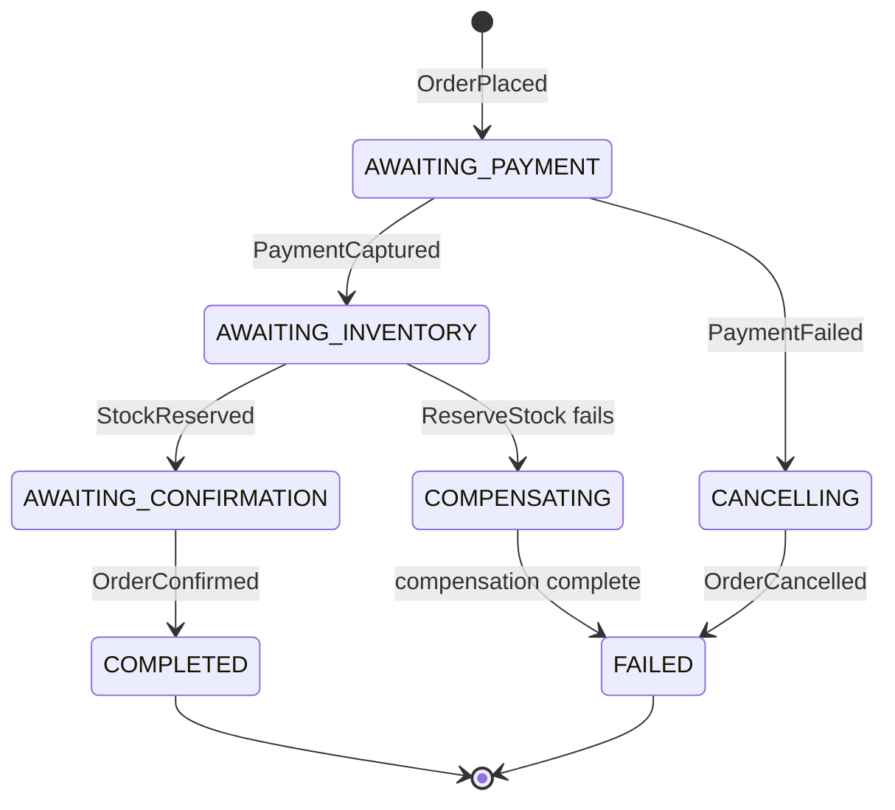

# Chapter 11 — Payment Aggregate & Saga

> **What you'll learn:**
> - What a saga is and why multi-aggregate coordination requires one
> - How to model a `Payment` aggregate with `PaymentCommand`, `PaymentEvent`, `PaymentState`, and `PaymentDecider`
> - How `SagaOrchestrator` separates business process logic from aggregate logic
> - How `OrderFulfillmentSaga` drives payment, inventory, and order confirmation in sequence
> - How `compensate()` issues step-appropriate refund, release, and cancel commands when a step fails
> - How `PostgresSagaStore`, `SagaRunner`, and `SagaStatus` wire the process into the running application
> - How the saga survives poison events, redelivered commands, and concurrent writers: `SagaDeadLetterStore`, the command inbox, and optimistic-concurrency CAS

---

## What We're Building and Why

Most domain operations touch a single aggregate: place an order, update a price, register a customer. A single command reaches a single stream, produces events, and the world moves on. Payment fulfillment is different. It coordinates three aggregates in order: the payment must be captured before stock is reserved, and stock must be reserved before the order is confirmed. If any step fails, all earlier steps must be undone. You cannot wrap this in a database transaction — each aggregate lives in its own stream, and the gateway is external.

This is the problem sagas solve.

A **saga** is a sequence of steps that span multiple aggregates, where each step is a command and each transition is triggered by an event. When a step fails, the saga issues compensating commands to undo whatever succeeded. The saga itself is stateful: it knows which step it is on and what information it needs to proceed or to compensate.

The order fulfillment flow the saga drives — what its `evolve()`/`handle()`/`compensate()` code reacts to, and what the assembled demo actually runs end-to-end — follows five steps:

1. `OrderPlaced` arrives — the saga starts, issues `InitiatePayment`
2. `PaymentCaptured` arrives — saga advances and issues `ReserveStock` against the inventory aggregate (Chapter 13)
3. `StockReserved` arrives — saga issues `ConfirmOrder`
4. `OrderConfirmed` arrives — saga completes (`COMPLETED`)
5. Any failure — on `PaymentFailed` the saga moves to a non-terminal `CANCELLING` step, dispatches `CancelOrder`, and `OrderCancelled` then closes it out to `FAILED` (a terminal `evolve()` would end the saga before `handle()` ever ran, so the cancel needs that intermediate step — see [Step 3](#step-3--implement-orderfulfillmentsaga)); if a later step's command throws, `compensate()` issues exactly the undo commands that step needs: cancel only before payment is captured, refund + cancel once payment is captured but stock isn't reserved, and release + refund + cancel once stock is held too



This chapter builds the `Payment` aggregate, the `OrderFulfillmentSaga`, and the `PaymentProcessManager` that drives the capture leg. The `Inventory` aggregate arrives in Chapter 13; the saga issues `ReserveStock` against it, and once that aggregate and its events are registered the inventory leg runs end-to-end too.

> **What makes the saga complete in the assembled demo.** When you place an order end-to-end, the saga does not stall — it runs all the way to `COMPLETED`. Two pieces make that work:
>
> - **`SagaRunner` binds the saga id as the request correlation id** when it dispatches each saga command. Every event those commands produce (`PaymentInitiated`, `PaymentCaptured`, `StockReserved`, `OrderConfirmed`) therefore carries the saga's `fulfillment-<orderId>` correlation id, so `OrderFulfillmentSaga.correlate()` routes the event straight back to the right saga instance. This correlation plumbing was the missing link that previously left the saga waiting in `AWAITING_PAYMENT`.
> - **A `PaymentProcessManager` drives the capture leg.** It is an `EventListener` (fed by its own `PollingEventSubscription`) that reacts to `PaymentInitiated`, calls `PaymentGatewaySimulator.processPayment(...)`, and dispatches `CapturePayment` when the gateway succeeds or `FailPayment` when the gateway fails — under the incoming event's correlation id, so the resulting event correlates back to the saga. A command it cannot dispatch is delivered again, never turned into a failed payment.
>
> You build the `PaymentProcessManager` in Step 5b and wire it in Step 6. Chapter 12 then wraps its gateway call in a circuit breaker.

---

## Domain Model: Payment Types

The payment domain is clean and focused. A payment moves through four statuses: `PENDING` after initiation, `CAPTURED` after the gateway confirms it, `REFUNDED` if a saga compensation refunds it, and `FAILED` if the gateway rejects it.

### PaymentStatus

Create `domain/src/main/java/org/streamrune/ecommerce/domain/payment/PaymentStatus.java`:

```java
package org.streamrune.ecommerce.domain.payment;

public enum PaymentStatus {
  PENDING,
  CAPTURED,
  REFUNDED,
  FAILED
}
```

### PaymentCommand

Create `domain/src/main/java/org/streamrune/ecommerce/domain/payment/PaymentCommand.java`:

```java
package org.streamrune.ecommerce.domain.payment;

import org.streamrune.core.Command;
import org.streamrune.ecommerce.domain.common.Money;

public sealed interface PaymentCommand extends Command {
  record InitiatePayment(String paymentId, String orderId, Money amount)
      implements PaymentCommand {}

  record CapturePayment(String paymentId) implements PaymentCommand {}

  record RefundPayment(String paymentId, String reason) implements PaymentCommand {}

  record FailPayment(String paymentId, String reason) implements PaymentCommand {}
}
```

`InitiatePayment` carries the full amount so the `PaymentDecider` can record it in state without needing to look up the order. `RefundPayment` and `FailPayment` both carry a `reason` so the event stream explains what happened — important for audit and projection consumers.

### PaymentEvent

Create `domain/src/main/java/org/streamrune/ecommerce/domain/payment/PaymentEvent.java`:

```java
package org.streamrune.ecommerce.domain.payment;

import org.streamrune.core.DomainEvent;
import org.streamrune.ecommerce.domain.common.Money;

public sealed interface PaymentEvent extends DomainEvent {
  record PaymentInitiated(String paymentId, String orderId, Money amount) implements PaymentEvent {}

  record PaymentCaptured(String paymentId, String orderId) implements PaymentEvent {}

  record PaymentRefunded(String paymentId, String reason) implements PaymentEvent {}

  record PaymentFailed(String paymentId, String reason) implements PaymentEvent {}
}
```

`PaymentCaptured` carries `orderId` so consumers — including the saga — can correlate the event back to the order without querying state.

### PaymentState

Create `domain/src/main/java/org/streamrune/ecommerce/domain/payment/PaymentState.java`:

```java
package org.streamrune.ecommerce.domain.payment;

import org.streamrune.core.AggregateState;
import org.streamrune.core.types.AggregateType;
import org.streamrune.ecommerce.domain.common.Money;

public record PaymentState(String paymentId, String orderId, Money amount, PaymentStatus status)
    implements AggregateState {
  /**
   * The aggregate type the payment decider is registered under: streams are payment:<paymentId>.
   */
  public static final AggregateType TYPE = AggregateType.of("payment");

  public PaymentState() {
    this(null, null, null, PaymentStatus.PENDING);
  }
}
```

The no-arg constructor initialises status to `PENDING`. StreamRune calls this constructor to create a blank state before replaying the event stream for an aggregate that has never been seen before. `TYPE` is the aggregate type the payment decider registers under (Step 6); a payment's stream is `payment:<paymentId>`.

---

## Step by Step

### Step 1 — Test and implement PaymentDecider

Start with the test. Create `commands/src/test/java/org/streamrune/ecommerce/commands/payment/PaymentDeciderTest.java`:

```java
package org.streamrune.ecommerce.commands.payment;

import static org.assertj.core.api.Assertions.assertThat;

import java.math.BigDecimal;
import org.junit.jupiter.api.Test;
import org.streamrune.core.DomainException;
import org.streamrune.ecommerce.domain.common.Money;
import org.streamrune.ecommerce.domain.payment.*;
import org.streamrune.test.DeciderFixture;

class PaymentDeciderTest {

  private final DeciderFixture<PaymentCommand, PaymentState, PaymentEvent> fixture =
      DeciderFixture.of(new PaymentDecider());

  private static final Money HUNDRED = new Money(BigDecimal.valueOf(100), "USD");

  private PaymentEvent.PaymentInitiated initiated() {
    return new PaymentEvent.PaymentInitiated("pay-1", "o-1", HUNDRED);
  }

  @Test
  void initiatePayment() {
    fixture
        .given()
        .when(new PaymentCommand.InitiatePayment("pay-1", "o-1", HUNDRED))
        .expectEvents(initiated())
        .expectState(s -> assertThat(s.status()).isEqualTo(PaymentStatus.PENDING));
  }

  @Test
  void capturePayment() {
    fixture
        .given(initiated())
        .when(new PaymentCommand.CapturePayment("pay-1"))
        .expectEvents(new PaymentEvent.PaymentCaptured("pay-1", "o-1"))
        .expectState(s -> assertThat(s.status()).isEqualTo(PaymentStatus.CAPTURED));
  }

  @Test
  void capturePayment_notPending_throws() {
    fixture
        .given(initiated(), new PaymentEvent.PaymentCaptured("pay-1", "o-1"))
        .when(new PaymentCommand.CapturePayment("pay-1"))
        .expectException(DomainException.class);
  }

  @Test
  void refundPayment_fromCaptured() {
    fixture
        .given(initiated(), new PaymentEvent.PaymentCaptured("pay-1", "o-1"))
        .when(new PaymentCommand.RefundPayment("pay-1", "Saga compensation"))
        .expectEvents(new PaymentEvent.PaymentRefunded("pay-1", "Saga compensation"))
        .expectState(s -> assertThat(s.status()).isEqualTo(PaymentStatus.REFUNDED));
  }

  @Test
  void failPayment() {
    fixture
        .given(initiated())
        .when(new PaymentCommand.FailPayment("pay-1", "Gateway timeout"))
        .expectEvents(new PaymentEvent.PaymentFailed("pay-1", "Gateway timeout"))
        .expectState(s -> assertThat(s.status()).isEqualTo(PaymentStatus.FAILED));
  }
}
```

Run the tests — they will fail. Now write the implementation. Create `commands/src/main/java/org/streamrune/ecommerce/commands/payment/PaymentDecider.java`:

```java
package org.streamrune.ecommerce.commands.payment;

import java.util.List;
import org.streamrune.core.Decider;
import org.streamrune.core.DomainException;
import org.streamrune.ecommerce.domain.payment.*;

public class PaymentDecider implements Decider<PaymentCommand, PaymentState, PaymentEvent> {

  @Override
  public PaymentState initialState() {
    return new PaymentState();
  }

  @Override
  public List<PaymentEvent> decide(PaymentCommand cmd, PaymentState state) {
    return switch (cmd) {
      case PaymentCommand.InitiatePayment c ->
          List.of(new PaymentEvent.PaymentInitiated(c.paymentId(), c.orderId(), c.amount()));

      case PaymentCommand.CapturePayment c -> {
        if (state.status() != PaymentStatus.PENDING)
          throw new DomainException("Can only capture PENDING payments");
        yield List.of(new PaymentEvent.PaymentCaptured(c.paymentId(), state.orderId()));
      }

      case PaymentCommand.RefundPayment c -> {
        if (state.status() != PaymentStatus.CAPTURED)
          throw new DomainException("Can only refund CAPTURED payments");
        yield List.of(new PaymentEvent.PaymentRefunded(c.paymentId(), c.reason()));
      }

      case PaymentCommand.FailPayment c -> {
        if (state.status() != PaymentStatus.PENDING)
          throw new DomainException("Can only fail PENDING payments");
        yield List.of(new PaymentEvent.PaymentFailed(c.paymentId(), c.reason()));
      }
    };
  }

  @Override
  public PaymentState evolve(PaymentState state, PaymentEvent evt) {
    return switch (evt) {
      case PaymentEvent.PaymentInitiated e ->
          new PaymentState(e.paymentId(), e.orderId(), e.amount(), PaymentStatus.PENDING);
      case PaymentEvent.PaymentCaptured e ->
          new PaymentState(
              state.paymentId(), state.orderId(), state.amount(), PaymentStatus.CAPTURED);
      case PaymentEvent.PaymentRefunded e ->
          new PaymentState(
              state.paymentId(), state.orderId(), state.amount(), PaymentStatus.REFUNDED);
      case PaymentEvent.PaymentFailed e ->
          new PaymentState(
              state.paymentId(), state.orderId(), state.amount(), PaymentStatus.FAILED);
    };
  }
}
```

The `decide()` method enforces state invariants: you cannot capture a payment that is already captured, you cannot refund one that was never captured, and you cannot fail one that has already moved on. The `evolve()` method is a pure function — no branches beyond the exhaustive sealed-interface pattern match.

Run the tests again: all five should pass.

### Step 2 — Saga state types

The saga needs its own status enum separate from `PaymentStatus`. Add `OrderFulfillmentStatus` to the domain module so both commands and domain code can reference it. Create `domain/src/main/java/org/streamrune/ecommerce/domain/saga/OrderFulfillmentStatus.java`:

```java
package org.streamrune.ecommerce.domain.saga;

public enum OrderFulfillmentStatus {
  AWAITING_PAYMENT,
  AWAITING_INVENTORY,
  AWAITING_CONFIRMATION,
  // Non-terminal intermediate: PaymentFailed evolves here (not directly to FAILED) so the
  // framework's SagaRunner still calls handle() — a terminal evolve short-circuits handle,
  // which would make the CancelOrder dispatch unreachable. See OrderFulfillmentSaga.
  CANCELLING,
  COMPLETED,
  COMPENSATING,
  FAILED
}
```

Now create the saga state record. Create `commands/src/main/java/org/streamrune/ecommerce/commands/saga/OrderFulfillmentState.java`:

```java
package org.streamrune.ecommerce.commands.saga;

import com.fasterxml.jackson.annotation.JsonCreator;
import com.fasterxml.jackson.annotation.JsonProperty;
import java.util.List;
import org.streamrune.core.saga.SagaId;
import org.streamrune.core.saga.SagaState;
import org.streamrune.core.saga.SagaStatus;
import org.streamrune.ecommerce.domain.common.Money;
import org.streamrune.ecommerce.domain.order.OrderEvent;
import org.streamrune.ecommerce.domain.saga.OrderFulfillmentStatus;

public record OrderFulfillmentState(
    SagaId sagaId,
    String orderId,
    String customerId,
    String paymentId,
    Money orderTotal,
    List<OrderEvent.OrderLine> lines,
    OrderFulfillmentStatus fulfillmentStatus)
    implements SagaState {

  @JsonCreator
  public OrderFulfillmentState(
      @JsonProperty("sagaId") SagaId sagaId,
      @JsonProperty("orderId") String orderId,
      @JsonProperty("customerId") String customerId,
      @JsonProperty("paymentId") String paymentId,
      @JsonProperty("orderTotal") Money orderTotal,
      @JsonProperty("lines") List<OrderEvent.OrderLine> lines,
      @JsonProperty("fulfillmentStatus") OrderFulfillmentStatus fulfillmentStatus) {
    this.sagaId = sagaId;
    this.orderId = orderId;
    this.customerId = customerId;
    this.paymentId = paymentId;
    this.orderTotal = orderTotal;
    this.lines = lines == null ? List.of() : List.copyOf(lines);
    this.fulfillmentStatus = fulfillmentStatus;
  }

  @Override
  public SagaStatus status() {
    return switch (fulfillmentStatus) {
      case COMPLETED -> SagaStatus.COMPLETED;
      case FAILED -> SagaStatus.FAILED;
      case COMPENSATING -> SagaStatus.COMPENSATING;
      case AWAITING_PAYMENT -> SagaStatus.STARTED;
      // CANCELLING is intentionally non-terminal (SagaStatus.RUNNING): the framework's
      // SagaRunner skips handle() once evolve() reaches a terminal status, so PaymentFailed
      // must land here first to let handle() dispatch CancelOrder before the saga ends.
      default -> SagaStatus.RUNNING;
    };
  }
}
```

The `@JsonCreator` / `@JsonProperty` annotations are required because `PostgresSagaStore` serialises saga state to JSON. Java records do not have a no-arg constructor, so Jackson needs explicit constructor mapping. The state carries the order `lines` so that when payment is captured the saga knows which product and quantity to reserve — it does not need to re-load the order aggregate. The constructor copies the list defensively and treats `null` as empty so a saga that has not yet seen `OrderPlaced` still has a usable (empty) line list. The `status()` method translates domain-specific `OrderFulfillmentStatus` values to the framework's `SagaStatus` enum on the forward path (a fresh, non-terminal `state.status()` is what gets persisted alongside a successful `handle()`); once a saga reaches a framework-classified outcome — `COMPENSATED`, `FAILED` via compensation, or `FAULTED` via poison-event quarantine — the *stored* status can diverge from what this method would compute, which is exactly why `SagaRunner` and `LoadedSaga` treat the store's persisted status, not this method, as authoritative (see [What We Learned](#what-we-learned)).

### Step 3 — Implement OrderFulfillmentSaga

Create `commands/src/main/java/org/streamrune/ecommerce/commands/saga/OrderFulfillmentSaga.java`:

```java
package org.streamrune.ecommerce.commands.saga;

import java.util.ArrayList;
import java.util.List;
import java.util.Optional;
import org.streamrune.core.EventEnvelope;
import org.streamrune.core.saga.SagaCommand;
import org.streamrune.core.saga.SagaId;
import org.streamrune.core.saga.SagaOrchestrator;
import org.streamrune.core.types.AggregateId;
import org.streamrune.ecommerce.domain.inventory.InventoryCommand;
import org.streamrune.ecommerce.domain.inventory.InventoryEvent;
import org.streamrune.ecommerce.domain.order.OrderCommand;
import org.streamrune.ecommerce.domain.order.OrderEvent;
import org.streamrune.ecommerce.domain.payment.PaymentCommand;
import org.streamrune.ecommerce.domain.payment.PaymentEvent;
import org.streamrune.ecommerce.domain.saga.OrderFulfillmentStatus;

/**
 * OrderFulfillment saga: OrderPlaced → InitiatePayment → PaymentCaptured → ReserveStock →
 * StockReserved → ConfirmOrder → COMPLETED.
 *
 * <p>On PaymentFailed → CANCELLING → CancelOrder → OrderCancelled → FAILED. The CANCELLING step is
 * a non-terminal intermediate (not a direct evolve to FAILED): {@code SagaRunner} skips {@link
 * #handle} once {@code evolve} reaches a terminal {@code SagaStatus}, so a final command can only
 * be dispatched from a state that is still running. Compensation is step-appropriate: a pre-payment
 * failure → CancelOrder only; a post-payment, pre-reservation failure → RefundPayment +
 * CancelOrder; a post-reservation failure → ReleaseStock + RefundPayment + CancelOrder (see {@link
 * #compensate}).
 *
 * <p>Correlation: every command this saga dispatches is executed by {@code SagaRunner} with the
 * saga id ({@code "fulfillment-<orderId>"}) bound as the request correlation id, so the resulting
 * events ({@code PaymentInitiated}, {@code PaymentCaptured}, {@code StockReserved}, {@code
 * OrderConfirmed}) carry that correlation id and {@link #correlate} routes them back here. A {@code
 * SagaId} holds 255 characters at most, so {@code OrderCommand.PlaceOrder} refuses an order id
 * longer than 255 minus the prefix ({@code SAGA_ID_PREFIX}, which this class uses to build and to
 * match the id) when the order is placed; an order id that got past it would make {@link
 * #extractSagaId} throw on {@code OrderPlaced}, and the order would stay {@code CREATED} with no
 * saga.
 *
 * <p>The capture leg is driven by a payment process manager (in the runtime app), which reacts to
 * {@code PaymentInitiated} by calling the payment gateway and dispatching {@code CapturePayment}
 * (success) or {@code FailPayment} (failure).
 *
 * <p>Command targets are built with the {@code AggregateId} constructor, never {@code
 * AggregateId.of}. Every target comes from the saga's stored state — the order, payment and product
 * ids recorded from {@code OrderPlaced} — so it is data already in the log, and the constructor is
 * the decode door for it. {@code AggregateId.of} is the ingress factory: it refuses a control
 * character or an id longer than 255 characters, so inside {@link #handle} or {@link #compensate}
 * it would make the framework quarantine the event as poison (payment captured, never refunded).
 * The order endpoints never record such a product id: {@code OrderCommand.OrderLine} refuses one
 * that carries a control character, or is longer than 255 characters, when the order is placed, so
 * the client gets a {@code 400} and nothing is written. Built with the constructor, the command
 * still reaches the bus, whose id extractor applies {@code AggregateId.of}: a product id that
 * reached the log without crossing that check (an {@code OrderPlaced} event an application appended
 * itself, say) is refused there with an {@code IllegalArgumentException}, and the framework
 * compensates the step (refund + cancel).
 *
 * <p>A saga command's target is only an id: the bus resolves the aggregate type from the command's
 * registration. {@code ReserveStock} and {@code ReleaseStock} are registered under {@code
 * inventory}, so the stock streams are {@code inventory:<productId>} — the product id is the
 * inventory id, with no hand-made prefix.
 */
public class OrderFulfillmentSaga implements SagaOrchestrator<OrderFulfillmentState> {

  @Override
  public Class<OrderFulfillmentState> stateType() {
    return OrderFulfillmentState.class;
  }

  @Override
  public OrderFulfillmentState initialState(SagaId sagaId) {
    return new OrderFulfillmentState(
        sagaId, null, null, null, null, List.of(), OrderFulfillmentStatus.AWAITING_PAYMENT);
  }

  @Override
  public boolean isStartEvent(EventEnvelope event) {
    return event.event() instanceof OrderEvent.OrderPlaced;
  }

  @Override
  public SagaId extractSagaId(EventEnvelope event) {
    if (event.event() instanceof OrderEvent.OrderPlaced placed) {
      return new SagaId(OrderCommand.PlaceOrder.SAGA_ID_PREFIX + placed.orderId());
    }
    throw new IllegalArgumentException("Not a start event: " + event.eventType().name());
  }

  @Override
  public Optional<SagaId> correlate(EventEnvelope event) {
    var corrId = event.metadata().correlationId();
    if (corrId != null && corrId.value().startsWith(OrderCommand.PlaceOrder.SAGA_ID_PREFIX)) {
      return Optional.of(new SagaId(corrId.value()));
    }
    return Optional.empty();
  }

  @Override
  public OrderFulfillmentState evolve(OrderFulfillmentState state, EventEnvelope event) {
    Object evt = event.event();
    return switch (evt) {
      case OrderEvent.OrderPlaced e ->
          new OrderFulfillmentState(
              state.sagaId(),
              e.orderId(),
              e.customerId(),
              "pay-" + e.orderId(),
              e.total(),
              e.lines(),
              OrderFulfillmentStatus.AWAITING_PAYMENT);

      case PaymentEvent.PaymentCaptured e ->
          new OrderFulfillmentState(
              state.sagaId(),
              state.orderId(),
              state.customerId(),
              state.paymentId(),
              state.orderTotal(),
              state.lines(),
              OrderFulfillmentStatus.AWAITING_INVENTORY);

      // PaymentFailed lands on the non-terminal CANCELLING (not directly on FAILED): the
      // framework's SagaRunner skips handle() once evolve() reaches a terminal SagaStatus, which
      // would make the CancelOrder dispatch below unreachable. CANCELLING keeps the saga RUNNING
      // long enough for handle() to emit CancelOrder; OrderCancelled then closes it out to FAILED.
      case PaymentEvent.PaymentFailed e ->
          new OrderFulfillmentState(
              state.sagaId(),
              state.orderId(),
              state.customerId(),
              state.paymentId(),
              state.orderTotal(),
              state.lines(),
              OrderFulfillmentStatus.CANCELLING);

      case OrderEvent.OrderCancelled e ->
          state.fulfillmentStatus() == OrderFulfillmentStatus.CANCELLING
              ? new OrderFulfillmentState(
                  state.sagaId(),
                  state.orderId(),
                  state.customerId(),
                  state.paymentId(),
                  state.orderTotal(),
                  state.lines(),
                  OrderFulfillmentStatus.FAILED)
              : state;

      case InventoryEvent.StockReserved e ->
          state.fulfillmentStatus() == OrderFulfillmentStatus.AWAITING_INVENTORY
              ? new OrderFulfillmentState(
                  state.sagaId(),
                  state.orderId(),
                  state.customerId(),
                  state.paymentId(),
                  state.orderTotal(),
                  state.lines(),
                  OrderFulfillmentStatus.AWAITING_CONFIRMATION)
              : state;

      case OrderEvent.OrderConfirmed e ->
          new OrderFulfillmentState(
              state.sagaId(),
              state.orderId(),
              state.customerId(),
              state.paymentId(),
              state.orderTotal(),
              state.lines(),
              OrderFulfillmentStatus.COMPLETED);

      default -> state;
    };
  }

  @Override
  public List<SagaCommand> handle(OrderFulfillmentState state, EventEnvelope event) {
    return switch (state.fulfillmentStatus()) {
      case AWAITING_PAYMENT -> {
        if (event.event() instanceof OrderEvent.OrderPlaced) {
          yield List.of(
              new SagaCommand(
                  new PaymentCommand.InitiatePayment(
                      state.paymentId(), state.orderId(), state.orderTotal()),
                  new AggregateId(state.paymentId())));
        }
        yield List.of();
      }

      // Reserve stock once the payment is captured. The demo's orders carry a single line; we
      // reserve that line, which drives one StockReserved → AWAITING_CONFIRMATION → ConfirmOrder.
      // (A multi-line order would need per-line reservation tracking before confirming; out of
      // scope for the demo.)
      case AWAITING_INVENTORY -> {
        if (!(event.event() instanceof PaymentEvent.PaymentCaptured) || state.lines().isEmpty()) {
          yield List.of();
        }
        var line = state.lines().get(0);
        yield List.of(
            new SagaCommand(
                new InventoryCommand.ReserveStock(
                    line.productId(), state.orderId(), line.quantity()),
                new AggregateId(line.productId())));
      }

      case AWAITING_CONFIRMATION -> {
        if (event.event() instanceof InventoryEvent.StockReserved) {
          yield List.of(
              new SagaCommand(
                  new OrderCommand.ConfirmOrder(state.orderId()),
                  new AggregateId(state.orderId())));
        }
        yield List.of();
      }

      case CANCELLING -> {
        if (event.event() instanceof PaymentEvent.PaymentFailed) {
          yield List.of(
              new SagaCommand(
                  new OrderCommand.CancelOrder(state.orderId(), "Payment failed"),
                  new AggregateId(state.orderId())));
        }
        yield List.of();
      }

      default -> List.of();
    };
  }

  @Override
  public List<SagaCommand> compensate(
      OrderFulfillmentState state, Throwable failure, SagaCommand failedCommand) {
    return switch (state.fulfillmentStatus()) {
      // Payment not yet captured — nothing to refund, just cancel.
      case AWAITING_PAYMENT ->
          List.of(
              new SagaCommand(
                  new OrderCommand.CancelOrder(state.orderId(), failure.getMessage()),
                  new AggregateId(state.orderId())));

      // Payment captured, stock not reserved — refund the payment and cancel.
      case AWAITING_INVENTORY ->
          List.of(
              new SagaCommand(
                  new PaymentCommand.RefundPayment(
                      state.paymentId(), "Inventory reservation failed"),
                  new AggregateId(state.paymentId())),
              new SagaCommand(
                  new OrderCommand.CancelOrder(state.orderId(), "Inventory reservation failed"),
                  new AggregateId(state.orderId())));

      // Payment captured AND stock reserved — release the reservation before refunding and
      // cancelling, so the held stock isn't stranded.
      case AWAITING_CONFIRMATION -> {
        var commands = new ArrayList<SagaCommand>();
        if (!state.lines().isEmpty()) {
          var line = state.lines().get(0);
          commands.add(
              new SagaCommand(
                  new InventoryCommand.ReleaseStock(
                      line.productId(), state.orderId(), line.quantity()),
                  new AggregateId(line.productId())));
        }
        commands.add(
            new SagaCommand(
                new PaymentCommand.RefundPayment(state.paymentId(), "Order confirmation failed"),
                new AggregateId(state.paymentId())));
        commands.add(
            new SagaCommand(
                new OrderCommand.CancelOrder(state.orderId(), "Order confirmation failed"),
                new AggregateId(state.orderId())));
        yield List.copyOf(commands);
      }

      // Terminal/other states (COMPLETED, FAILED, COMPENSATING, CANCELLING, ...) — nothing to
      // compensate; an empty list is classified by the framework as FAILED, which is correct for
      // an unexpected compensation request in a terminal (or already-cancelling) state.
      default -> List.of();
    };
  }
}
```

The methods that carry the weight here:

- `isStartEvent` tells `SagaRunner` which event creates a new saga instance. Only `OrderPlaced` qualifies.
- `extractSagaId` derives the saga's stable identity from the start event. The pattern `"fulfillment-" + orderId` is predictable and unique per order. The prefix is `OrderCommand.PlaceOrder.SAGA_ID_PREFIX`, the constant that also fixes the longest order id `PlaceOrder` accepts (243 characters, chapter 8), so the id this method builds always fits the 255 characters of a `SagaId`.
- `correlate` connects subsequent events to an existing saga. Because `SagaRunner` binds the saga id as the correlation id on every command it dispatches, the events those commands produce — `PaymentInitiated`, `PaymentCaptured`, `StockReserved`, `OrderConfirmed` — all carry a correlation id of the form `"fulfillment-..."`, so this method returns the matching saga without consulting any other state.
- `handle` advances the process. `AWAITING_INVENTORY` is gated on `PaymentEvent.PaymentCaptured` — the same `instanceof` discipline as every other branch — before it reads the first order line out of `state.lines()` and dispatches `ReserveStock` (targeting the inventory stream `inventory:<productId>` — the bus resolves the `inventory` type from `ReserveStock`'s registration). Without that gate a redelivered or unrelated event sharing the `fulfillment-...` correlation id (for example a replayed `OrderConfirmed`) would re-issue `ReserveStock` while the saga sat in `AWAITING_INVENTORY` — this was fixed as part of the saga-reliability adaptation. The demo's orders carry a single line, so one `ReserveStock` produces one `StockReserved`, which moves the saga to `AWAITING_CONFIRMATION`, where the next `handle` call issues `ConfirmOrder`. A multi-line order would need per-line reservation tracking before confirming — out of scope for the demo. `CANCELLING` mirrors that same gating discipline: it dispatches `CancelOrder` only for the `PaymentEvent.PaymentFailed` that put the saga there.
- `evolve` for `StockReserved` is guarded on `AWAITING_INVENTORY`, and for `OrderEvent.OrderCancelled` is guarded on `CANCELLING`: either an unrelated event sharing the correlation id, or an `OrderCancelled` seen outside the cancelling flow, cannot push a saga past its current step.
- `compensate` is called by `SagaRunner` when a dispatched `SagaCommand` throws. The compensation strategy is now step-appropriate, not a blanket cancel: `AWAITING_PAYMENT` cancels only (nothing was ever captured); `AWAITING_INVENTORY` refunds the payment and cancels (captured but not reserved); `AWAITING_CONFIRMATION` releases the stock reservation *before* refunding and cancelling (captured **and** reserved — releasing first avoids stranding held stock). Every other state — including terminal ones — returns an empty list; the framework classifies an empty compensation list as `FAILED`, which is correct because there is nothing left to undo. `SagaCommand` pairs each command with an `AggregateId`, not a bare string — the type carries the routing target through `SagaRunner`'s dispatch. The saga builds it with `new AggregateId(...)`, not the `AggregateId.of(...)` your id extractors use. `of` is the factory for ids a client sends, and it refuses control characters and ids longer than 255 characters (chapter 2). Every id here comes from the saga's stored state instead: the order, payment and product ids it recorded from `OrderPlaced`. Inside `handle()` or `compensate()`, `of` would throw on such a value, and the framework would quarantine the event as poison, with the payment captured and never refunded. The order endpoints never record a product id that `of` would refuse here: the `OrderCommand.OrderLine` constructor (chapter 8) refuses one that carries a control character, or is longer than 255 characters, when the order is placed. The client gets a `400`, and no payment is taken. With the constructor, the command still reaches the bus, and the id extractor applies `AggregateId.of` there. A product id that reached the log without crossing the order-line check, such as one in an `OrderPlaced` event an application appended itself, is refused at that point with an `IllegalArgumentException`. The saga treats that like a business rejection: it compensates the step with a refund and a cancel.

### Step 4 — Saga tests

Create `commands/src/test/java/org/streamrune/ecommerce/commands/saga/OrderFulfillmentSagaTest.java`:

```java
package org.streamrune.ecommerce.commands.saga;

import static org.assertj.core.api.Assertions.assertThat;
import static org.assertj.core.api.Assertions.assertThatThrownBy;

import java.math.BigDecimal;
import java.time.Instant;
import java.util.List;
import java.util.Optional;
import java.util.UUID;
import org.junit.jupiter.api.Test;
import org.streamrune.core.DomainEvent;
import org.streamrune.core.EventEnvelope;
import org.streamrune.core.EventMetadata;
import org.streamrune.core.saga.SagaCommand;
import org.streamrune.core.saga.SagaId;
import org.streamrune.core.types.AggregateId;
import org.streamrune.core.types.AggregateType;
import org.streamrune.core.types.CommandId;
import org.streamrune.core.types.CorrelationId;
import org.streamrune.core.types.EventId;
import org.streamrune.core.types.EventType;
import org.streamrune.core.types.GlobalOffset;
import org.streamrune.core.types.StreamId;
import org.streamrune.core.types.Version;
import org.streamrune.ecommerce.domain.common.Money;
import org.streamrune.ecommerce.domain.inventory.InventoryCommand;
import org.streamrune.ecommerce.domain.order.OrderCommand;
import org.streamrune.ecommerce.domain.order.OrderEvent;
import org.streamrune.ecommerce.domain.order.OrderState;
import org.streamrune.ecommerce.domain.payment.PaymentCommand;
import org.streamrune.ecommerce.domain.payment.PaymentEvent;
import org.streamrune.ecommerce.domain.payment.PaymentState;
import org.streamrune.ecommerce.domain.saga.OrderFulfillmentStatus;

class OrderFulfillmentSagaTest {

  private final OrderFulfillmentSaga saga = new OrderFulfillmentSaga();

  private EventEnvelope envelope(
      DomainEvent event, AggregateType type, String id, String correlationId) {
    var metadata =
        new EventMetadata(
            new EventId(UUID.randomUUID().toString()),
            new CommandId(UUID.randomUUID().toString()),
            null,
            null,
            new CorrelationId(correlationId),
            null,
            null,
            Instant.now());
    return new EventEnvelope(
        GlobalOffset.initial(),
        StreamId.of(type, new AggregateId(id)),
        Version.initial(),
        new EventType(event.getClass().getSimpleName()),
        event,
        metadata);
  }

  @Test
  void isStartEvent_orderPlaced() {
    var evt =
        envelope(
            new OrderEvent.OrderPlaced("o-1", "c-1", List.of(), new Money(BigDecimal.TEN, "USD")),
            OrderState.TYPE,
            "o-1",
            "corr-1");
    assertThat(saga.isStartEvent(evt)).isTrue();
  }

  @Test
  void isStartEvent_otherEvent_false() {
    var evt = envelope(new OrderEvent.OrderConfirmed("o-1"), OrderState.TYPE, "o-1", "corr-1");
    assertThat(saga.isStartEvent(evt)).isFalse();
  }

  @Test
  void extractSagaId() {
    var evt =
        envelope(
            new OrderEvent.OrderPlaced("o-1", "c-1", List.of(), new Money(BigDecimal.TEN, "USD")),
            OrderState.TYPE,
            "o-1",
            "corr-1");
    assertThat(saga.extractSagaId(evt)).isEqualTo(new SagaId("fulfillment-o-1"));
  }

  // ---- PlaceOrder refuses an order id longer than MAX_ORDER_ID_LENGTH, so that the saga id the
  // order starts always fits the 255 characters a SagaId holds. The bound is the saga's own: ----

  @Test
  void extractSagaId_orderIdAtThePlaceOrderBound_buildsTheSagaId() {
    var orderId = "o".repeat(OrderCommand.PlaceOrder.MAX_ORDER_ID_LENGTH);
    var evt =
        envelope(
            new OrderEvent.OrderPlaced(orderId, "c-1", List.of(), new Money(BigDecimal.TEN, "USD")),
            OrderState.TYPE,
            orderId,
            "corr-1");

    var sagaId = saga.extractSagaId(evt);

    assertThat(sagaId.value()).isEqualTo("fulfillment-" + orderId).hasSize(255);
  }

  @Test
  void extractSagaId_orderIdOneOverThePlaceOrderBound_isRefusedByTheSagaId() {
    var orderId = "o".repeat(OrderCommand.PlaceOrder.MAX_ORDER_ID_LENGTH + 1);
    var evt =
        envelope(
            new OrderEvent.OrderPlaced(orderId, "c-1", List.of(), new Money(BigDecimal.TEN, "USD")),
            OrderState.TYPE,
            orderId,
            "corr-1");

    assertThatThrownBy(() -> saga.extractSagaId(evt))
        .isInstanceOf(IllegalArgumentException.class)
        .hasMessageContaining("at most 255 characters");
  }

  @Test
  void happyPath_orderPlaced_initiatesPayment() {
    var placed =
        envelope(
            new OrderEvent.OrderPlaced("o-1", "c-1", List.of(), new Money(BigDecimal.TEN, "USD")),
            OrderState.TYPE,
            "o-1",
            "corr-1");
    var state = saga.initialState(new SagaId("fulfillment-o-1"));
    state = saga.evolve(state, placed);
    var commands = saga.handle(state, placed);

    assertThat(state.fulfillmentStatus()).isEqualTo(OrderFulfillmentStatus.AWAITING_PAYMENT);
    assertThat(commands).hasSize(1);
    assertThat(commands.get(0).command()).isInstanceOf(PaymentCommand.InitiatePayment.class);
  }

  @Test
  void happyPath_paymentCaptured_reservesStock() {
    var line = new OrderEvent.OrderLine("prod-1", 2, new Money(BigDecimal.TEN, "USD"));
    var state =
        new OrderFulfillmentState(
            new SagaId("fulfillment-o-1"),
            "o-1",
            "c-1",
            "pay-o-1",
            new Money(BigDecimal.TEN, "USD"),
            List.of(line),
            OrderFulfillmentStatus.AWAITING_PAYMENT);
    var captured =
        envelope(
            new PaymentEvent.PaymentCaptured("pay-o-1", "o-1"),
            PaymentState.TYPE,
            "pay-o-1",
            "fulfillment-o-1");

    state = saga.evolve(state, captured);
    var commands = saga.handle(state, captured);

    assertThat(state.fulfillmentStatus()).isEqualTo(OrderFulfillmentStatus.AWAITING_INVENTORY);
    assertThat(commands).hasSize(1);
    assertThat(commands.get(0).command()).isInstanceOf(InventoryCommand.ReserveStock.class);
    var reserve = (InventoryCommand.ReserveStock) commands.get(0).command();
    assertThat(reserve.productId()).isEqualTo("prod-1");
    assertThat(reserve.quantity()).isEqualTo(2);
  }

  @Test
  void correlate_matchesSagaId() {
    var evt =
        envelope(
            new PaymentEvent.PaymentCaptured("pay-o-1", "o-1"),
            PaymentState.TYPE,
            "pay-o-1",
            "fulfillment-o-1");
    Optional<SagaId> result = saga.correlate(evt);
    assertThat(result).isPresent();
    assertThat(result.get()).isEqualTo(new SagaId("fulfillment-o-1"));
  }

  // ---- AWAITING_INVENTORY must gate on PaymentCaptured, like its sibling branches ----

  @Test
  void awaitingInventory_unrelatedEvent_noCommands() {
    var line = new OrderEvent.OrderLine("prod-1", 2, new Money(BigDecimal.TEN, "USD"));
    var state =
        new OrderFulfillmentState(
            new SagaId("fulfillment-o-1"),
            "o-1",
            "c-1",
            "pay-o-1",
            new Money(BigDecimal.TEN, "USD"),
            List.of(line),
            OrderFulfillmentStatus.AWAITING_INVENTORY);
    // A redelivered/unrelated event arrives while the saga sits in AWAITING_INVENTORY — must not
    // re-issue ReserveStock for anything other than the PaymentCaptured that drives this step.
    var unrelated =
        envelope(new OrderEvent.OrderConfirmed("o-1"), OrderState.TYPE, "o-1", "fulfillment-o-1");

    var commands = saga.handle(state, unrelated);

    assertThat(commands).isEmpty();
  }

  @Test
  void awaitingInventory_paymentCaptured_reservesStock() {
    var line = new OrderEvent.OrderLine("prod-1", 2, new Money(BigDecimal.TEN, "USD"));
    var state =
        new OrderFulfillmentState(
            new SagaId("fulfillment-o-1"),
            "o-1",
            "c-1",
            "pay-o-1",
            new Money(BigDecimal.TEN, "USD"),
            List.of(line),
            OrderFulfillmentStatus.AWAITING_INVENTORY);
    var captured =
        envelope(
            new PaymentEvent.PaymentCaptured("pay-o-1", "o-1"),
            PaymentState.TYPE,
            "pay-o-1",
            "fulfillment-o-1");

    var commands = saga.handle(state, captured);

    assertThat(commands).hasSize(1);
    assertThat(commands.get(0).command()).isInstanceOf(InventoryCommand.ReserveStock.class);
    var reserve = (InventoryCommand.ReserveStock) commands.get(0).command();
    assertThat(reserve.productId()).isEqualTo("prod-1");
    assertThat(reserve.quantity()).isEqualTo(2);
  }

  // ---- PaymentFailed must actually cancel the order. A direct evolve-to-FAILED made the
  // handle() FAILED branch unreachable, because SagaRunner.persistStatusFor returns before
  // calling handle() once evolve() lands on a terminal SagaStatus. Fixed via a non-terminal
  // CANCELLING intermediate: evolve(PaymentFailed) -> CANCELLING (RUNNING), handle() dispatches
  // CancelOrder, then evolve(OrderCancelled) while CANCELLING -> FAILED (terminal, saga ends). ----

  @Test
  void paymentFailed_evolvesToCancelling_andHandleEmitsCancelOrder() {
    var state =
        new OrderFulfillmentState(
            new SagaId("fulfillment-o-1"),
            "o-1",
            "c-1",
            "pay-o-1",
            new Money(BigDecimal.TEN, "USD"),
            List.of(),
            OrderFulfillmentStatus.AWAITING_PAYMENT);
    var failed =
        envelope(
            new PaymentEvent.PaymentFailed("pay-o-1", "insufficient funds"),
            PaymentState.TYPE,
            "pay-o-1",
            "fulfillment-o-1");

    state = saga.evolve(state, failed);
    assertThat(state.fulfillmentStatus()).isEqualTo(OrderFulfillmentStatus.CANCELLING);

    var commands = saga.handle(state, failed);

    assertThat(commands).hasSize(1);
    assertThat(commands.get(0).command()).isInstanceOf(OrderCommand.CancelOrder.class);
    var cancel = (OrderCommand.CancelOrder) commands.get(0).command();
    assertThat(cancel.orderId()).isEqualTo("o-1");
  }

  @Test
  void orderCancelled_whileCancelling_terminatesFailed() {
    var state =
        new OrderFulfillmentState(
            new SagaId("fulfillment-o-1"),
            "o-1",
            "c-1",
            "pay-o-1",
            new Money(BigDecimal.TEN, "USD"),
            List.of(),
            OrderFulfillmentStatus.CANCELLING);
    var cancelled =
        envelope(
            new OrderEvent.OrderCancelled("o-1", "Payment failed"),
            OrderState.TYPE,
            "o-1",
            "fulfillment-o-1");

    state = saga.evolve(state, cancelled);

    assertThat(state.fulfillmentStatus()).isEqualTo(OrderFulfillmentStatus.FAILED);
  }

  // ---- Compensation must be step-appropriate, not a blanket cancel ----

  @Test
  void compensate_awaitingPayment_cancelOnly_noRefund() {
    var state =
        new OrderFulfillmentState(
            new SagaId("fulfillment-o-1"),
            "o-1",
            "c-1",
            "pay-o-1",
            new Money(BigDecimal.TEN, "USD"),
            List.of(),
            OrderFulfillmentStatus.AWAITING_PAYMENT);
    var failure = new RuntimeException("payment initiation failed");
    var failedCommand =
        new SagaCommand(
            new PaymentCommand.InitiatePayment("pay-o-1", "o-1", state.orderTotal()),
            org.streamrune.core.types.AggregateId.of("pay-o-1"));

    var commands = saga.compensate(state, failure, failedCommand);

    // Payment was never captured — nothing to refund.
    assertThat(commands).hasSize(1);
    assertThat(commands.get(0).command()).isInstanceOf(OrderCommand.CancelOrder.class);
    var cancel = (OrderCommand.CancelOrder) commands.get(0).command();
    assertThat(cancel.orderId()).isEqualTo("o-1");
  }

  @Test
  void compensate_awaitingInventory_refundAndCancel() {
    var line = new OrderEvent.OrderLine("prod-1", 2, new Money(BigDecimal.TEN, "USD"));
    var state =
        new OrderFulfillmentState(
            new SagaId("fulfillment-o-1"),
            "o-1",
            "c-1",
            "pay-o-1",
            new Money(BigDecimal.TEN, "USD"),
            List.of(line),
            OrderFulfillmentStatus.AWAITING_INVENTORY);
    var failure = new RuntimeException("reservation failed");
    var failedCommand =
        new SagaCommand(
            new InventoryCommand.ReserveStock("prod-1", "o-1", 2), AggregateId.of("prod-1"));

    var commands = saga.compensate(state, failure, failedCommand);

    // Payment WAS captured, stock was not reserved — refund + cancel (existing behavior, kept).
    assertThat(commands).hasSize(2);
    assertThat(commands.get(0).command()).isInstanceOf(PaymentCommand.RefundPayment.class);
    assertThat(commands.get(1).command()).isInstanceOf(OrderCommand.CancelOrder.class);
    var refund = (PaymentCommand.RefundPayment) commands.get(0).command();
    var cancel = (OrderCommand.CancelOrder) commands.get(1).command();
    assertThat(refund.paymentId()).isEqualTo("pay-o-1");
    assertThat(cancel.orderId()).isEqualTo("o-1");
  }

  @Test
  void compensate_awaitingConfirmation_releasesStockRefundsAndCancels() {
    var line = new OrderEvent.OrderLine("prod-1", 2, new Money(BigDecimal.TEN, "USD"));
    var state =
        new OrderFulfillmentState(
            new SagaId("fulfillment-o-1"),
            "o-1",
            "c-1",
            "pay-o-1",
            new Money(BigDecimal.TEN, "USD"),
            List.of(line),
            OrderFulfillmentStatus.AWAITING_CONFIRMATION);
    var failure = new RuntimeException("order confirmation failed");
    var failedCommand =
        new SagaCommand(
            new OrderCommand.ConfirmOrder("o-1"), org.streamrune.core.types.AggregateId.of("o-1"));

    var commands = saga.compensate(state, failure, failedCommand);

    // Payment WAS captured AND stock WAS reserved — release the reservation, refund, cancel.
    assertThat(commands).hasSize(3);
    assertThat(commands.get(0).command()).isInstanceOf(InventoryCommand.ReleaseStock.class);
    assertThat(commands.get(1).command()).isInstanceOf(PaymentCommand.RefundPayment.class);
    assertThat(commands.get(2).command()).isInstanceOf(OrderCommand.CancelOrder.class);
    var release = (InventoryCommand.ReleaseStock) commands.get(0).command();
    var refund = (PaymentCommand.RefundPayment) commands.get(1).command();
    var cancel = (OrderCommand.CancelOrder) commands.get(2).command();
    assertThat(release.productId()).isEqualTo("prod-1");
    assertThat(release.orderId()).isEqualTo("o-1");
    assertThat(release.quantity()).isEqualTo(2);
    assertThat(refund.paymentId()).isEqualTo("pay-o-1");
    assertThat(cancel.orderId()).isEqualTo("o-1");
  }

  @Test
  void compensate_terminalState_returnsEmpty() {
    var state =
        new OrderFulfillmentState(
            new SagaId("fulfillment-o-1"),
            "o-1",
            "c-1",
            "pay-o-1",
            new Money(BigDecimal.TEN, "USD"),
            List.of(),
            OrderFulfillmentStatus.COMPLETED);
    var failure = new RuntimeException("unexpected compensation request");
    var failedCommand =
        new SagaCommand(
            new OrderCommand.ConfirmOrder("o-1"), org.streamrune.core.types.AggregateId.of("o-1"));

    var commands = saga.compensate(state, failure, failedCommand);

    // Nothing to compensate in a terminal state — the framework classifies empty as FAILED.
    assertThat(commands).isEmpty();
  }

  // ---- AggregateId.of is the INGRESS factory and refuses control characters
  // and ids longer than 255 characters. Every target this saga builds comes from its stored state
  // (the OrderPlaced lines it recorded) — data already in the log — so it uses the AggregateId
  // constructor, the decode door. Through of(), a product id carrying a control character, or one
  // longer than 255 characters, would throw inside handle(), and the framework
  // would quarantine the PaymentCaptured event as poison with the payment captured and never
  // refunded. With the constructor the ReserveStock reaches the bus, whose id extractor
  // (AggregateId.of) refuses it with an IllegalArgumentException, and the framework compensates the
  // forward step: refund + cancel. ----

  @Test
  void awaitingInventory_storedProductIdWithAControlCharacter_stillYieldsReserveStock() {
    var raw = "prod\r\n-1";
    var line = new OrderEvent.OrderLine(raw, 2, new Money(BigDecimal.TEN, "USD"));
    var state =
        new OrderFulfillmentState(
            new SagaId("fulfillment-o-1"),
            "o-1",
            "c-1",
            "pay-o-1",
            new Money(BigDecimal.TEN, "USD"),
            List.of(line),
            OrderFulfillmentStatus.AWAITING_INVENTORY);
    var captured =
        envelope(
            new PaymentEvent.PaymentCaptured("pay-o-1", "o-1"),
            PaymentState.TYPE,
            "pay-o-1",
            "fulfillment-o-1");

    var commands = saga.handle(state, captured);

    assertThat(commands).hasSize(1);
    assertThat(commands.get(0).command()).isInstanceOf(InventoryCommand.ReserveStock.class);
    assertThat(commands.get(0).aggregateId().value()).isEqualTo(raw);
  }

  @Test
  void awaitingInventory_storedProductIdTooLongForTheIngressBound_stillYieldsReserveStock() {
    var raw = "p".repeat(256); // one over the 255-character bound
    var line = new OrderEvent.OrderLine(raw, 2, new Money(BigDecimal.TEN, "USD"));
    var state =
        new OrderFulfillmentState(
            new SagaId("fulfillment-o-1"),
            "o-1",
            "c-1",
            "pay-o-1",
            new Money(BigDecimal.TEN, "USD"),
            List.of(line),
            OrderFulfillmentStatus.AWAITING_INVENTORY);
    var captured =
        envelope(
            new PaymentEvent.PaymentCaptured("pay-o-1", "o-1"),
            PaymentState.TYPE,
            "pay-o-1",
            "fulfillment-o-1");

    var commands = saga.handle(state, captured);

    assertThat(commands).hasSize(1);
    assertThat(commands.get(0).command()).isInstanceOf(InventoryCommand.ReserveStock.class);
    assertThat(commands.get(0).aggregateId().value()).isEqualTo(raw);
  }

  @Test
  void compensate_storedProductIdWithAControlCharacter_stillBuildsTheUndo() {
    var raw = "prod\u0085-1";
    var line = new OrderEvent.OrderLine(raw, 2, new Money(BigDecimal.TEN, "USD"));
    var state =
        new OrderFulfillmentState(
            new SagaId("fulfillment-o-1"),
            "o-1",
            "c-1",
            "pay-o-1",
            new Money(BigDecimal.TEN, "USD"),
            List.of(line),
            OrderFulfillmentStatus.AWAITING_CONFIRMATION);
    var failedCommand =
        new SagaCommand(new OrderCommand.ConfirmOrder("o-1"), new AggregateId("o-1"));

    var commands =
        saga.compensate(state, new RuntimeException("order confirmation failed"), failedCommand);

    assertThat(commands).hasSize(3);
    assertThat(commands.get(0).command()).isInstanceOf(InventoryCommand.ReleaseStock.class);
    assertThat(commands.get(0).aggregateId().value()).isEqualTo(raw);
  }
}
```

Two test scenarios are worth highlighting, plus three regression tests for the cancel, event-gate and compensation rules:

**Happy path:** `OrderPlaced` is consumed, `evolve()` populates the state with order data (including a derived `paymentId` of `"pay-" + orderId` and the order `lines`), and `handle()` returns a single `InitiatePayment` command. After `PaymentCaptured`, the saga transitions to `AWAITING_INVENTORY` and `handle()` returns a `ReserveStock` command for the first order line. When the resulting `StockReserved` arrives, the saga moves to `AWAITING_CONFIRMATION` and `handle()` returns `ConfirmOrder`; `OrderConfirmed` then drives it to `COMPLETED`.

**Compensation path:** When `PaymentFailed` arrives, `evolve()` moves status to the non-terminal `CANCELLING` (not directly to `FAILED`) and `handle()` emits `CancelOrder`; `OrderCancelled` then drives `evolve()` to the terminal `FAILED`. The two-step detour matters: `SagaRunner` skips `handle()` entirely once `evolve()` reaches a terminal `SagaStatus`, so a direct `PaymentFailed` → `FAILED` evolve would make the `CancelOrder` dispatch unreachable — `CANCELLING` keeps the saga running long enough to actually dispatch the cancel. When a saga command throws mid-flight (for example the `ReserveStock` command fails), `compensate()` is called with the state at the point of failure. The `AWAITING_INVENTORY` branch issues both `RefundPayment` and `CancelOrder` because payment had already been captured.

**`PaymentFailed` must actually cancel the order:** `paymentFailed_evolvesToCancelling_andHandleEmitsCancelOrder` proves the full two-step flow — `evolve()` lands on `CANCELLING`, then `handle()` on that same state dispatches exactly one `CancelOrder`. `orderCancelled_whileCancelling_terminatesFailed` proves the closing transition: `OrderCancelled` while `CANCELLING` evolves to `FAILED`. Before this fix `evolve(PaymentFailed)` set the status directly to `FAILED` (terminal), so `SagaRunner.persistStatusFor` returned before ever calling `handle()` — the `handle()` branch for a payment failure was dead code, and a failed payment never actually cancelled the order.

**`AWAITING_INVENTORY` event gate:** `awaitingInventory_unrelatedEvent_noCommands` proves `handle()` returns nothing for an event other than `PaymentEvent.PaymentCaptured` while the saga sits in `AWAITING_INVENTORY`. Before this fix the branch dispatched `ReserveStock` for *any* correlated event reaching that state — including a redelivered or unrelated event — which could re-reserve stock. `awaitingInventory_paymentCaptured_reservesStock` is the companion positive case: the gate does not break the legitimate transition.

**Step-appropriate compensation:** the four `compensate_*` tests each seed the saga at a different `fulfillmentStatus` and assert the *exact* compensation command list for that step: `AWAITING_PAYMENT` cancels only, `AWAITING_INVENTORY` refunds and cancels, `AWAITING_CONFIRMATION` releases the stock reservation before refunding and cancelling, and any terminal state returns an empty list (which `SagaRunner` classifies as `FAILED` — see [Step 6](#step-6--wire-everything-into-streamruneconfig)). Before this fix every non-`AWAITING_INVENTORY` failure fell into a single `default` branch that only cancelled the order — so a failure after stock was already reserved would strand that reservation instead of releasing it.

**The saga id fits every order id `PlaceOrder` accepts:** `extractSagaId_orderIdAtThePlaceOrderBound_buildsTheSagaId` builds the saga id from an order id of `OrderCommand.PlaceOrder.MAX_ORDER_ID_LENGTH` characters (243) and gets a `fulfillment-` id of exactly 255, and `extractSagaId_orderIdOneOverThePlaceOrderBound_isRefusedByTheSagaId` shows that one character more is refused by `SagaId`. Together they pin the bound chapter 8 puts on `PlaceOrder` to the saga that depends on it: if the prefix or the bound ever changed on one side only, one of the two would fail. Before the check existed, an order id of 244 to 255 characters was placed, `extractSagaId` threw when the saga runner read `OrderPlaced`, the runner quarantined that event as poison, and the order stayed `CREATED` with no payment and no confirmation.

**Targets from stored state use the constructor:** `awaitingInventory_storedProductIdWithAControlCharacter_stillYieldsReserveStock` and `compensate_storedProductIdWithAControlCharacter_stillBuildsTheUndo` seed the saga with an order line whose product id carries a control character, a value already in the log, and assert that `handle()` and `compensate()` still return their commands, targeting that id verbatim. With `AggregateId.of` both methods threw `IllegalArgumentException`, and the framework would have quarantined the event as poison. The refusal belongs to the bus's id extractor, which turns it into an ordinary failed dispatch that the saga compensates. `awaitingInventory_storedProductIdTooLongForTheIngressBound_stillYieldsReserveStock` does the same for a stored product id of 256 characters, one over the 255-character bound: `handle()` still returns `ReserveStock` for that target, built with the constructor, and the refusal is again left to the bus's extractor.

### Step 5 — PaymentGatewaySimulator

The demo uses a simple simulator rather than a real payment gateway. It has an injectable failure flag so you can demonstrate the failure/compensation path via a REST call. Create `spring-app/src/main/java/org/streamrune/ecommerce/spring/config/PaymentGatewaySimulator.java`:

```java
package org.streamrune.ecommerce.spring.config;

import java.util.Set;
import java.util.concurrent.ConcurrentHashMap;
import java.util.concurrent.atomic.AtomicBoolean;

/**
 * Stands in for an external payment gateway. {@link #processPayment} captures a payment, or throws
 * the way a failing gateway call would while failure injection is on.
 *
 * <p>The payment id is the call's idempotency key, as it would be in the idempotency-key header of
 * a real gateway's API: a second call for a payment the gateway already captured returns without
 * charging again. The {@link PaymentProcessManager} relies on this when the same {@code
 * PaymentInitiated} reaches it twice — after a capture the app could not record, the gateway has
 * already taken the money. A real gateway keeps its keys for a limited time; this simulator keeps
 * them in memory until the app stops.
 */
public class PaymentGatewaySimulator {

  private final AtomicBoolean failureInjected = new AtomicBoolean(false);
  private final Set<String> capturedPayments = ConcurrentHashMap.newKeySet();

  public boolean isFailureInjected() {
    return failureInjected.get();
  }

  public void setFailureInjected(boolean inject) {
    failureInjected.set(inject);
  }

  /**
   * Captures the payment, or throws while failure injection is on. A call for a payment this
   * gateway already captured returns without charging again, whether or not failure injection is
   * on.
   */
  public void processPayment(String paymentId) {
    if (capturedPayments.contains(paymentId)) {
      return;
    }
    if (failureInjected.get()) {
      throw new RuntimeException("Simulated payment gateway failure for payment " + paymentId);
    }
    capturedPayments.add(paymentId);
  }

  /** Whether this gateway has captured the payment. */
  public boolean hasCaptured(String paymentId) {
    return capturedPayments.contains(paymentId);
  }
}
```

The `AtomicBoolean` makes the flag thread-safe for concurrent requests. This `processPayment(paymentId)` method is the gateway call the `PaymentProcessManager` makes when it reacts to `PaymentInitiated` (Step 5b). When the failure flag is on, the call throws — that drives the `FailPayment` branch and lets you watch the saga compensate. Chapter 12 (Circuit Breaker) wraps this same call in a breaker so repeated gateway failures stop hammering the gateway.

The payment id doubles as the call's **idempotency key**, the way a real gateway's API takes an idempotency-key header: a second call for a payment the gateway already captured returns without charging again. Step 5b explains why the process manager needs that — it may call the gateway twice for the same payment.

### Step 5b — PaymentProcessManager: drive the capture leg

`InitiatePayment` only records that a payment is `PENDING`. Something has to actually talk to the gateway and turn the outcome into a `CapturePayment` or `FailPayment` command — that is the **payment process manager**. It is an `EventListener` that reacts to `PaymentInitiated`, calls the gateway, and dispatches the follow-up command under the *incoming event's correlation id*, so the resulting `PaymentCaptured`/`PaymentFailed` carries the saga's `fulfillment-<orderId>` correlation id and the saga correlates it back.

Create `spring-app/src/main/java/org/streamrune/ecommerce/spring/config/PaymentProcessManager.java`:

```java
package org.streamrune.ecommerce.spring.config;

import java.time.Instant;
import java.util.List;
import java.util.Map;
import org.slf4j.Logger;
import org.slf4j.LoggerFactory;
import org.streamrune.core.CommandBus;
import org.streamrune.core.DomainException;
import org.streamrune.core.EventEnvelope;
import org.streamrune.core.EventStore;
import org.streamrune.core.StreamRuneContext;
import org.streamrune.core.subscription.EventListener;
import org.streamrune.core.types.CorrelationId;
import org.streamrune.core.types.IdempotencyKey;
import org.streamrune.core.types.LogSanitizer;
import org.streamrune.ecommerce.domain.payment.PaymentCommand;
import org.streamrune.ecommerce.domain.payment.PaymentEvent;

/**
 * Payment process manager: reacts to {@code PaymentInitiated} by calling the payment gateway and
 * turning the gateway's answer into a command, so the order-fulfillment saga can advance or
 * compensate.
 *
 * <ul>
 *   <li>gateway succeeds → {@code CapturePayment} → {@code PaymentCaptured} → saga reserves stock;
 *   <li>gateway fails → {@code FailPayment} → {@code PaymentFailed} → saga cancels the order.
 * </ul>
 *
 * <p>The gateway call is guarded by a {@link PaymentGatewayCircuitBreaker}: after a few consecutive
 * gateway failures the breaker opens and the manager fails the payment (dispatches {@code
 * FailPayment} without calling the gateway) until the cooldown lets a probe through.
 *
 * <p><b>Only the gateway decides the payment.</b> A gateway failure is counted by the breaker and
 * becomes {@code FailPayment}. A failure to dispatch either command — the event store unreachable,
 * the command bus's own circuit breaker open, the bus shutting down — says nothing about the
 * payment, so it propagates out of {@link #onEvents}: the subscription keeps its checkpoint before
 * the event and delivers it again after a backoff. Treating it as a gateway failure would cancel an
 * order whose money the gateway had already taken; swallowing it would leave the payment {@code
 * PENDING} with the event already consumed.
 *
 * <p><b>Safe to deliver twice.</b> The subscription delivers at least once, and after a dispatch
 * failure it delivers the whole batch again:
 *
 * <ul>
 *   <li>A payment whose stream already holds a later event (an earlier delivery captured or failed
 *       it) is skipped before the gateway is called, so a failed payment is never charged later.
 *   <li>The gateway call carries the payment id as its idempotency key: calling it again for a
 *       payment it already captured — the capture could not be recorded — charges nothing.
 *   <li>Each command is dispatched under a key derived from the payment id, the same on every
 *       delivery. When the bus also dead-letters a command that failed on the store, the replay of
 *       that copy and a later delivery deduplicate in the command inbox.
 *   <li>A command the payment rejects because an earlier delivery settled it ({@code
 *       DomainException}, payment no longer {@code PENDING}) is logged and skipped. Any other
 *       rejection propagates.
 * </ul>
 *
 * <p>Each command runs with the incoming event's correlation id bound, so the resulting {@code
 * PaymentCaptured}/{@code PaymentFailed} carries the saga's correlation id and the saga correlates
 * it back.
 */
public class PaymentProcessManager implements EventListener {

  private static final Logger LOG = LoggerFactory.getLogger(PaymentProcessManager.class);

  private final PaymentGatewaySimulator gateway;
  private final PaymentGatewayCircuitBreaker breaker;
  private final CommandBus commandBus;
  private final EventStore eventStore;

  public PaymentProcessManager(
      PaymentGatewaySimulator gateway,
      PaymentGatewayCircuitBreaker breaker,
      CommandBus commandBus,
      EventStore eventStore) {
    this.gateway = gateway;
    this.breaker = breaker;
    this.commandBus = commandBus;
    this.eventStore = eventStore;
  }

  @Override
  public void onEvents(List<EventEnvelope> events) {
    for (EventEnvelope envelope : events) {
      if (envelope.event() instanceof PaymentEvent.PaymentInitiated initiated
          && !alreadySettled(envelope)) {
        capture(initiated.paymentId(), envelope);
      }
    }
  }

  private void capture(String paymentId, EventEnvelope initiated) {
    if (!breaker.allowRequest()) {
      LOG.warn(
          "Payment gateway circuit OPEN — failing payment {}",
          LogSanitizer.sanitizeForLog(paymentId));
      settle(
          new PaymentCommand.FailPayment(paymentId, "payment gateway circuit open"),
          failKey(paymentId),
          initiated);
      return;
    }
    try {
      gateway.processPayment(paymentId);
    } catch (RuntimeException gatewayFailure) {
      breaker.recordFailure();
      LOG.warn(
          "Payment gateway failed for {}: {}",
          LogSanitizer.sanitizeForLog(paymentId),
          LogSanitizer.sanitizeForLog(gatewayFailure.getMessage()));
      settle(
          new PaymentCommand.FailPayment(paymentId, gatewayFailure.getMessage()),
          failKey(paymentId),
          initiated);
      return;
    }
    breaker.recordSuccess();
    settle(new PaymentCommand.CapturePayment(paymentId), captureKey(paymentId), initiated);
  }

  /**
   * Dispatches the payment's settling command. Only a rejection of a payment that is in fact no
   * longer {@code PENDING} is swallowed; every other failure propagates, so the subscription
   * delivers the event again.
   */
  private void settle(PaymentCommand command, IdempotencyKey key, EventEnvelope initiated) {
    try {
      dispatch(command, key, initiated.metadata().correlationId());
    } catch (DomainException rejected) {
      if (!alreadySettled(initiated)) {
        throw rejected;
      }
      LOG.info(
          "{} skipped: payment {} was settled by an earlier delivery",
          command.getClass().getSimpleName(),
          LogSanitizer.sanitizeForLog(initiated.streamId().value()));
    }
  }

  /**
   * Whether the payment was settled by an earlier delivery: its stream holds an event after this
   * {@code PaymentInitiated}. Read from the event store, which every committed command reaches, not
   * from a read model that may lag.
   */
  private boolean alreadySettled(EventEnvelope initiated) {
    return !eventStore.readStream(initiated.streamId(), initiated.version(), 1).isEmpty();
  }

  /** The capture's idempotency key: one per payment, the same on every delivery. */
  private static IdempotencyKey captureKey(String paymentId) {
    return new IdempotencyKey("payment-capture:" + paymentId);
  }

  /** The failure's idempotency key: one per payment, the same on every delivery. */
  private static IdempotencyKey failKey(String paymentId) {
    return new IdempotencyKey("payment-fail:" + paymentId);
  }

  private void dispatch(PaymentCommand command, IdempotencyKey key, CorrelationId correlationId) {
    if (correlationId == null) {
      commandBus.execute(command, key);
      return;
    }
    StreamRuneContext.RequestContext ctx =
        new StreamRuneContext.RequestContext(null, null, correlationId, Instant.now(), Map.of());
    ScopedValue.where(StreamRuneContext.CURRENT, ctx).run(() -> commandBus.execute(command, key));
  }
}
```

Four details earn their keep:

- **Correlation preservation.** `dispatch()` rebinds the incoming `PaymentInitiated` correlation id onto the `CapturePayment`/`FailPayment` it sends. Without this the resulting event would lose the `fulfillment-...` correlation and the saga would never see the capture outcome.
- **Only the gateway decides the payment.** The `try` block holds the gateway call and nothing else. A gateway failure is counted by the breaker and becomes `FailPayment`. A failure to *dispatch* a command — the event store unreachable, the command bus's own circuit breaker open (Chapter 12), the bus shutting down during a restart — says nothing about the payment, so `settle()` lets it propagate out of `onEvents`. The polling subscription then keeps its checkpoint before the event and delivers it again after a backoff. Catching it as a gateway failure would dispatch `FailPayment` for money the gateway had already taken, and the saga would cancel an order the customer paid for. Swallowing it would leave the payment `PENDING` forever, with the event already consumed and no dead-letter entry or timeout to bring it back.
- **Safe to deliver twice.** The subscription delivers at least once, and after a failure it delivers the whole batch again. `alreadySettled()` reads the payment's own stream from the event store: a later event there means an earlier delivery captured or failed the payment, so the manager does nothing — in particular it never calls the gateway for a payment that already failed. A payment that is still `PENDING` may have been charged by an attempt whose capture could not be recorded; calling the gateway again is safe because the payment id is the gateway's idempotency key (Step 5). Each command goes out under a key derived from the payment id — `payment-capture:<paymentId>`, `payment-fail:<paymentId>` — which the command inbox wired in Step 6 records with the resulting event. When the bus has also dead-lettered a capture that failed on the store, replaying that copy later is an inbox hit, not a second capture.
- **A rejection means "already settled" only when it is true.** The decider rejects `CapturePayment`/`FailPayment` with a `DomainException` once the payment is no longer `PENDING`. `settle()` swallows that rejection only after re-reading the stream and finding the payment settled; any other rejection propagates.

> If you are working through the tutorial strictly in order and have not built `PaymentGatewayCircuitBreaker` yet (Chapter 12), you can drop the `breaker` field and the `allowRequest()`/`recordSuccess()`/`recordFailure()` calls for now and call the gateway directly — the saga still completes. The finished demo includes the breaker, so this chapter shows the final shape.

The demo pins this behaviour in `PaymentProcessManagerTest` (a failed capture or `FailPayment` dispatch makes `onEvents` throw and is applied on the next delivery, a settled payment is never sent to the gateway again, every delivery uses the same keys) and in `PaymentCaptureRetryIT`, which makes the event store refuse one payment's `PaymentCaptured` after the gateway has charged it: the payment is not failed, and once the store accepts the event the capture is recorded and the saga confirms the order.

### Step 6 — Wire everything into StreamRuneConfig

Open `spring-app/src/main/java/org/streamrune/ecommerce/spring/config/StreamRuneConfig.java` and add the saga beans and the Payment aggregate registration.

**PostgresSagaStore bean** — persists saga state to the `saga_state` table:

```java
@Bean
public PostgresSagaStore sagaStore(DataSource ds, ObjectMapper objectMapper) {
  return new PostgresSagaStore(ds, objectMapper);
}
```

`PostgresSagaStore` requires Jackson's `ObjectMapper` because saga state is serialised as JSON. The `saga_state` table (columns: `saga_id`, `saga_type`, `status`, `state_json`, `version`, `created_at`, `updated_at`, plus `episode_version` and `episode_claimed_at` — internal bookkeeping the framework uses to give a durable compensation-episode identity across fault→replay cycles, not something this tutorial's code touches) is part of the framework's `V001__streamrune_baseline.sql`, which the event store factory applied on the application's first start (`streamrune.event-store.schema.auto-initialize: true`, Chapter 1).

**PostgresSagaDeadLetterStore bean** — quarantines poison saga events instead of wedging the subscription:

```java
/**
 * Quarantine store for poison saga events (routing failure, extract/correlate errors, decider
 * exceptions). Required by {@link SagaRunner.Builder#sagaDeadLetterStore} below — without it the
 * saga runner cannot be built. Mirrors {@link #sagaStore}.
 */
@Bean
public PostgresSagaDeadLetterStore sagaDeadLetterStore(DataSource ds) {
  return new PostgresSagaDeadLetterStore(ds);
}
```

A saga orchestrator's pure-logic methods (`evolve`, `handle`, `correlate`, `extractSagaId`, `compensate`) are not supposed to throw — but if one does (a bug, or a payload that fails deserialization), `SagaRunner` treats the exception as a **poison event**: it records the event's offset, event type, error, and the saga id (when known) in `saga_dead_letters`, marks the saga `FAULTED`, and moves on to the next event in the batch. This is metadata only — the offending event's payload is deliberately **not** copied into `saga_dead_letters`. `event_stream` is the framework's single crypto-governed, shreddable source of truth for event payloads (per-subject key deletion / `@Encrypted` fields); copying an already-decrypted payload into the quarantine table would create an unshreddable, plaintext copy of personal data, undermining GDPR erasure. To inspect a quarantined event, read `event_stream` at the recorded `event_offset`. Without a `SagaDeadLetterStore` wired in, `SagaRunner.builder().build()` throws `NullPointerException("sagaDeadLetterStore is required")` — the field is required, not optional, because the alternative (letting a poison event propagate) would stall the whole `order-fulfillment-saga` subscription: every order behind the poisoned one would wait forever. The `saga_dead_letters` table comes from the same baseline, `V001__streamrune_baseline.sql`.

**PostgresCommandInbox bean** — makes saga command dispatch effectively-once under redelivery:

```java
/**
 * Records commands processed under a caller-supplied {@code IdempotencyKey} so a redelivered
 * saga command (broker at-least-once redelivery) applies its events effectively once. Picked up
 * automatically by the framework's auto-configured {@code postgresEventStoreFactory} (for the
 * atomic keyed append) and wired explicitly into {@link #commandBus} below (saga command dispatch
 * requires a command bus with an inbox — see {@code SagaCommandDispatch}).
 */
@Bean
public PostgresCommandInbox commandInbox(DataSource ds) {
  return new PostgresCommandInbox(ds);
}
```

Every command `SagaRunner` dispatches carries a deterministic idempotency key derived from the triggering event's global offset and the command's position in the dispatch list. If the `order-fulfillment-saga` subscription redelivers an event it already processed — a batch retry after a transient failure, for example — the saga re-evaluates `handle()`/`compensate()` and tries to dispatch the same commands again. The `command_inbox` table (created by the framework's `V001__streamrune_baseline.sql`) is where the event store's `appendWithKey` records the idempotency key alongside the command's events in the *same* transaction: key insert and event append commit atomically, so a redelivered command finds its key already claimed and returns the previously recorded result instead of re-running the decider and re-appending events. The inbox pre-check runs inside the interceptor chain, not before it — so a redelivered/idempotent replay still runs `AuditCommandInterceptor`, `AnnotationAuthorizationInterceptor`, and `BeanValidationInterceptor` before the inbox short-circuits the decider; authorization and audit logging apply on every attempt, not only the first. Without a command inbox wired into the bus, saga command dispatch throws `IllegalStateException("execute(command, key) requires a CommandInbox; none was configured on this bus")` — `VirtualThreadCommandBus.execute(command, IdempotencyKey)` requires one.

**PaymentGatewaySimulator bean:**

```java
@Bean
public PaymentGatewaySimulator paymentGateway() {
  return new PaymentGatewaySimulator();
}
```

**Register Payment in the CommandBus, and wire the command inbox** — add a `.register()` call inside the `VirtualThreadCommandBus.builder()` chain alongside the existing Order, Product, and Customer registrations, and add the `commandInbox` bean as a new constructor parameter with a `.commandInbox(...)` call on the builder:

```java
@Bean
public VirtualThreadCommandBus commandBus(
    EventStore store,
    BeanValidationInterceptor validation,
    AnnotationAuthorizationInterceptor auth,
    AuditCommandInterceptor audit,
    CircuitBreakerCommandInterceptor circuitBreaker,
    PostgresCommandInbox commandInbox) {
  return VirtualThreadCommandBus.builder()
      .eventStore(store)
      // Required for saga command dispatch: SagaCommandDispatch calls
      // commandBus.execute(command, IdempotencyKey), which throws IllegalStateException unless
      // the bus has a commandInbox wired in.
      .commandInbox(commandInbox)
      .interceptors(audit, auth, validation, circuitBreaker)
      .snapshotPolicy(SnapshotPolicy.everyNEvents(5))
      // ... existing .register(...) calls for Product, Order, Customer ...
      .register(
          PaymentState.TYPE,
          PaymentCommand.class,
          cmd ->
              AggregateId.of(
                  switch (cmd) {
                    case PaymentCommand.InitiatePayment c -> c.paymentId();
                    case PaymentCommand.CapturePayment c -> c.paymentId();
                    case PaymentCommand.RefundPayment c -> c.paymentId();
                    case PaymentCommand.FailPayment c -> c.paymentId();
                  }),
          new PaymentDecider())
      .build();
}
```

The stream id extractor returns `paymentId` for every command variant, wrapped in `AggregateId.of(...)` (the strict-typed form the bus builder now expects). This means all events for a given payment are appended to the stream `payment:<paymentId>` (for example `payment:pay-o-100`): the stream is the registered type, `PaymentState.TYPE`, paired with the id the extractor returns, unchanged.

**SagaRunner bean** — the runner drives the saga when fed events. Make it a bean, not a local variable inside the subscription bean: the Spring integration looks for `SagaRunner` beans. For each one it starts a compensation retry sweeper (a compensation that failed transiently is re-driven, see [What We Learned](#what-we-learned)), and it applies `streamrune.inbox.retention-max-age` to the runner's key-age guard, which stops a live event from resuming a compensation so old that its deduplication keys may already be pruned. A runner the integration cannot see gets neither.

```java
@Bean
public SagaRunner<?> orderFulfillmentSagaRunner(
    PostgresSagaStore sagaStore,
    VirtualThreadCommandBus commandBus,
    PostgresSagaDeadLetterStore sagaDeadLetterStore) {
  return SagaRunner.<org.streamrune.ecommerce.commands.saga.OrderFulfillmentState>builder()
      .orchestrator(new OrderFulfillmentSaga())
      .sagaStore(sagaStore)
      .commandBus(commandBus)
      // Required: poison events (routing/decider failures) are quarantined here instead of
      // blocking the subscription.
      .sagaDeadLetterStore(sagaDeadLetterStore)
      .build();
}
```

`SagaRunner` processes events fed to it. For each event it receives, it calls `isStartEvent()` on the orchestrator. If true, it creates a new saga instance via `sagaStore.create(...)` (an atomic insert — a concurrent duplicate `create` throws `OptimisticLockException`, which the runner treats as a harmless dedup no-op) and calls `handle()` to get the first commands. For subsequent events, it calls `correlate()` to find the matching saga, loads the state and its `version` via `sagaStore.load(...)`, calls `evolve()` then `handle()`, dispatches the resulting commands, and persists the updated state with `sagaStore.update(..., expectedVersion)` — a compare-and-swap write that only succeeds if the stored version still matches what was loaded. This cycle is not wrapped in a single atomic transaction — but it no longer needs to be: a concurrent writer that raced ahead (another subscription batch, or the saga's own timeout sweep) is caught by the version CAS, which throws `OptimisticLockException` on conflict; the subscription retries the batch against fresh state, and any command already dispatched by the losing attempt is deduplicated by the command inbox above rather than re-applied.

**PollingEventSubscription bean** — the subscription feeds events from the store to the runner:

```java
@Bean(destroyMethod = "close")
public PollingEventSubscription orderFulfillmentSagaSubscription(
    EventStore eventStore, OffsetStore offsetStore, SagaRunner<?> orderFulfillmentSagaRunner) {
  var subscription =
      PollingEventSubscription.builder()
          .subscriptionName("order-fulfillment-saga")
          .eventStore(eventStore)
          .offsetStore(offsetStore)
          .config(SubscriptionConfig.pollingOnly(Duration.ofMillis(500)))
          .listener(orderFulfillmentSagaRunner.asEventListener())
          .build();
  subscription.start();
  return subscription;
}
```

> **This bean is required.** `SagaRunner` does not subscribe to the event store itself — it only processes events when explicitly called. Without `PollingEventSubscription`, the saga is never triggered: `OrderPlaced` events land in the event store but the runner never sees them. The subscription polls the event store on its own virtual thread every 500 ms, passes new events to the runner's `asEventListener()`, and persists the offset to `PostgresOffsetStore` under the name `"order-fulfillment-saga"`.

**PaymentGatewayCircuitBreaker bean** — the breaker the process manager wraps around the gateway call (you build the class itself in Chapter 12). Three consecutive gateway failures open it; a 30-second cooldown then admits one probe:

```java
@Bean
public PaymentGatewayCircuitBreaker paymentGatewayCircuitBreaker() {
  return new PaymentGatewayCircuitBreaker(3, Duration.ofSeconds(30));
}
```

**PaymentProcessManager bean + its subscription** — the manager reacts to `PaymentInitiated`; its own polling subscription feeds it the event stream. Without the subscription nothing drives the capture leg and the saga would stall in `AWAITING_PAYMENT`. The manager gets the `VirtualThreadCommandBus` — the one with the command inbox wired above, which its keyed `execute(command, key)` calls require — and the `EventStore` it reads a payment's stream from:

```java
@Bean
public PaymentProcessManager paymentProcessManager(
    PaymentGatewaySimulator paymentGateway,
    PaymentGatewayCircuitBreaker paymentGatewayCircuitBreaker,
    VirtualThreadCommandBus commandBus,
    EventStore eventStore) {
  return new PaymentProcessManager(
      paymentGateway, paymentGatewayCircuitBreaker, commandBus, eventStore);
}

@Bean(destroyMethod = "close")
public PollingEventSubscription paymentProcessSubscription(
    EventStore eventStore, OffsetStore offsetStore, PaymentProcessManager paymentProcessManager) {
  var subscription =
      PollingEventSubscription.builder()
          .subscriptionName("payment-process-manager")
          .eventStore(eventStore)
          .offsetStore(offsetStore)
          .config(SubscriptionConfig.pollingOnly(Duration.ofMillis(500)))
          .listener(paymentProcessManager)
          .build();
  subscription.start();
  return subscription;
}
```

These two beans, plus the `SagaRunner` binding the saga id as the correlation id, are what let an order run all the way to `COMPLETED` end-to-end: `OrderPlaced` → (saga) `InitiatePayment` → `PaymentInitiated` → (manager) `CapturePayment` → `PaymentCaptured` → (saga) `ReserveStock` → `StockReserved` → (saga) `ConfirmOrder` → `OrderConfirmed` → `COMPLETED`.

Add the import:

```java
import org.streamrune.runtime.PollingEventSubscription;
```

Add the necessary imports:

```java
import java.time.Duration;
import org.streamrune.core.subscription.SubscriptionConfig;
import org.streamrune.core.types.AggregateId;
import org.streamrune.ecommerce.commands.payment.PaymentDecider;
import org.streamrune.ecommerce.commands.saga.OrderFulfillmentSaga;
import org.streamrune.ecommerce.commands.saga.OrderFulfillmentState;
import org.streamrune.ecommerce.domain.payment.PaymentCommand;
import org.streamrune.postgres.PostgresCommandInbox;
import org.streamrune.postgres.PostgresSagaDeadLetterStore;
import org.streamrune.postgres.PostgresSagaStore;
import org.streamrune.runtime.SagaRunner;
```

(`PaymentProcessManager`, `PaymentGatewaySimulator`, and `PaymentGatewayCircuitBreaker` live in the same `config` package as `StreamRuneConfig`, so they need no import. The shipped `StreamRuneConfig.java` uses wildcard imports — `org.streamrune.core.*`, `org.streamrune.postgres.*`, `org.streamrune.runtime.*` — so in the real file these individual imports collapse into the wildcards already present from earlier chapters.)

### Step 7 — Verify

Register payment events in the `SimpleEventTypeRegistry` inside the `eventTypeRegistry` bean:

```java
.registerEvent(
    "PaymentInitiated",
    org.streamrune.ecommerce.domain.payment.PaymentEvent.PaymentInitiated.class)
.registerEvent(
    "PaymentCaptured",
    org.streamrune.ecommerce.domain.payment.PaymentEvent.PaymentCaptured.class)
.registerEvent(
    "PaymentRefunded",
    org.streamrune.ecommerce.domain.payment.PaymentEvent.PaymentRefunded.class)
.registerEvent(
    "PaymentFailed",
    org.streamrune.ecommerce.domain.payment.PaymentEvent.PaymentFailed.class)
```

Start the application and place an order:

```bash
curl -s -X POST http://localhost:8080/api/orders \
  -H "Content-Type: application/json" \
  -H "X-User-Id: c-1" \
  -H "X-User-Role: CUSTOMER" \
  -d '{"orderId":"o-100","customerId":"c-1","lines":[{"productId":"p-1","quantity":1,"unitPrice":49.99}]}'
```

The order lands in the event store as `OrderPlaced`, the saga's polling subscription feeds it to the runner, and the runner starts the saga and dispatches `InitiatePayment`. That records `PaymentInitiated` on the `payment:pay-o-100` stream; the `PaymentProcessManager`'s subscription picks that up, calls the gateway (the failure flag is off, so it succeeds), and dispatches `CapturePayment`. `PaymentCaptured` flows back to the saga, which reserves stock, confirms the order, and reaches `COMPLETED`. Because each leg goes through a separate polling subscription, the round-trip takes a moment — give it a second or two, then query the saga store (the `SagaController` you build in Step 8):

```bash
curl -s http://localhost:8080/api/saga/fulfillments/fulfillment-o-100 | jq .fulfillmentStatus
# "COMPLETED"
```

The order itself ends up `CONFIRMED` (the saga's final `ConfirmOrder`), which you can confirm with `curl -s http://localhost:8080/api/orders/o-100 | jq .status`.

> The above assumes the `Inventory` aggregate and its events are wired in. If you are reading this before Chapter 13 — where `InventoryDecider` is registered on the command bus and `StockReserved`/`ReservationConfirmed`/etc. are added to the event-type registry — the saga will reach `AWAITING_INVENTORY` and the `ReserveStock` command will fail because no decider is registered for it, tripping `compensate()`. With Chapter 13 in place the inventory leg runs end-to-end and the saga reaches `COMPLETED`.

To watch the failure/compensation path instead, flip the gateway failure flag on before placing the order (see the toggle below). The manager then calls `processPayment`, the gateway throws, the manager dispatches `FailPayment`, and the saga moves to `FAILED` and cancels the order:

```bash
curl -s http://localhost:8080/api/saga/fulfillments/fulfillment-<orderId> | jq .fulfillmentStatus
# "FAILED"
```

There is an admin endpoint that flips the gateway's failure flag, which Chapter 12 uses to demonstrate the circuit breaker:

```bash
curl -s -X POST -H "X-User-Role: ADMIN" http://localhost:8080/api/admin/payment-failure/toggle
# {"failureInjected":true}
```

The toggle is a mutating admin endpoint, so the call carries the ADMIN role header: the demo's `AdminController` answers `403` without it. Chapter 14 introduces that check — a `requireRole("ADMIN")` helper on every mutating admin endpoint, a stand-in for the gateway that would authenticate the caller in a real deployment.

### Step 8 — SagaController: inspect sagas and inject failures via REST

The demo includes a `SagaController` (`spring-app/src/main/java/org/streamrune/ecommerce/spring/controller/SagaController.java`) that exposes three endpoints for interacting with running sagas.

**List all fulfillment sagas** (reads directly from the `saga_state` table):

```bash
curl -s http://localhost:8080/api/saga/fulfillments | jq .
```

Example response:

```json
[
  {
    "sagaId": "fulfillment-o-100",
    "sagaType": "org.streamrune.ecommerce.commands.saga.OrderFulfillmentState",
    "status": "COMPLETED",
    "state": "{\"sagaId\":{\"value\":\"fulfillment-o-100\"},\"orderId\":\"o-100\",...}"
  }
]
```

The `sagaType` field is the saga state class's fully-qualified name, the value `SagaType.fromClass` derives and the `saga_state.saga_type` column holds. The `state` field is the raw `state_json` column from the `saga_state` row, and `status` is the framework `SagaStatus` value persisted alongside it (`STARTED` while `AWAITING_PAYMENT`, `RUNNING` mid-flight, then `COMPLETED`, `COMPENSATED`, `FAILED`, or — if a poison event quarantined the saga — `FAULTED`). This list endpoint reads `status` directly off the row with a raw SQL query, so it always reflects the framework-owned value.

**Fetch a single saga by id:**

```bash
curl -s http://localhost:8080/api/saga/fulfillments/fulfillment-o-100 | jq .
```

```java
@GetMapping("/{id}")
public ResponseEntity<OrderFulfillmentState> getSaga(@PathVariable String id) {
  return sagaStore
      .load(
          new SagaId(id),
          SagaType.fromClass(OrderFulfillmentState.class),
          OrderFulfillmentState.class)
      .map(LoadedSaga::state)
      .map(ResponseEntity::ok)
      .orElse(ResponseEntity.notFound().build());
}
```

The load is type-scoped: it names the saga type the row must belong to (`SagaType.fromClass(OrderFulfillmentState.class)`, the same value `SagaRunner` stamps on every row it creates) and returns empty both when no row exists and when the id belongs to a different saga type, so the endpoint answers `404` instead of deserializing another saga's state. `sagaStore.load(...)` returns `Optional<LoadedSaga<OrderFulfillmentState>>` — a `LoadedSaga` bundles the deserialized `state`, the framework-owned `status`, and the `version` CAS token together (see [What We Learned](#what-we-learned) below). This endpoint only cares about `state`, so it maps `LoadedSaga::state` straight through: the JSON response is the bare `OrderFulfillmentState` record — `fulfillmentStatus`, `orderId`, `paymentId`, `orderTotal`, and the order `lines` — with no wrapper. If you need the framework's `status` or `version` (for example to spot a `FAULTED` saga that the domain state's own `fulfillmentStatus` doesn't reflect), use the list endpoint above instead, which surfaces the `saga_state.status` column directly.

**Inject a payment failure** (toggles `PaymentGatewaySimulator.failureInjected`):

```bash
curl -s -X POST -H "X-User-Role: ADMIN" http://localhost:8080/api/saga/fulfillments/fulfillment-o-100/inject-failure | jq .
# {"failureInjected":true}
```

The `{id}` path variable is accepted but not used — the endpoint flips the single shared `PaymentGatewaySimulator` flag rather than scoping the failure to one saga. Calling it a second time toggles the flag back off. This is a convenient shorthand for the `/api/admin/payment-failure/toggle` endpoint exposed by `AdminController` — both toggle the same `PaymentGatewaySimulator` bean, so both need the ADMIN role header (Step 7). The saga route applies the admin endpoint's own check: it calls `AdminController.requireRole("ADMIN")` before it touches the flag. Chapter 14 introduces that helper; if you are building along, add the method's first line when you get there.

```java
@PostMapping("/{id}/inject-failure")
public Map<String, Boolean> injectFailure(@PathVariable String id) {
  AdminController.requireRole("ADMIN");
  boolean current = paymentGateway.isFailureInjected();
  paymentGateway.setFailureInjected(!current);
  return Map.of("failureInjected", !current);
}
```

Without the header the route answers `403` and the flag stays as it was; a second route to the same switch must not be a way around the admin endpoint's check.

---

## What We Learned

This chapter introduced six collaborating types from the saga subsystem:

**`SagaOrchestrator`** is the interface you implement. It defines `isStartEvent`, `extractSagaId`, `correlate`, `evolve`, `handle`, and `compensate`. Like `Decider`, it is a pure function holder — no infrastructure dependencies, easy to test.

**`SagaState`** is the interface your state record implements. The single required method is `status()`, which maps your domain-specific status enum to the framework's `SagaStatus`: `STARTED`, `RUNNING`, `COMPENSATING`, `COMPLETED`, `COMPENSATED`, `FAILED`, or `FAULTED`. `OrderFulfillmentState.status()` only ever returns a subset of these (it has no domain concept of `FAULTED`) — but `SagaRunner` does not rely on `state.status()` alone. See `LoadedSaga` below.

**`SagaStore`** is the persistence interface for saga state. `PostgresSagaStore` implements it using a single `saga_state` table, with an explicit **create / CAS-update split** rather than a single save method: `create(sagaId, sagaType, state, status)` atomically inserts a new saga at `version = 1` and throws `OptimisticLockException` if one already exists; `update(sagaId, sagaType, state, status, expectedVersion)` is a compare-and-swap write that only succeeds when the stored version matches `expectedVersion` **and** the stored status is not terminal (`COMPLETED`, `COMPENSATED`, `FAILED`) — any other condition throws `OptimisticLockException`. Both `create` and `update` persist an explicit `SagaStatus` argument; the store does not derive it from `state.status()`. This is what protects against the lost-update race where one writer (the event path) and another (the saga's own timeout sweep, wired in a later slice) race on the same saga: whichever writes second with a stale `expectedVersion` gets a CAS failure and retries on fresh state instead of silently overwriting.

**`LoadedSaga`** is what `sagaStore.load(sagaId, sagaType, stateType)` returns, wrapped in `Optional`: a record of `(state, status, version)`. `status` is the framework-owned, authoritative lifecycle value from the store row — not derived from `state.status()` — because the framework can persist a status the domain state never reflects (for example `FAULTED` after a poison event the orchestrator's own `evolve` never saw, or `COMPENSATED`/`FAILED` set by `SagaRunner` itself after classifying a compensation outcome). `version` is the CAS token to pass back into `update`.

**`SagaRunner`** is the runtime that connects all the pieces — but it does not subscribe to anything itself (see Step 6): it is fed events by a `PollingEventSubscription` calling its `asEventListener()`, identifies which sagas are interested in each event, and coordinates the load → evolve → handle → persist → dispatch cycle. `SagaCommand` is the value it dispatches: a pair of `(command, aggregateId)` where `aggregateId` (an `AggregateId`, not a bare string) identifies the target aggregate stream. Each dispatched command carries a deterministic `IdempotencyKey` so a redelivered event does not re-apply it (see the command inbox in Step 6). A `SagaDeadLetterStore` is a required builder field: an orchestrator method that throws is treated as a poison event, quarantined, and the saga marked `FAULTED` instead of wedging the whole subscription.

**Compensation** is where saga logic earns its complexity budget. `compensate()` receives the current state, the failure, and the command that failed, and returns the compensation commands to dispatch. `SagaRunner` then classifies the outcome for you: `COMPENSATED` if every compensation command succeeded, `FAILED` if one of them was rejected for a business reason (a `DomainException`, which no retry can change) **or** the list was empty. A compensation command that fails *transiently* — a store blip, an open circuit breaker — decides nothing: the saga stays `COMPENSATING`, and the compensation retry sweeper the Spring integration starts for the `orderFulfillmentSagaRunner` bean re-drives it under the same idempotency keys, so a refund that already went through is not repeated. If the compensation still has not finished after `streamrune.saga.compensation-retry-give-up-after` (1 hour by default), the sweeper faults the saga for an operator; Chapter 14's `POST /api/admin/sagas/faulted/resume` runs it again. The compensation commands must undo exactly the steps that already succeeded — which means the implementation must be aware of which step failed. `OrderFulfillmentSaga.compensate()` (Step 3) has one branch per step: `AWAITING_PAYMENT` cancels only, `AWAITING_INVENTORY` refunds and cancels, `AWAITING_CONFIRMATION` releases the stock reservation before refunding and cancelling, and every other (terminal) state returns an empty list. A `compensate()` call that itself throws is treated the same as any other poison event: the triggering event is quarantined and the saga is marked `FAULTED`.

---

## Reliability under failure

Everything above gets an order from `OrderPlaced` to `COMPLETED` on the happy path. Four properties, all wired in Step 6, keep the saga correct when things go wrong — a fuller treatment lives in the framework's `CHANGELOG.md` under **Reliability**; this section covers only what the demo exercises.

**Poison events don't wedge the subscription.** If an orchestrator method throws — a decider bug, a payload that fails to deserialize — `SagaRunner` quarantines the offending event in `saga_dead_letters` (via the `sagaDeadLetterStore` bean) and marks that one saga `FAULTED`, then keeps processing the rest of the batch. Every other order behind the poisoned one keeps moving. The quarantine row stores metadata only — event offset, event type, error — never the event payload: `event_stream` remains the framework's single crypto-governed, shreddable source of truth for payloads, so a GDPR erasure never has to chase a plaintext copy left behind in `saga_dead_letters`. To inspect what was quarantined, read `event_stream` at the recorded offset.

**A `FAULTED` saga is no longer undiagnosable via the reference app.** Earlier, the only way to find a `FAULTED` saga or its quarantine reason was a direct `psql` query against `saga_state`/`saga_dead_letters`. `AdminController` (Chapter 14) now exposes both as HTTP endpoints — `GET /api/admin/sagas/faulted` enumerates `FAULTED` saga ids, and `GET /api/admin/saga-dead-letters` lists quarantine entries with their error details — and once the poison cause is fixed and redeployed, `POST /api/admin/saga-dead-letters/replay-all` drives the framework's `SagaDeadLetterReplayer` to feed the saga's quarantined events back through the saga runner, oldest first, and reports one outcome per event. The replayer never un-faults a saga itself: the fault is cleared by the fed step's own successful write, so `REPLAYED` means the saga moved on and `STILL_POISON` means the fix did not resolve the failure. A compensation the retry sweeper gave up on is `FAULTED` without a quarantined event; `POST /api/admin/sagas/faulted/resume` runs it again. `DELETE /api/admin/saga-dead-letters` discards an entry without replaying it. See Chapter 14's dead-letter section for the endpoints, all of their outcomes, and the refusals that keep a late replay from charging a customer twice.

**Saga command dispatch is effectively-once.** Every command `SagaRunner` dispatches carries a deterministic `IdempotencyKey`. The `commandInbox` bean records each key in `command_inbox` inside the same transaction as the command's resulting events, so if the `order-fulfillment-saga` subscription redelivers an event — a batch retry after a transient failure — the saga re-evaluates `handle()`/`compensate()` but the bus recognizes the repeated key and returns the prior result instead of re-dispatching. A redelivered correlated event cannot double-reserve stock or double-refund a payment. The inbox check happens inside the interceptor chain, not ahead of it, so authorization and audit interceptors still run on every replay — only the decider/event-append step is skipped.

**Saga writes are optimistic-concurrency safe.** `sagaStore.create`/`update` are CAS-protected on the `version` column, so two writers racing on the same saga (for example the event path and a timeout sweep) cannot silently lose an update — the loser gets `OptimisticLockException` and retries on fresh state. Start-event dedup is atomic too: two listeners racing on the same `OrderPlaced` resolve to one `create` winner and one no-op.

**Timeout-driven compensation is claim-first, so it can't double-compensate.** The demo does not wire a timeout runner itself, but the framework ships one (`SagaTimeoutRunner`) that sweeps sagas stuck past a configured duration and compensates them. Before dispatching anything, the timeout runner first claims the saga with a CAS write to `COMPENSATING`; only the writer that wins that claim goes on to compute and dispatch compensation commands. A saga that completes normally right as the timeout sweep fires cannot be double-compensated — but not merely because "whichever writer is second loses the CAS on the terminal write": the claim happens *before* any compensation is computed, so losing it means no compensation commands were ever dispatched by that attempt in the first place, not that a second wave of commands was silently discarded after being sent.

---

## Next Up

The saga now runs end-to-end — initiate payment, capture it through the `PaymentProcessManager`, reserve stock, confirm the order — and you have a `PaymentGatewaySimulator` whose failure flag you can flip to drive the compensation path. But what happens when the payment gateway goes down mid-order — not one clean failure but a string of them? You do not want the process manager calling a dead gateway on every order. Next: circuit breaker and retry. Chapter 12 wraps the manager's `processPayment` call in the `PaymentGatewayCircuitBreaker` you registered here, so repeated gateway failures open the breaker and the manager fast-fails instead of hammering a failing service.
