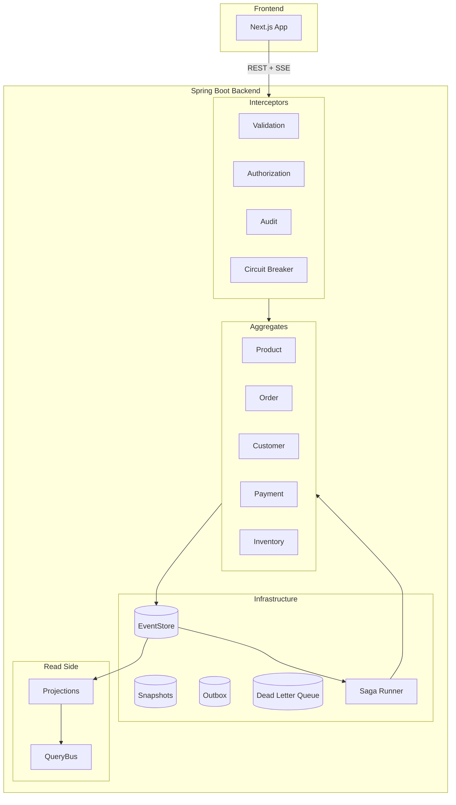

# Chapter 17: Putting It All Together

> **What you'll learn:** How every feature built across Chapters 1–16 connects into a single running system — the complete request lifecycle from browser click to event store and back, verified against a real end-to-end walkthrough scenario.

---

## What We're Building

There is no new code in this chapter. You already built it. This chapter is a guided end-to-end walkthrough of the complete ecommerce demo — from the Next.js frontend through the Spring Boot backend, across all five aggregates, through the saga, and back to the read model.

The goal is to see every feature work together at the same time, understand where each piece lives, and confirm that the system behaves correctly: encrypted PII at rest, an order-fulfillment saga that runs end-to-end (payment captured by the process manager, stock reserved, order confirmed), a payment-gateway circuit breaker that trips when you inject failures, the dead letter queue wired into the command bus, and a GDPR forget request that crypto-shreds the key and purges the read model.

By the end of this chapter you will have run the entire application, exercised every major feature, and have a checklist to verify that nothing was missed.

---

## Full System Diagram

The diagram below shows how all components connect. The five aggregates share a single `EventStore`. The `CommandBus` sits in front of the aggregates, gated by four interceptors that run in sequence on every command. The `SagaRunner` orchestrates multi-aggregate workflows by reacting to events and dispatching further commands. Projections consume events and maintain read models that the `QueryBus` serves. The `OutboxPoller` drains the transactional outbox to external subscribers. The `DeadLetterRetryRunner` retries failed commands. The Next.js frontend talks to the backend over REST and a persistent SSE connection.



---

## Create `SeedDataRunner`

Until now you have been creating demo data manually via `curl`. `SeedDataRunner` automates this at startup so the frontend has data immediately and you can skip the manual setup commands.

Create `spring-app/src/main/java/org/streamrune/ecommerce/spring/config/SeedDataRunner.java`:

```java
package org.streamrune.ecommerce.spring.config;

import java.math.BigDecimal;
import java.util.List;
import org.slf4j.Logger;
import org.slf4j.LoggerFactory;
import org.springframework.boot.ApplicationArguments;
import org.springframework.boot.ApplicationRunner;
import org.springframework.stereotype.Component;
import org.streamrune.core.Command;
import org.streamrune.core.DomainException;
import org.streamrune.core.EventStore;
import org.streamrune.core.types.AggregateId;
import org.streamrune.core.types.StreamId;
import org.streamrune.ecommerce.domain.common.Money;
import org.streamrune.ecommerce.domain.customer.CustomerCommand;
import org.streamrune.ecommerce.domain.inventory.InventoryCommand;
import org.streamrune.ecommerce.domain.inventory.InventoryState;
import org.streamrune.ecommerce.domain.order.OrderCommand;
import org.streamrune.ecommerce.domain.product.ProductCommand;
import org.streamrune.runtime.VirtualThreadCommandBus;

/**
 * Seeds the demo data at startup: three products with their opening stock, two customers and one
 * order.
 *
 * <p>Seeding is idempotent, one command at a time. A product, a customer and an order are each
 * created by a command its decider refuses when the aggregate already exists, so on a later start
 * those commands are skipped. The opening stock is received only while the product's inventory
 * stream is empty. A start that was interrupted halfway is therefore completed by the next one, and
 * a complete seed is never applied twice.
 */
@Component
public class SeedDataRunner implements ApplicationRunner {

  private static final Logger LOG = LoggerFactory.getLogger(SeedDataRunner.class);

  private final VirtualThreadCommandBus commandBus;
  private final EventStore eventStore;

  public SeedDataRunner(VirtualThreadCommandBus commandBus, EventStore eventStore) {
    this.commandBus = commandBus;
    this.eventStore = eventStore;
  }

  @Override
  public void run(ApplicationArguments args) {
    int applied = seed();
    if (applied == 0) {
      LOG.info("Seed data skipped (already exists)");
    } else {
      LOG.info("Demo data seeded ({} commands)", applied);
    }
  }

  /**
   * Dispatches every seed command that has not been applied yet.
   *
   * @return the number of commands applied; 0 when the data was already there
   */
  public int seed() {
    int applied = 0;

    // Products
    applied +=
        dispatch(
            new ProductCommand.CreateProduct(
                "prod-widget",
                "Widget",
                "A versatile widget for all occasions",
                "Electronics",
                new Money(BigDecimal.valueOf(19.99), "USD"),
                100));
    applied +=
        dispatch(
            new ProductCommand.CreateProduct(
                "prod-gadget",
                "Gadget",
                "The latest and greatest gadget",
                "Electronics",
                new Money(BigDecimal.valueOf(49.99), "USD"),
                50));
    applied +=
        dispatch(
            new ProductCommand.CreateProduct(
                "prod-doohickey",
                "Doohickey",
                "Nobody knows what it does, but everybody wants one",
                "Accessories",
                new Money(BigDecimal.valueOf(9.99), "USD"),
                200));

    // Inventory (opening stock, before the seed order so the saga's ReserveStock succeeds)
    applied += receiveOpeningStock("prod-widget", 100);
    applied += receiveOpeningStock("prod-gadget", 50);
    applied += receiveOpeningStock("prod-doohickey", 200);

    // Customers (encrypted PII)
    applied +=
        dispatch(
            new CustomerCommand.RegisterCustomer(
                "cust-alice", "Alice Johnson", "alice@example.com", "123 Main St", "+1-555-0101"));
    applied +=
        dispatch(
            new CustomerCommand.RegisterCustomer(
                "cust-bob", "Bob Smith", "bob@example.com", "456 Oak Ave", "+1-555-0102"));

    // One seed order; the fulfillment saga confirms it
    applied +=
        dispatch(
            new OrderCommand.PlaceOrder(
                "order-seed-1",
                "cust-alice",
                List.of(
                    new OrderCommand.OrderLine(
                        "prod-widget", 2, new Money(BigDecimal.valueOf(19.99), "USD")),
                    new OrderCommand.OrderLine(
                        "prod-gadget", 1, new Money(BigDecimal.valueOf(49.99), "USD")))));

    return applied;
  }

  /**
   * Dispatches one creation command. The decider refuses it with a {@link DomainException} when the
   * aggregate already exists, which is how a later start finds the data seeded.
   */
  private int dispatch(Command command) {
    try {
      commandBus.execute(command);
      return 1;
    } catch (DomainException e) {
      LOG.info("Seed data skipped: {}", e.getMessage());
      return 0;
    } catch (RuntimeException e) {
      LOG.warn("Seed command {} failed: {}", command.getClass().getSimpleName(), e.toString());
      return 0;
    }
  }

  /**
   * Receives a product's opening stock once. {@code ReceiveShipment} adds to the stock every time
   * it runs and no decider rule can tell the opening shipment from a later one, so the runner
   * dispatches it only while the product's inventory stream is still empty.
   */
  private int receiveOpeningStock(String productId, int quantity) {
    try {
      StreamId stream = StreamId.of(InventoryState.TYPE, AggregateId.of(productId));
      if (!eventStore.load(stream).events().isEmpty()) {
        LOG.info("Seed data skipped: inventory already stocked: {}", productId);
        return 0;
      }
      commandBus.execute(new InventoryCommand.ReceiveShipment(productId, quantity));
      return 1;
    } catch (RuntimeException e) {
      LOG.warn("Seed shipment for {} failed: {}", productId, e.toString());
      return 0;
    }
  }
}
```

`SeedDataRunner` implements `ApplicationRunner` and is annotated `@Component` so Spring picks it up automatically. On the first boot it dispatches nine commands through the full interceptor chain (audit, authorization with `ADMIN` role not required for `CreateProduct`, validation), so all seed data appears in the audit log and produces events visible in the Event Explorer.

The runner must not seed twice: the database outlives the application (the `pgdata` volume in `docker-compose.yml`), and every later start runs it again. It relies on two things, one command at a time:

- **Products, customers and the order** are created by commands whose deciders refuse an id that already exists (the creation guards from chapters 2, 6 and 8). On a later start `dispatch` catches that `DomainException`, logs `Seed data skipped: Product already exists: prod-widget`, and moves on. The refused command went through the same bus as any other, so the audit log gains a `FAILURE` row for it on every restart — an honest record of a command that was sent and refused.
- **The opening stock** has no such guard. `ReceiveShipment` is a command that is supposed to succeed every time — that is how a shop restocks — so a second run would add another 100 widgets. `receiveOpeningStock` therefore looks at the product's inventory stream first and dispatches the shipment only while that stream is empty.

Because each command is skipped on its own evidence, a start that was interrupted halfway (say, after the products but before the customers) is completed by the next one, and a complete seed is never applied twice. When nothing was left to do, the runner logs `Seed data skipped (already exists)`; otherwise `Demo data seeded (9 commands)` with the number it applied. A command that fails for any other reason is logged as a warning and does not stop the application.

---

## End-to-End Walkthrough

### Step 1: Start Everything with Docker Compose

Build the Spring Boot and notifications-service JARs, then start all services:

```bash
./gradlew :spring-app:bootJar :notifications-service:bootJar
docker compose up
```

Docker Compose starts five services: PostgreSQL (schema initialized via `scripts/init-db.sql`), RabbitMQ (ports 5672/15672), the Spring Boot backend (port 8080), the notifications-service outbox consumer (port 8090), and the Next.js frontend (port 3000). Wait for the backend to log `Started SpringEcommerceApplication`.

Verify that the application is healthy:

```bash
curl -s http://localhost:8080/actuator/health | jq .status
```

Expected output: `"UP"`

> **Alternative (without Docker Compose):** Start PostgreSQL with `docker run`, then `./gradlew :spring-app:bootRun`, then `cd frontend && npm install && npm run dev`. See the README for details.

### Step 2: Open the Frontend

Open `http://localhost:3000` in your browser. The Dashboard page loads with four stat cards and a live event feed. The green dot on the Event Explorer item in the sidebar confirms that the SSE connection to `/api/events/sse` is established. Seed data is loaded automatically on first startup — see the note below.

> **Where does the seed data come from?**
>
> `SeedDataRunner` (`spring-app/src/main/java/org/streamrune/ecommerce/spring/config/SeedDataRunner.java`) is a Spring `ApplicationRunner` that runs once during startup. It dispatches commands through the `VirtualThreadCommandBus` to create three products (`prod-widget` Widget $19.99, `prod-gadget` Gadget $49.99, `prod-doohickey` Doohickey $9.99), their initial inventory shipments (100 / 50 / 200 units), two customers (`cust-alice` Alice Johnson and `cust-bob` Bob Smith), and one seed order (`order-seed-1`) for Alice containing two widgets and one gadget.
>
> On subsequent startups the deciders refuse the creation commands (`DomainException`, e.g. `Product already exists: prod-widget`), the runner finds the inventory streams already stocked, and it logs `Seed data skipped (already exists)` without appending anything. All seed data flows through the full interceptor chain — audit, authorization, validation, and circuit breaker — so it appears in the audit log and produces events visible in the Event Explorer.

If you are running the demo manually (not via Docker Compose), seed data is created on the first `./gradlew :spring-app:bootRun` against a database that does not hold it yet.

### Step 3: Register a Customer — Observe Encrypted PII

In the Admin role, open the Customers page and register a new customer (use `cust-walkthrough` to avoid colliding with the `cust-alice` seed account from `SeedDataRunner`):

```bash
curl -s -X POST http://localhost:8080/api/customers \
  -H "Content-Type: application/json" \
  -H "X-User-Id: admin-1" \
  -H "X-User-Role: ADMIN" \
  -d '{
    "customerId": "cust-walkthrough",
    "name": "Alice Smith",
    "email": "alice@example.com",
    "address": "123 Main St"
  }' | jq .
```

> **About the two headers.** They are what the frontend's `ADMIN` role sends. The backend takes `X-User-Id` as the identity because it runs in the trusted-gateway mode, and the role from `X-User-Role` through the demo's `HeaderUserRoleResolver` — stand-ins for a gateway and a real role source that a production deployment must not copy (Chapter 9 explains why). Every `curl` in this walkthrough plays the gateway's part.

Now read the raw event from the event store to see the encrypted PII:

```bash
curl -s "http://localhost:8080/api/events/customer/cust-walkthrough" | jq '.[0].payload'
```

The stream id is `customer:cust-walkthrough` — the `CustomerCommand` registration in `StreamRuneConfig.java` names the aggregate type `customer` (`CustomerState.TYPE`) and its id extractor returns `c.customerId()`, so the URL carries the type and the id as two path segments.

The `name`, `email`, and `address` fields in the `CustomerRegistered` event are AES-GCM ciphertext blobs, not plaintext. The `CustomerProjection` decrypts them on read, so the Customers page in the frontend shows `Alice Smith` — but the event store itself never holds plaintext personal data. This is the field encryption from Chapter 6.

### Step 4: Create Products — Events, Projection, Query

The seed already created `prod-widget`, `prod-gadget` and `prod-doohickey`. Create two more products:

```bash
curl -s -X POST http://localhost:8080/api/products \
  -H "Content-Type: application/json" \
  -H "X-User-Id: admin-1" \
  -H "X-User-Role: ADMIN" \
  -d '{
    "productId": "prod-sprocket",
    "name": "Sprocket",
    "description": "A reliable sprocket",
    "category": "General",
    "price": 29.99,
    "initialStock": 100
  }' | jq .

curl -s -X POST http://localhost:8080/api/products \
  -H "Content-Type: application/json" \
  -H "X-User-Id: admin-1" \
  -H "X-User-Role: ADMIN" \
  -d '{
    "productId": "prod-gizmo",
    "name": "Gizmo",
    "description": "A handy gizmo",
    "category": "General",
    "price": 49.99,
    "initialStock": 50
  }' | jq .
```

A product id can be created once. Send the first request again, with `-i` instead of `-s` and without `| jq .`, and it answers `400 Bad Request` with the body `Product already exists: prod-sprocket` — the creation guard in `ProductDecider` (Chapter 2). The same request for a seeded id such as `prod-widget` is refused the same way, which is what keeps `SeedDataRunner` from seeding twice.

Read the events directly to see what was appended:

```bash
curl -s "http://localhost:8080/api/events/product/prod-sprocket" | jq .
```

As with the customer stream, the product stream id is `product:prod-sprocket` — `ProductCommand` registers under `ProductState.TYPE` with `c.productId()` as the id.

You should see a single `ProductCreated` event, with its `category` — the refused request appended nothing. Because `ProductCreatedUpcaster` (Chapter 4) is registered, the event was stored with schema version 2 and loads without an upcast; only rows stamped version 1 — like the hand-inserted `p-legacy` — pass through the upcaster.

Query the read model built by `ProductProjection`:

```bash
curl -s "http://localhost:8080/api/products" | jq .
```

The response comes from the `QueryBus` (with caching from Chapter 5). The first call executes the query against the projection. A second call within the cache TTL is served entirely from memory — no SQL executed.

Switch to the Products page in the frontend. Both products are listed next to the three seeded ones. The SSE live feed on the Dashboard already shows two `ProductCreated` events.

### Step 5: Place an Order — Watch the Saga

Place an order for Alice:

```bash
curl -s -X POST http://localhost:8080/api/orders \
  -H "Content-Type: application/json" \
  -H "X-User-Role: CUSTOMER" \
  -H "X-User-Id: cust-walkthrough" \
  -d '{
    "orderId": "ord-1",
    "customerId": "cust-walkthrough",
    "lines": [
      {"productId": "prod-widget", "quantity": 2, "unitPrice": 9.99}
    ]
  }' | jq .
```

The `OrderDecider` appends `OrderPlaced`. From there the order-fulfillment saga (Chapter 11) runs all the way to completion, driven by three polling subscriptions cooperating through correlation ids:

1. `SagaRunner` reacts to `OrderPlaced`, starts the `OrderFulfillmentSaga`, and dispatches `InitiatePayment` (correlation id `fulfillment-ord-1`). `PaymentDecider` appends `PaymentInitiated`.
2. The `PaymentProcessManager` reacts to `PaymentInitiated`, calls `PaymentGatewaySimulator.processPayment(...)` (the failure flag is off, so it succeeds), and dispatches `CapturePayment`. `PaymentCaptured` flows back to the saga, which moves to `AWAITING_INVENTORY` and dispatches `ReserveStock`.
3. `StockReserved` returns the saga to `AWAITING_CONFIRMATION`; it dispatches `ConfirmOrder`; `OrderConfirmed` drives the saga to `COMPLETED`.

The saga's full design (see the Javadoc on `OrderFulfillmentSaga`) is `OrderPlaced → InitiatePayment → PaymentCaptured → ReserveStock → StockReserved → ConfirmOrder → COMPLETED`. The link that makes this work end-to-end is that `SagaRunner` binds the saga id as the request correlation id on every command it dispatches, so each resulting event carries `fulfillment-ord-1` and `correlate()` routes it back to the right saga; the `PaymentProcessManager` preserves that correlation id when it dispatches the capture command.

Because each leg hops through a separate polling subscription, give it a second or two, then inspect the saga state:

```bash
curl -s http://localhost:8080/api/saga/fulfillments/fulfillment-ord-1 | jq .fulfillmentStatus
```

Expected output: `"COMPLETED"`

In the browser, open the Fulfillment page. The order row for `ord-1` walks through Payment → Inventory → Confirmation → Completed; the step visualizer updates in real time via SSE — no page refresh needed.

Confirm the order state — the saga's final `ConfirmOrder` emitted `OrderConfirmed`, so the projection reports:

```bash
curl -s http://localhost:8080/api/orders/ord-1 | jq .status
```

Expected output: `"CONFIRMED"`

The order snapshot is stored after every 5 events (`SnapshotPolicy.everyNEvents(5)` from Chapter 8). If you have placed enough orders, you can verify that the next load of the aggregate reads from the snapshot store rather than replaying from offset 0.

### Step 6: Check the Audit Log — Verify All Commands Were Tracked

Every command that passed through `AuditCommandInterceptor` (Chapter 10) is recorded:

```bash
curl -s "http://localhost:8080/api/audit/commands?limit=20" | jq '.[] | {commandType, aggregateId, userId, occurredAt, outcome}'
```

You should see entries for `RegisterCustomer`, `CreateProduct` (twice, and a third with outcome `FAILURE` if you sent the duplicate request in Step 4), and `PlaceOrder` — plus the commands the saga dispatched while fulfilling `ord-1` in Step 5 (`InitiatePayment`, `CapturePayment`, `ReserveStock`, `ConfirmOrder`), since every command goes through the same audited bus. The audit log stores the `user_id` taken from the `X-User-Id` request header (trusted-gateway mode, Chapter 9), so the customer and product commands from Steps 3 and 4 carry `admin-1` and the order command (Step 5 sent `X-User-Id: cust-walkthrough`) carries `cust-walkthrough`; the saga-dispatched commands run with the saga's correlation context rather than a user, so their `userId` is empty. The role itself is used by the authorization interceptor but is not persisted in the audit row. Open the Audit page in the frontend to browse the log; a **Show** selector at the top chooses how many rows to load (25 / 50 / 100).

### Step 7: Trip the Payment-Gateway Circuit Breaker

The demo runs **two** breakers (Chapter 12), and `/api/admin/circuit-breaker` reports both:

```bash
curl -s http://localhost:8080/api/admin/circuit-breaker
# {"state":"CLOSED","paymentGateway":"CLOSED"}
```

- `state` is the command-bus `CircuitBreakerCommandInterceptor` (`new CircuitBreakerCommandInterceptor(3, Duration.ofSeconds(30))`). It counts genuine infrastructure failures on the command bus and opens after 3 in a row.
- `paymentGateway` is the `PaymentGatewayCircuitBreaker` (also `3` / `30s`) wrapped around the gateway call the `PaymentProcessManager` makes.

Now exercise the gateway breaker. Toggle payment failure on (a mutating admin endpoint, so the call carries the ADMIN role header — Chapter 14) and place a few orders:

```bash
curl -s -X POST -H "X-User-Role: ADMIN" http://localhost:8080/api/admin/payment-failure/toggle
# {"failureInjected":true}

for i in 1 2 3; do
  curl -s -X POST http://localhost:8080/api/orders \
    -H "Content-Type: application/json" -H "X-User-Role: CUSTOMER" -H "X-User-Id: cust-walkthrough" \
    -d "{\"orderId\":\"walk-cb-$i\",\"customerId\":\"cust-walkthrough\",\"lines\":[{\"productId\":\"prod-widget\",\"quantity\":1,\"unitPrice\":9.99}]}"
done
```

Each order's `PaymentProcessManager` calls the gateway, which now throws, so the manager dispatches `FailPayment` and the saga cancels the order. After three consecutive gateway failures the gateway breaker opens:

```bash
curl -s http://localhost:8080/api/admin/circuit-breaker
# {"state":"CLOSED","paymentGateway":"OPEN"}

curl -s http://localhost:8080/api/saga/fulfillments/fulfillment-walk-cb-1 | jq .fulfillmentStatus
# "FAILED"
```

Notice the command-bus breaker (`state`) stays `CLOSED`: the gateway failures are swallowed by the manager and converted into *successful* `FailPayment`/`CancelOrder` commands, so the command bus never sees a failure — and even if it did, its counter resets on every successful command. This is exactly why the demo puts a dedicated breaker around the gateway (Chapter 12 walks through the reasoning). While `paymentGateway` is `OPEN`, the manager fast-fails new payments without calling the gateway. Toggle the flag back off and, once the 30-second cooldown elapses, the next order's gateway call probes successfully and closes the breaker.

### Step 8: Forget the Customer — Verify GDPR Crypto Shredding

Forget the walkthrough customer using the GDPR right-to-erasure feature from Chapter 7:

```bash
curl -s -X POST http://localhost:8080/api/customers/cust-walkthrough/forget \
  -H "X-User-Id: admin-1" \
  -H "X-User-Role: ADMIN" | jq .
```

```json
{
  "keyDeleted": true,
  "fullyErased": true,
  "failedPurgers": []
}
```

Only an `ADMIN` or the customer themself may send this (Chapter 9); anyone else gets `403` and nothing is written. The `CustomerDecider` appends a `CustomerForgotten` event. The endpoint then calls `ForgetSubjectService.forget(...)`, which (1) crypto-shreds the subject's encryption key in the key store and (2) runs the registered `CustomerSubjectDataPurger` to delete the customer's read-model row. The answer is `200` only because `fullyErased` is `true`. Had the key deletion failed, or a purger, it would be `500` with `keyDeleted` or `failedPurgers` saying what is left, and you would send the same request again: the decider records nothing for a customer already forgotten, `deleteKey` is a no-op on a deleted key and each purger is idempotent, so the repeat finishes the erasure from wherever the last attempt stopped (Chapter 7, Step 2). Now read the raw events:

```bash
curl -s "http://localhost:8080/api/events/customer/cust-walkthrough" | jq '.[].payload | .name // .email // empty'
```

The `CustomerRegistered` event still exists in the append-only event store — it cannot be deleted — but its encrypted payload can no longer be decrypted because the key is gone. The read model is handled separately: both the `CustomerProjection` (on the `CustomerForgotten` event) and the `CustomerSubjectDataPurger` **delete the `customers_view` row entirely** rather than leaving a redacted shell. In the frontend, switch to the Customers page; Alice's walkthrough row is gone — `GET /api/customers/cust-walkthrough` now returns `404 Not Found`.

The event history is intact and auditable, but the personal data is irrecoverably gone — the ciphertext can never be decrypted and the read-model row no longer exists. Both GDPR requirements are satisfied simultaneously.

### Step 9: Check the Dead Letter Queue

The DLQ (Chapter 14) collects commands that exhausted their retries. Check it:

```bash
curl -s "http://localhost:8080/api/admin/dead-letters" | jq .
```

In this walkthrough nothing lands in the DLQ: the gateway failures from Step 7 are handled cleanly by the saga (the `FailPayment`/`CancelOrder` commands succeed), so no command exhausts its retries. The endpoint returns an empty array `[]`. When a command *does* land in the DLQ, each entry exposes the failed `commandType`, the `errorType`/`errorMessage`, and the attempt counts (`attempts` / `dlqAttempts`). The `commandPayload` of a dead-lettered `RegisterCustomer` or `UpdateProfile` shows the customer's personal data as ciphertext: those commands carry `@Encrypted` (Chapter 6), so the queued copy is erased with the customer (Chapter 7). From the Admin page in the frontend you can re-run individual entries with the **Retry** button. `POST /api/admin/dead-letters/{id}/retry` calls `deadLetterRetryRunner.retry(new CommandId(id))`, which **re-dispatches the dead-lettered command through the bus** under a `DLQ_REPLAY` marker and the entry's original request context — discarding the entry on success, bumping its DLQ attempt count on failure, and returning `404` if no entry exists for that id. Like every mutating admin endpoint it requires the ADMIN role header and answers `403` without it; the Admin page sends it for the ADMIN persona. This is the same operation the `DeadLetterRetryRunner` bean performs automatically on its own schedule; the endpoint just lets an operator trigger one entry on demand.

Verify the outbox as well — the listing is read-only (`findByStatus(PENDING)`), so it never stalls delivery:

```bash
curl -s "http://localhost:8080/api/admin/outbox" | jq .
curl -s "http://localhost:8080/api/admin/outbox/failed" | jq .
```

The `OutboxPoller` drains entries every 5 seconds (the default `streamrune.outbox.flush-interval-ms`, not overridden in the demo's `application.yml`), so the first list is usually empty or shows the last few seconds of entries. The second list is empty in a healthy run: on the demo's `STRICT_PER_AGGREGATE` channel a `FAILED` entry would block its order, payment or product until replayed or skipped from the admin API (Chapter 14).

### Step 10: Browse Events in the Event Explorer

The Event Explorer page in the frontend provides a paginated view of the global event stream. You can also query it directly:

```bash
curl -s "http://localhost:8080/api/events?offset=0&limit=10" | \
  jq '.[] | "\(.globalOffset)  \(.eventType)  \(.aggregateType):\(.aggregateId)"'
```

The output shows every event appended during this walkthrough, in global order. This is the complete audit trail of everything that happened in the system — immutable, append-only, and queryable at any offset.

Open a persistent SSE connection in a separate terminal to watch new events arrive in real time:

```bash
curl -N http://localhost:8080/api/events/sse
```

Every command you dispatch from this point forward produces SSE frames here within one second.

---

## Feature Checklist

| Feature | Chapter | Status |
|---------|---------|--------|
| EventStore (PostgreSQL) | 1 | ✅ |
| Decider pattern | 2 | ✅ |
| Bean validation | 3 | ✅ |
| Event upcasting | 4 | ✅ |
| Projections (TRANSACTIONAL_LOCAL ×4, AT_LEAST_ONCE_IDEMPOTENT audit) | 5, 10 | ✅ |
| QueryBus + Caching | 5 | ✅ |
| Field encryption | 6 | ✅ |
| Crypto shredding (GDPR) | 7 | ✅ |
| Snapshots | 8 | ✅ |
| Authorization | 9 | ✅ |
| Audit logging | 10 | ✅ |
| Saga orchestration | 11 | ✅ |
| Circuit breaker | 12 | ✅ |
| Transactional outbox | 13 | ✅ |
| Outbox ordering modes (strict default, audited skip) | 13, 14 | ✅ |
| Type-qualified streams — `<type>:<id>`, two key columns (all three apps) | 2, 4, 15 | ✅ |
| Dead letter queue | 14 | ✅ |
| Projection lifecycle (MultiProjectionRunner) | 5, 14 | ✅ |
| Observability (metrics) | 15 | ✅ |
| SSE live events | 15 | ✅ |
| Next.js frontend | 16 | ✅ |

---

## Next Steps

You have built a production-grade event-sourced application from scratch. Here are directions to take it further.

**Explore Quarkus and Micronaut variants.** The same domain model, deciders, and projections work with StreamRune's Quarkus and Micronaut starters. The `streamrune-integration` module contains `streamrune-quarkus` and `streamrune-micronaut` starters with auto-configuration equivalent to the Spring Boot starter. Swap the starter dependency and the `StreamRuneConfig` equivalent, and the application runs on a different runtime with no domain code changes. A runner you define yourself (the demo's `quarkus-app` and `micronaut-app` each define their own dead-letter retry runner) replaces the framework's, and you start it yourself — the demo does it in `EcommerceSubscriptionLifecycle` (Chapter 14). Carry the request-identity setting over too: on Quarkus, `streamrune.security.trust-user-id-header=true` goes in `application.properties` (as in the demo's `quarkus-app`), and on Micronaut `streamrune.security.trust-user-id-header: true` goes in `application.yml` (as in the demo's `micronaut-app`) — without it `X-User-Id` is ignored and, with annotation authorization configured, the application refuses to start (see Chapter 9). For a Quarkus native image, register your records with `@RegisterForReflection` (the demo's `EcommerceDomainReflectionConfig`), but list every sealed command and event interface as a `{"type": "…"}` entry in `src/main/resources/META-INF/native-image/<groupId>/<artifactId>/reachability-metadata.json`: `@RegisterForReflection` on a sealed interface does not make the image list its permitted subclasses, and the framework then refuses to start with *"Sealed type … reports no permitted subclasses"* rather than letting the dead-letter runner and the startup checks see only the root. The Quarkus starter ships the HikariCP metadata for the framework's own connection pools. `scripts/native-image-smoke-test.sh quarkus` builds the Quarkus binary and runs the same checks as for Spring. For a Micronaut native image, list your records in your own `src/main/resources/META-INF/native-image/<groupId>/<artifactId>/reflect-config.json` (the demo's `micronaut-app` has one; include the outbox mapper's DTO records, which Jackson serialises when an event is appended) and the sealed interfaces in a `reachability-metadata.json` beside it, exactly as for Quarkus: a Micronaut `@TypeHint` or `@ReflectiveAccess` on a sealed interface registers the type without its permitted subclasses, and the application refuses to start. Keep a `logback.xml` at INFO (the demo ships one): without it Logback logs at DEBUG, and at DEBUG HikariCP reads its pool settings reflectively, which fails in the image. Build the Micronaut image with `-H:+SharedArenaSupport`. The option is experimental, so wrap it in `-H:+UnlockExperimentalVMOptions` / `-H:-UnlockExperimentalVMOptions`, as `micronaut-app/build.gradle.kts` does in `graalvmNative.binaries.main.buildArgs`. Micronaut's HTTP server runs on Netty 4.2, which on Java 25 frees each direct buffer above 1 MiB, and every pooled chunk when an event loop exits, through `Arena.ofShared().close()`, and a GraalVM 25 image supports that only with this option. Without it the demo's binary answered a request with a 1.5 MiB body with 500, threw `UnsupportedFeatureError: Support for Arena.ofShared is not active` from six event-loop threads at shutdown, and never freed those buffers. `scripts/native-image-smoke-test.sh micronaut` builds the Micronaut binary and runs the same checks on port 8081.

**Add your own aggregate.** Pick a domain concept not in this demo — a `Review`, a `Voucher`, a `Supplier` — and build it from scratch following the pattern in Chapters 2–5. Define the sealed command and event interfaces, write a `DeciderFixture` test, implement the decider, add a projection, and wire it into the command bus. The process is the same every time.

**Implement windowed projections.** The projections in this tutorial are simple append-only views. StreamRune projections can also maintain time-windowed aggregations — for example, "total revenue in the last 24 hours" or "orders per customer per week." Explore `WindowedProjection` in the reference documentation.

**Set up a CI/CD pipeline.** The tutorial test suite runs entirely with `./gradlew test`. Add a GitHub Actions workflow that runs the full test suite on every pull request, builds a Docker image with `./gradlew bootBuildImage`, and pushes it to a container registry on merge to main.

**Deploy to production.** The application runs on any JVM with a PostgreSQL database. The `application.yml` file holds the primary runtime config (datasource, `streamrune.*`, management endpoints); `application.properties` carries the AOT-time datasource defaults. In Docker Compose, connection details are overridden at runtime via the `SPRING_DATASOURCE_URL` / `SPRING_DATASOURCE_USERNAME` / `SPRING_DATASOURCE_PASSWORD` environment variables. For GraalVM native images, the Spring starter registers StreamRune's own types for reflection and the application registers its own: the demo's `EcommerceNativeHints` (wired with `@ImportRuntimeHints` on `StreamRuneConfig`) calls `StreamRuneRuntimeHints.registerDomainPackages` for the four domain modules, which registers every record, enum and value object, and every sealed command and event interface. The sealed interfaces matter: a native image lists a sealed type's permitted subclasses only when the sealed type itself is registered, and the dead-letter runner's `registerCommand(InventoryCommand.class)` (Chapter 14) depends on that list — without it the application refuses to start. Build with `./gradlew :spring-app:nativeCompile` for a self-contained binary with sub-second startup (on a GraalVM without `lib/svm/schemas/reachability-metadata-schema.json`, such as GraalVM CE 25.0.1, native-build-tools refuses its metadata repository: the README's *GraalVM Native Image* section shows how to point `-PgraalvmMetadataRepository` at a copy without the schema); `scripts/native-image-smoke-test.sh spring` runs it against PostgreSQL and RabbitMQ and checks health, a command-to-read-model round trip, the replay of a dead-lettered `InventoryCommand$ReceiveShipment` through its sealed root, and a product with a 1.5 MiB description written and read back. It then stops the binary with SIGTERM, waits for it to exit, and fails if the binary's output (startup, requests and shutdown) holds a GraalVM `UnsupportedFeatureError`.
